# TrustSignal — Reverse-Engineering and Reconstruction Specification

> Source of truth: the inspected implementation, not the architectural assumptions in the request or the repository README. This specification describes what can be rebuilt from the supplied checkout and identifies components that are referenced but absent.

## Document map

1. Scope and evidence: what exists, what is absent, and verification limits.
2. Complete repository tree and runtime-relevant ignored assets.
3. Dependencies and architecture.
4. Configuration, gateway protocol, authentication and HTTP.
5. Every LangGraph workflow, task dependency, runner, state and schema.
6. Source integrations, transformations, validation, storage and end-to-end flows.
7. Actual UI behavior and demo/live limitations.
8. Airflow absence and requested-attribute inventory.
9. Dataproc absence and incomplete GCS/BigQuery/Vault bootstrap.
10. Failure handling, observability, idempotency and recovery.
11. Tests, development and deployment.
12. Eleven-step reconstruction blueprint.
13. External unknowns and equivalence limits.
14. Final coverage verification.

Appendix A lists exact source function/class signatures and line references.

## 1. Scope, evidence, and reconstruction target

- **Repository inspected:** `/Users/paror137/Workspaces/github.aexp repositories/touchstone-svc`.
- **Revision:** `729b90c46f466faf0aaa5541f0db2822a1161723`; the tracked working tree was clean when inspected.
- **Inspection date:** 2026-10-01.
- **Inventory:** 68 tracked files, 57 Python files, 20 test modules, and 130 statically identified `test_*` functions/methods. A definition count is not a pytest execution count; parametrization can produce additional cases.
- **Method:** read tracked source/configuration/tests and the runtime-selected ignored prompt override; inspect existing SQLite table schema without row values; extract Python syntax and symbol inventories; follow UI entry points through graph nodes, tools, validation, persistence, and deployment. All 57 Python files parsed successfully with Python 3.11.16. Five credential-loader unit tests passed. The complete pytest suite was not run because the available Python environment lacks the project's third-party dependencies. No live AskAmex, SEC, GLEIF, search, cloud, or deployment integration was exercised.
- **Privacy:** actual credential values, runtime output row values, and editor state were not used as specification inputs. Environment variable names are documented from the sample/configuration; secret values are omitted. The ignored `.agent/prompt/fetch-verified-negative-news.prompt.md` was read because application code actively selects it; the existing SQLite file was inspected for table schema only. Credential examples use `<SECRET>`. Public source data was inspected for structure rather than reproduced wholesale.
- **Path convention:** source references in this document are repository-relative. The final symbol appendix includes original line locations. A source-relative path remains meaningful after moving/reconstructing the checkout.

### 1.1 Evidence vocabulary

**Confirmed** means observable in the inspected code, configuration, manifest, or tests. Unless otherwise labeled, implementation descriptions below are confirmed static-source findings; they do not imply a successful live deployment. **Inference** means an interpretation of intent or a consequence not tested in a running application. **Reconstruction recommendation** specifies a deliberate implementation choice or improvement, not existing behavior. **Absent/unresolved** means the inspected checkout does not supply the component or value; do not invent it.

### 1.2 What this repository actually implements

Touchstone is a Python package and local Streamlit KYB/legal-entity intelligence console. Its backend contains five specialist LangGraph workflows and a sixth LangGraph workflow that orchestrates those specialists and produces a final KYB summary. It calls an internal AskAmex Functions model gateway, SEC EDGAR/XBRL, GLEIF, and public DuckDuckGo HTML search. Business outputs and logs are local JSON/JSONL; graph checkpoints are in embedded SQLite. Docker Compose runs one Streamlit container.

**There are no Airflow DAG definitions and no Dataproc jobs in the inspected repository.** A disconnected compatibility module, `src/touchstone/common/env_bootstrapper.py`, references GCS paths containing the literal directory `dataproc`, a BigQuery audit helper, and Vault. Its imported service implementations are absent and no application code calls its `initialize()` function. The presence of that path string does not establish a Dataproc execution architecture.

The README's two-workflow UI narrative is stale relative to `app.py` and `src/touchstone/ui/kyb_console.py`. Rebuild the actual KYB console and public Python APIs described here. Do not create Airflow, Spark, cloud tables, background workers, or a REST server merely to fit the requested architecture template.

### 1.3 Technology presence and absence

| Area | Confirmed implementation | Reconstruction implication |
|---|---|---|
| Python | `requires-python = ">=3.11"`; container `python:3.11-slim` from internal Artifactory | Python 3.11 is the concrete deployment baseline; no upper bound is declared. |
| Web/UI | Streamlit, one `app.py`; large KYB console with session state | No FastAPI/Flask/Django service or REST routes. |
| Workflow engine | LangGraph `StateGraph`, nodes, edges, conditional sends, checkpoints | Graph nodes are not Airflow tasks; launches are programmatic/user-driven. |
| Models | LangChain `BaseChatModel` subclass `AskAmexChatModel`; purpose-based selection | The gateway, not direct OpenAI/Gemini SDKs, handles inference. |
| Persistence | Local JSON/JSONL, HTML evidence, CIK cache, SQLite checkpoint file | No application SQL warehouse or database server. |
| Airflow | No dependency, import, DAG file, operators, providers, or configuration | Version, schedules, tasks, variables, connections, sensors and callbacks are N/A. |
| Dataproc / Spark | No SDK, cluster specification, job submitter, PySpark import, or job script | Cluster settings, jobs, worker counts, lifecycle, retries are not recoverable because no implementation exists. |
| GCS | Three URI templates in the dormant bootstrapper | Describe as incomplete optional integration only. |
| BigQuery | Missing `services.bigquery_service._safe_audit_log_direct` imported by dormant bootstrapper | No dataset/table/schema/SQL supplied. |
| Pub/Sub | No usage found | No topics/subscriptions to reconstruct. |
| Vault / EAG / CIBIS | Credential compatibility helpers and environment variable names | Not the active AskAmex credential path; no EAG/CIBIS API clients in this checkout. |
| External data | SEC, GLEIF, DuckDuckGo; regulator/media domains in prompts | Most regulator/court routes are model search instructions, not dedicated APIs. |
| CI/infrastructure | Dockerfile and Compose only | No tracked CI workflow, Kubernetes, Terraform, Airflow deployment or GCP deployment procedure. |

## 2. Complete relevant repository structure

Every tracked file is represented below. Generated/local-only directories are described afterward.

```text
touchstone-svc/
├── .dockerignore
├── .env.example
├── .gitignore
├── .streamlit/
│   └── config.toml
├── Dockerfile
├── README.md
├── app.py
├── compose.yml
├── pyproject.toml
├── config/
│   └── local.yml
├── data/
│   └── sec/
│       └── cik-data.zip
├── outputs/
│   └── .gitkeep
├── src/
│   └── touchstone/
│       ├── __init__.py
│       ├── askamex.py
│       ├── config.py
│       ├── http.py
│       ├── model_provider.py
│       ├── models.py
│       ├── common/
│       │   ├── __init__.py
│       │   ├── credential_loader.py
│       │   └── env_bootstrapper.py
│       ├── data/
│       │   ├── __init__.py
│       │   └── cik_loader.py
│       ├── graphs/
│       │   ├── __init__.py
│       │   ├── board_of_directors.py
│       │   ├── customer_linkage.py
│       │   ├── kyb_verification.py
│       │   ├── legal_entity_enrichment.py
│       │   ├── negative_news.py
│       │   └── search_response.py
│       ├── prompts/
│       │   ├── __init__.py
│       │   └── negative_news.py
│       ├── services/
│       │   ├── __init__.py
│       │   └── enrichment_batch.py
│       ├── storage/
│       │   ├── __init__.py
│       │   └── artifact_writer.py
│       ├── tools/
│       │   ├── __init__.py
│       │   ├── board_parser.py
│       │   ├── company_name_standardizer.py
│       │   ├── gleif.py
│       │   ├── negative_news_search.py
│       │   ├── negative_news_validation.py
│       │   ├── search_response.py
│       │   ├── sec.py
│       │   └── web_search.py
│       └── ui/
│           ├── __init__.py
│           ├── kyb_console.py
│           └── theme.py
└── tests/
    ├── test_artifact_writer.py
    ├── test_board_graph.py
    ├── test_board_models.py
    ├── test_board_parser.py
    ├── test_cik_loader.py
    ├── test_credential_loader.py
    ├── test_enrichment_batch.py
    ├── test_graph_observability.py
    ├── test_http.py
    ├── test_kyb_verification.py
    ├── test_model_provider.py
    ├── test_models.py
    ├── test_negative_news_graph.py
    ├── test_negative_news_search.py
    ├── test_negative_news_validation.py
    ├── test_search_response_graph.py
    ├── test_search_response_tool.py
    ├── test_sec_filings.py
    ├── test_ui_theme.py
    └── test_web_search.py
```

Not tracked: actual `.env`, `.cache/`, runtime contents of `outputs/`, `.pytest_cache/`, `.idea/`, `.agent/`, Python environments, certificates, and SQLite sidecars. `.gitignore` explicitly ignores these. These are not extra Python source modules. One ignored supporting asset is runtime-relevant and present in this checkout: `.agent/prompt/fetch-verified-negative-news.prompt.md` (149 lines). `load_negative_news_prompt()` prefers this authored prompt when available; Docker excludes `.agent`, and the wheel omits it, so those deployments use the shorter packaged fallback plus the same structured-output adapter. The prompt analysis below covers both behaviors. No `requirements.txt`, `setup.py`, `setup.cfg`, `airflow.cfg`, `dags/`, lockfile, or deployment shell script is tracked. `uv.lock` is explicitly ignored, so transitive dependency resolution is not fully reproducible from a lock.

## 3. Packaging, dependencies, and runtime architecture

### 3.1 Dependency contract

`pyproject.toml` defines package `touchstone`, version `0.1.0`, description "Local legal-entity relationship and enrichment workflows", setuptools package discovery under `src`, and `setuptools>=69` / `setuptools.build_meta`. The SEC archive is packaged as data at `share/touchstone/data/sec/cik-data.zip`; runtime discovery must support source checkout and installed-wheel locations. The wheel does not package `app.py`, `config/local.yml`, or `.streamlit` as runtime data; backend use outside the checkout still needs a supplied YAML configuration and the UI needs its separate application assets.

| Dependency declaration | Actual role |
|---|---|
| `beautifulsoup4==4.14.3` | Parse SEC filing HTML, director rosters/tables and DuckDuckGo search-result HTML. |
| `langchain==1.3.9` | Build research agents using `create_agent` and tool strategies. |
| `langchain-core==1.4.7` | Chat-model base, messages/tool calling, callbacks, runnables, structured response parsing. |
| `langgraph==1.2.11` | State graphs, fan-out/fan-in, graph streaming and execution. |
| `langgraph-checkpoint-sqlite==3.0.3` | `SqliteSaver` persistence of LangGraph execution checkpoints. |
| `pydantic==2.12.5` | Request/result schema validation, enum conversion, computed counts and model serialization. |
| `python-dotenv==1.2.2` | Local environment bootstrap, with existing environment values preserved. |
| `PyYAML==6.0.1` | `config/local.yml` loading through `yaml.safe_load`. |
| `requests==2.33.1` | Gateway and public-source HTTP sessions. |
| `streamlit>=1.40,<2` | Browser UI, intake forms, session state, downloads, progress rendering. |
| Optional `dev`: `pytest>=8,<10` | Main test runner; some tests use stdlib `unittest` and mocks. |

The uv default package index and Docker pip index are `https://artifactory.aexp.com/api/pypi/pypi/simple/`. No Airflow distribution/provider, `pyspark`, `google-cloud-*`, database ORM, or Vault client is declared. Embedding/reranker names appear in model configuration but no embedding/vector-store/retrieval-index workflow calls them.

### 3.2 Active component diagram

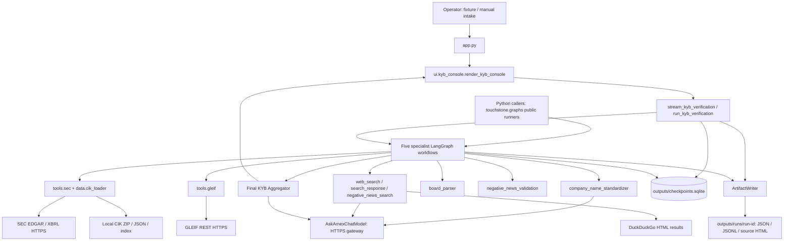

Graph/API data is passed as Python dicts, Pydantic models, LangGraph state updates, and run IDs. External services use HTTPS JSON or HTML. There is no message broker between components. Concurrency is process-local graph execution and thread pools; the Streamlit process waits while handling a verification, and its live display consumes generator events.

### 3.3 Actual end-to-end path versus requested Airflow path

```text
Input (UI intake or Python kwargs)
 → validated request / generated run ID
 → LangGraph runner and SQLite checkpointer
 → Python graph node
 → source client or AskAmex-backed research agent
 → deterministic validation / parsing / structured model aggregation
 → local JSON result + JSONL telemetry + SQLite state
 → streamed UI state / result dict / downloadable evidence.
```

There is **no** `Input → Airflow DAG → Task → Dataproc → Storage` execution path to trace. The complete implemented graph alternatives are specified below using their real node names and code paths. A cloud pipeline would be a new system, not a faithful reconstruction of this checkout.

## 4. Configuration, model gateway, HTTP, and authentication

### 4.1 Local settings lifecycle (`src/touchstone/config.py`)

At import, `ROOT_DIR = Path(os.getenv("TOUCHSTONE_ROOT_DIR", Path.cwd())).expanduser().resolve()`. Then `load_dotenv(ROOT_DIR / ".env")` runs without override. The root is an import-time value; changing the environment later does not recalculate it merely by clearing `get_settings()`.

`_path_from_env(name, default)` expands `~` and resolves relative paths beneath `ROOT_DIR`. `get_settings()` is cached with `lru_cache(maxsize=1)`. It sets `os.environ["CONFIG_PATH"]` to the computed path, reads YAML if present, builds frozen settings dataclasses, validates every configured purpose model, and creates output/cache/checkpoint/CIK parent directories. A missing YAML file does **not** produce a usable default config: `_askamex_settings({})` subsequently indexes required AskAmex keys and raises `KeyError`. Batch size is parsed with `int` and clamped to at least 1; no upper bound is set here. Output/cache overrides are independent: changing `TOUCHSTONE_OUTPUT_DIR` does not relocate the literal default `CHECKPOINT_DB_PATH`, and changing `TOUCHSTONE_CACHE_DIR` does not relocate the literal default `CIK_FILE_PATH`. Set both relevant variables when relocating all persistent state.

| Environment variable | Default / meaning | Consumer |
|---|---|---|
| `TOUCHSTONE_ROOT_DIR` | Current working directory; `/app` in Docker | Import-time root selection. |
| `CONFIG_PATH` | `config/local.yml` | YAML settings; also rewritten to absolute path. |
| `TOUCHSTONE_OUTPUT_DIR` | `outputs` | Backend artifact directories. |
| `TOUCHSTONE_CACHE_DIR` | `.cache/touchstone` | Local cached reference/index state. |
| `CHECKPOINT_DB_PATH` | `outputs/checkpoints.sqlite` | All six graph runners. |
| `CIK_ARCHIVE_PATH` | `data/sec/cik-data.zip` | Source/wheel archive resolution. |
| `CIK_FILE_PATH` | `.cache/touchstone/cik-data.json` | Extracted SEC reference dataset. |
| `SEC_USER_AGENT` | Settings fallback: `Touchstone Hackathon contact@example.com` | SEC headers reject only an empty/whitespace value; the fallback is accepted by code. Configure a real application/contact identity for deployment. |
| `LOG_LEVEL` | `INFO` (uppercased) | Settings and `configure_logging()`. Unknown levels use INFO in logging configuration. |
| `ASKAMEX_FUNCTIONS_APP_ID` | `<SECRET>` | Gateway `Authorization: Auth <SECRET>`. |
| `GH_TEAM_APP_ID` | `<SECRET>` | `X-AXP-ClientId`. |
| `GH_TEAM_SECRET` | `<SECRET>` | `X-AXP-APIKey`. |
| `GH_TEAM_NAME` | `<SECRET>` | `X-AXP-TeamId`. |
| `http_proxy`, `https_proxy`, `no_proxy` | Optional empty proxy fields and `.aexp.com,localhost,127.0.0.1,.docker.internal` in sample | Both active HTTP session types default to `trust_env=False`, so inherited proxy configuration is ignored unless AskAmex transport configuration is changed. |
| `PYTHONDONTWRITEBYTECODE`, `PYTHONUNBUFFERED`, `PIP_NO_CACHE_DIR` | `1` in Docker | Container Python/pip behavior. |

Do not confuse the four AskAmex variables with the separate dormant CIBIS/EAG credential variables documented in the cloud section. No active Airflow Variable, connection ID, service account key, GCP credential file, or database password exists.

### 4.2 Exact YAML shape and routing

```yaml
aggregator:
  batch_size: 10
askamex:
  endpoint: https://askamexfunctionssl-dev.aexp.com/aaa/functions/v1/gh_genai
  default_chat_model: gpt-5.2
  chat_models:
    standardization: llama3.3
    research: gemini-3.5-flash
    aggregation: gpt-5.2
  credentials:
    functions_app_id_key: ASKAMEX_FUNCTIONS_APP_ID
    team_app_id_key: GH_TEAM_APP_ID
    team_secret_key: GH_TEAM_SECRET
    team_name_key: GH_TEAM_NAME
  transport:
    trust_env: false
  models:
    - {type: embedding, header_name: bge-large-en, request_name: bge-large-en}
    - {type: embedding, header_name: text-embedding-ada-002, request_name: text-embedding-ada-002}
    - {type: reranker, header_name: bge-reranker, request_name: bge-reranker-large}
    - {type: chat, header_name: llama3.3, request_name: llama33-70b-instruct}
    - {type: chat, header_name: gpt-5.2, request_name: gpt-5.2}
    - {type: chat, header_name: gemini-3.5-flash, request_name: google/gemini-3.5-flash}
```

These are declared gateway aliases, not a claim about externally available model versions. `AskAmexSettings.resolve_chat_model(purpose=None)` selects the purpose override or default and matches a record with identical `header_name` and `type == "chat"`; no match raises `ValueError`. Unknown purposes fall back to the default. `transport.trust_env` is converted using Python `bool`, so YAML boolean values should be used rather than strings such as `"false"`.

### 4.3 Model provider and gateway wire contract

`model_provider.get_model(purpose=None) -> AskAmexChatModel` is cached for up to eight purpose keys; it calls `AskAmexChatModel.from_settings(get_settings().askamex, purpose)`. `clear_model_cache()` clears this cache independently of settings. Config/model caches must both be cleared in tests that change routing.

`AskAmexChatModel` subclasses LangChain `BaseChatModel` and declares `endpoint`, `header_model`, `model_name`, four environment-key names, `trust_env=False`, `temperature=0.0`, and a private thread-local session. `_llm_type` is `"askamex"`; identifying parameters include endpoint/header model/request model, not credentials.

Request construction in `_generate(messages, stop=None, run_manager=None, **kwargs)`:

```json
{
  "messages": [{"role": "user", "content": "<REQUEST>"}],
  "model": "<request_name from YAML>",
  "temperature": 0.0,
  "tools": ["<optional OpenAI-style tool schemas>"],
  "tool_choice": "<optional required/other choice>",
  "stop": ["<optional stops>"]
}
```

`_request_messages()` uses `convert_to_openai_messages`, removes message `name`, and preserves original raw assistant `tool_calls` when present. Keyword arguments with prefix `ls_` are omitted; other kwargs update the request body and can override initial keys. `run_manager` is discarded inside `_generate` (LangChain surrounding callbacks still supply usage collection). `bind_tools()` converts tool schemas with `convert_to_openai_tool`, maps `tool_choice="any"` to `"required"`, and returns the bound runnable. This enables `.with_structured_output(PydanticModel)` using tool calling.

Each POST includes `Content-Type: application/json`, a new UUID `X-AXP-CorrelationId`, `Authorization: Auth <SECRET>`, `X-AXP-ClientId: <SECRET>`, `X-AXP-APIKey: <SECRET>`, `X-AXP-TeamId: <SECRET>`, and configured `X-AXP-ModelName`. Credentials are read when constructing headers, not frozen at model creation. Missing variables raise `RuntimeError` listing variable names, never values.

Expected response envelope:

```json
{
  "response": {
    "choices": [{"finish_reason": "stop", "message": {
      "role": "assistant", "content": "<TEXT OR NULL>",
      "tool_calls": [{"id": "<ID>", "type": "function", "function": {
        "name": "<SCHEMA_OR_TOOL>", "arguments": "<JSON STRING>"
      }}]
    }}],
    "model": "<MODEL>",
    "usage": {"prompt_tokens": 0, "completion_tokens": 0, "total_tokens": 0}
  }
}
```

Only the first choice is used. `_message_from_response` creates `AIMessage`, parses valid tool calls, records invalid tool calls rather than crashing on their individual parse failures, preserves refusal/raw tool-call metadata, and maps usage into `input_tokens/output_tokens/total_tokens`. Missing content becomes `""`; absent usage yields no usage metadata. `ChatResult` returns the generation, finish reason, model name and token usage. Top-level `status` is not independently checked; nested response choices determine usability.

`_request()` makes at most **two** attempts, with **0.5 seconds** between attempts for transport errors, HTTP 400/408/429, or HTTP >=500. Connect/read timeout is `(10, 60)` seconds per request. This is not an overall graph timeout. Final non-2xx HTTP status raises a sanitized status-only `RuntimeError`; empty choices raise another `RuntimeError`; JSON/shape errors can propagate. An HTTP body is deliberately omitted from the HTTP error message. There is no exponential backoff, Retry-After handling, custom HTTP adapter, or gateway-specific rate limiter.

### 4.4 Public-source transport (`src/touchstone/http.py`)

`get_source_session() -> requests.Session` caches one session per thread in `_SOURCE_SESSION`, sets `trust_env=False`, and retains Requests' certificate verification default. `clear_source_session_cache()` closes/deletes only the calling thread's session. SEC/GLEIF/search clients use this helper; model sessions are separate. Neither path reads `AMEX_CERT_PATH` nor explicitly passes a custom certificate bundle. Setting that variable in the dormant bootstrapper therefore does not alter these active clients.

### 4.5 Logging and secret boundaries

`configure_logging()` calls `logging.basicConfig` with format `%(asctime)s %(levelname)s %(name)s: %(message)s`. There is no remote logging/metrics/alert backend. Tool records store inputs and outputs, which can contain business information; sanitizing gateway HTTP errors does not make artifact contents globally redacted. Credentials are supplied by environment name and never need to appear in the reconstruction document, tests with real systems, or output manifests.

## 5. Complete LangGraph execution and schema contracts

### Actual runtime

Six LangGraph `StateGraph` builders exist, not Airflow DAGs. They have no schedules, start dates, Airflow operators/sensors/Variables/Connections/trigger rules, Dataproc clusters/jobs or distributed Spark execution. Actual path is `active Streamlit KYB console → stream_kyb_verification → local StateGraph → Python node → HTTP/model tool → Pydantic result → ArtifactWriter JSON/local SQLite checkpoint → UI/result dict`.

`graphs/__init__.py` eagerly imports/exports six sync runners and three streaming runners. Current `ui/kyb_console.py:2208` invokes `stream_kyb_verification`; the batch service is a separate Python API with no active console caller found. Each graph module calls `configure_logging()` at import.

| Module under `src/touchstone/graphs/` | Public APIs | max_concurrency / recursion_limit | Result key |
|---|---|---|---|
| customer_linkage.py | run_company_check, stream_company_check | 20 / 200 | assessments |
| legal_entity_enrichment.py | run_enrichment, stream_enrichment | 10 / 50 | enrichment |
| board_of_directors.py | run_board_research | 2 / 20 | board |
| negative_news.py | run_negative_news | 1 / 20 | negative_news |
| search_response.py | run_search_response | 1 / 20 | search_response |
| kyb_verification.py | run_kyb_verification, stream_kyb_verification | 5 / 30 | kyb |

Concurrency is local graph execution; recursion limit counts graph steps, not seconds. No graph supplies RetryPolicy, node timeout, failure callback or task retry setting. Model/network retries are separate wrapper concerns. `get_usage_metadata_callback()` records model tokens, not task failure callbacks.

Common lifecycle: get settings; allocate UUID hex if absent; validate request; start ArtifactWriter manifest; `SqliteSaver.from_conn_string(str(settings.checkpoint_db_path))`; compile builder with checkpointer; set configurable.thread_id and above limits; invoke/stream; save workflow result/final state/token summary; finish manifest; return/emit completion. Outer `except Exception` finalizes usage, records failed manifest, re-raises. Validation/directory/start errors occurring before try do not receive this cleanup.

Streaming requests `stream_mode=['updates','values']`. Values retain the latest full state; each update emits `{type:'node',run_id,node,data:to_jsonable(update)}`; final event is `{type:'complete',run_id,data:<completion payload>}`. The linkage, enrichment and KYB sync wrappers drain their streams and return final data, raising RuntimeError if no completion. Board, news and SearchResponse use graph.invoke directly. **Inference:** a caller abandoning a generator before completion can leave its manifest running: `GeneratorExit` is not caught and there is no finalizing finally.

Board/news/search/KYB enforce `^[A-Za-z0-9][A-Za-z0-9._-]{0,127}$`; allocate `<output_dir>/runs/<run_id>` with exist_ok=False; reject reuse via FileExistsError. Their checkpoint thread IDs are `<workflow>:<run_id>:<fresh UUID>`. Linkage/enrichment do not locally validate/reject IDs and use bare thread_id=run_id. **Potential consequence:** reused old-workflow IDs can mix artifacts/checkpoints. No public checkpoint resume/replay API or scheduled backfill exists.

### Master KYB

File `src/touchstone/graphs/kyb_verification.py`.

```python
run_kyb_verification(
    company_name: str, *, parent_company: str | None = None,
    linkage_companies: list[str] | None = None, city: str | None = None,
    address: str | None = None, industry: str | None = None,
    cik: str | None = None,
    segment: CompanySegment | str = CompanySegment.corporate,
    geography: ScreeningGeography | str = ScreeningGeography.us,
    identifiers: dict[str,str] | None = None,
    aliases: list[str] | None = None, lookback: int | None = None,
    query: str | None = None, run_id: str | None = None,
) -> dict
```

`stream_kyb_verification` has identical parameters and returns `Iterator[dict]`.

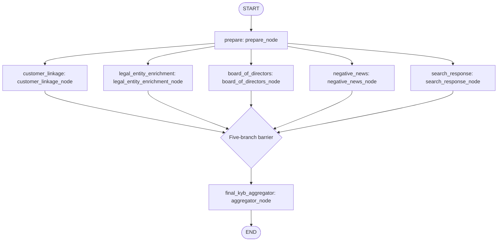

Barrier depicts real `builder.add_edge(list(_BRANCHES),'final_kyb_aggregator')`, not another registered node. `_BRANCHES` has five diagram names; `_STATE_KEYS` maps branch to `<branch>_branch`. GraphState has serialized request, run_id, five distinct branch dicts, final_result; no reducer needed for these separate keys.

Schemas defined locally: `KYBVerificationRequest` mirrors runner excluding run_id; company length1..300; lookback nullable int1..36500; defaults Corporate/US; lists/dict factories. Name validators stringify non-null, collapse whitespace, reject blank. List validators accept list/tuple or None→[], stringify/collapse members, reject blank. Punctuation-only names are allowed here (unlike news/search input).

`BranchStatus`/`KYBStatus`: completed|partial|failed. `KYBRiskLevel`: low|medium|high|critical|unknown. `KYBRecommendation`: approve|approve_with_monitoring|manual_review|reject.

`BranchEnvelope(branch:Literal[five names],status:BranchStatus,run_id:str,result:Any=None,error:str|None=None)`.

`FinalKYBAssessment(executive_summary:str,overall_risk:KYBRiskLevel,recommendation:KYBRecommendation,key_findings:list[str]=[],risk_factors:list[str]=[],conflicts:list[str]=[],data_gaps:list[str]=[])`.

`FinalKYBResult(company_name:str,status:KYBStatus,generated_at:datetime,branch_statuses:dict[str,BranchStatus],branch_results:dict[str,Any],assessment:FinalKYBAssessment,errors:list[str]=[])`.

Execution:
1. `prepare_node` validates `_request(state)`, returns {}. Five nodes run concurrently.
2. `_run_branch(state,branch,runner,*args,**kwargs)` computes `_child_run_id`: first28 master-ID characters rstrip('._-'), hyphenated branch, first8 SHA256 of `<run_id>:<branch>`, joined by hyphens. Child IDs deterministic/distinct; each child has own artifacts.
3. `customer_linkage_node` calls `run_company_check(parent_company or company_name, linkage_companies or [company_name],city=...,run_id=child)`. Missing parent/candidates means self-comparison, not parent discovery.
4. `legal_entity_enrichment_node` calls `run_enrichment(company_name,address=...,industry=...,run_id=child)`.
5. `board_of_directors_node` calls `run_board_research(company_name,cik=...,run_id=child)`.
6. `negative_news_node` calls `run_negative_news(company_name,segment=...,geography=...,identifiers=...,address=...,aliases=...,lookback_start=...,lookback_end=...,run_id=child)`. Supplied lookback gives end=date.today(), start=end−days; absent gives null dates. No company_id forwarded; separate cik is not copied to identifiers. Local calendar date contrasts UTC result timestamps.
7. `search_response_node` calls lazy local wrapper `run_search_response(company_name,query=...,run_id=child)` which imports local graphs/search_response.py. Helix-derived docstring is provenance, not remote Helix execution.
8. `_run_branch` catches child exceptions, status failed/result None/error text, logs master branch envelope; otherwise `_reported_status` maps child status. Returns serialized envelope under branch state key.
9. Explicit barrier; `aggregator_node` validates all five and serializes complete envelopes to aggregation prompt; `get_model('aggregation').with_structured_output(FinalKYBAssessment,include_raw=False).invoke(prompt)`.
10. Prompt forbids invented facts, distinguishes missing from negative evidence, preserves conflicts/gaps, suggests manual review for incomplete/inconsistent evidence. SearchResponse supplementary and cannot override SEC/GLEIF identity, filing board or validated events. These are model instructions, not deterministic risk policy.
11. Synthesis error creates `_fallback_assessment`: unknown risk/manual_review, aggregation failure data gap, preserves every raw result. Tool/token logging always attempted.
12. completed_count zero→overall failed even when partial data exists; otherwise incomplete branch/synthesis error→partial; all5 completed and synthesis success→completed.
13. Top-level errors are envelope exception strings + synthesis error; nested result errors are not automatically copied.
14. Save `kyb_verification.json` wrapper `{run_id,thread_id,kyb}`, final state/token/manifest. Completion `{run_id,thread_id,kyb:<JSON FinalKYBResult>,token_summary,output_dir}`.

`_reported_status`: result None→partial; non-dict→completed; inspect outer status overridden by board.status/negative_news.status/search_response.status. failed|failure|error→failed; partial|unresolved|not_found|incomplete→partial; known successes including no_verified_events→completed; unrecognized/absent status→completed (search no_results included via fallback). **Accounting:** master does not sum child usage; its token summary principally captures final aggregation, child summaries stay inside branch_results/artifacts.

### Customer linkage

File `src/touchstone/graphs/customer_linkage.py`.

```python
run_company_check(parent_company: str, companies: list[str], *,
                  city: str | None = None, run_id: str | None = None) -> dict
stream_company_check(parent_company: str, companies: list[str], *,
                     city: str | None = None,
                     run_id: str | None = None) -> Iterator[dict]
```

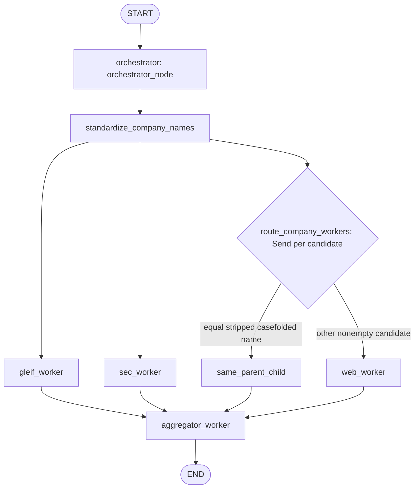

Router is conditional-edge function, not registered node. Worker→aggregator edges are independent edges, not KYB's explicit list barrier. Workers fan out at same graph stage.

State request/request_standard use Annotated `_keep_first(left,right):return left`; current_company/current_city/run_id; gleif_results/ sec_results list[str]; web_results `Annotated[list[FinalResponse],operator.add]`; assessments list[Assessment].

`orchestrator_node` no-op {}. `standardize_company_names` calls `standardize_request_names(parent,companies)`, preserves city, uses returned nonempty values or originals; exception re-raised after logs/usage (fatal). `route_company_workers`: parent strip/casefold; city defaults literal unknown city; skip falsey candidate; Send same_parent_child when equality else web_worker; payload request_standard/current_company/current_city/run_id.

`gleif_worker`→`get_all_children(parent)`, `sec_worker`→`get_subsidiaries(parent)`: outputs list under own state key; failure logs then []. `same_parent_child` constructs FinalResponse input `<company> is the same entity as <parent>`, relationship same_companies, answer `Parent and candidate resolve to the same company.`, empty queries/evidence, confidence1.0; logs identity_match; adds web_results; no model call. `web_worker` queries authoritative corporate ownership/franchise/managed-property/brand relationship for company/city/parent; `get_web_subsidiaries(query)` returns one web_results item; failure logs then [].

`aggregator_worker` uses settings.aggregator_batch_size, slices standardized candidates; selects web responses whose input_query or any final_answer contains any batch company case-insensitively. Slim payload input/relationship/answer/confidence/evidence; every batch includes full SEC/GLEIF lists. `_aggregator_prompt(parent,companies,gleif_results,sec_results,web_results)` mandates evidence-only, SEC/GLEIF absence as strong negative overridden by authoritative company-specific web evidence, explicit relationship proof (mention insufficient), no leakage, identical-name relation, only supportive confirmation_sources, no invented URLs, one assessment per candidate in order. Calls aggregation model structured AssessmentBatch, validates and extends returned list. Exceptions re-raise.

**Effective limits:** output count/order/source attribution are not verified in Python; relation_type is free text, not enum; substring matching may conflate overlapping names. Partial source failures can still produce completed manifest.

Save `assessments.json` `{run_id,parent_company,assessments}`; completion `{run_id,assessments:<JSON list>,token_summary,output_dir}`.

### Legal-entity enrichment

File `src/touchstone/graphs/legal_entity_enrichment.py`.

```python
run_enrichment(company_name: str, *, address: str | None = None,
               industry: str | None = None, run_id: str | None = None) -> dict
stream_enrichment(company_name: str, *, address: str | None = None,
                  industry: str | None = None,
                  run_id: str | None = None) -> Iterator[dict]
```

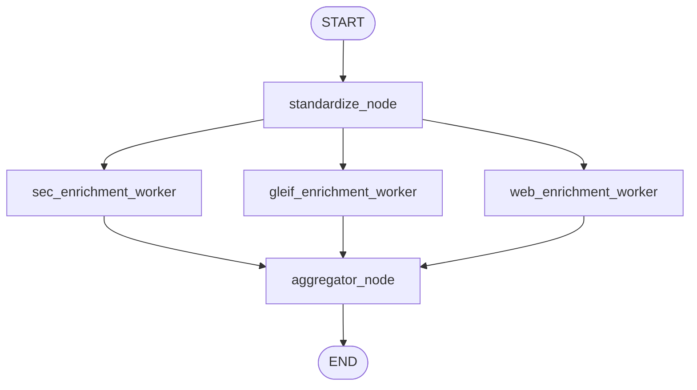

Separate worker→aggregator edges, no list-edge barrier. State request EnrichmentRequest/company_name_std/run_id/sec_result dict/gleif_result list[dict]/web_result dict/enrichment_result CompanyProfileResponse.

`standardize_node` calls standardize_request_names(name,[name]); returned parent or original; failure logged/usage retained and original name used (unlike linkage). Parallel `sec_enrichment_worker`→get_enrichment_attributes(company), `gleif_enrichment_worker`→get_legal_entities(company), `web_enrichment_worker`→get_enrichment_entities(company,address,industry). Failure respectively {} / [] / {} with logs; web model serializes mode=json.

`aggregator_node` formats AGGREGATOR_PROMPT with all results/hints; aggregation model structured CompanyProfileResponse. Priority SEC for US tax ID/industry/legal structure/legal name; GLEIF for legal name/registered address/incorporation country; web fallback. Supplied evidence only; source URL/snippet/confidence on populated fields; unavailable null; overall confidence <= least-confident populated field; hints may not override authoritative data. **Limits:** these are prompt rules, no cross-field enforcement; empty source results may still yield all-null profile and completed manifest. Aggregation exception re-raises.

Save `enrichment.json` `{run_id,company_name,address,industry,profile}`; completion `{run_id,enrichment:<JSON profile>,token_summary,output_dir}`.

### Board-of-directors

File `src/touchstone/graphs/board_of_directors.py`.

```python
run_board_research(company_name: str, *, cik: str | None = None,
                   run_id: str | None = None) -> dict
```

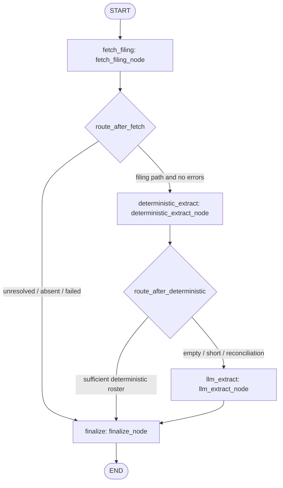

State request BoardResearchRequest/run_id/filing_reference FilingReference/filing_path/cik_resolution_status/deterministic_names/deterministic_branch/expected_count/requires_llm_reconciliation/llm_names/llm_used/board_result; warnings and errors are additive list reducers.

1. `fetch_filing_node` calls `get_latest_filing(request.name,cik=request.cik)` (tool default form DEF 14A). Status provided when explicit cik truthy else resolved. None document→no-DEF-14A warning. Document→SHA256 UTF8 HTML, UTC retrieval timestamp, validate FilingReference, save_source_document('proxy-statement.html',html), local path/reference in state. HTML itself not retained in state.
2. `CIKResolutionError` maps missing/ambiguous to resolution status and warning, no errors; generic exception→SEC filing retrieval failed error. Always tool log get_latest_filing.
3. `route_after_fetch`: path and no errors→deterministic_extract else finalize.
4. `_load_filing_text`: Path.read_text(UTF8)→html_to_text. `deterministic_extract_node`→extract_deterministic(full_text,company), store names/branch/count/reconciliation. Exception→empty list, branch exception, error then fallback.
5. `route_after_deterministic`: no names, requires reconciliation, or len(names)<expected→llm_extract; else finalize.
6. `llm_extract_node`: extract_llm_context(full_text); research model with structured DirectorNamesResponse; prompt current directors/current nominees in supplied text, no former directors/non-director executives/committees. sanitize_director_names(...); only names where extract_name_evidence(full_text,name) returns evidence. Empty gives warning; failure gives LLM fallback failed error; llm_used true. Tool log and usage attempted. Unlike most nodes usage assignment follows successful invoke, so a failed call may lose callback usage.
7. `_merge_names`: NFKD/casefold/alnum `_name_key`; high-confidence deterministic branches proxy_voting_card/intro_nominee_list/summary_table retain names. For other branches with nonempty LLM result, retain deterministic names only if matching LLM key, then merge LLM names and method labels. Empty/failed LLM does not remove deterministic names.
8. `finalize_node` status table below; reload full text (failure warning); extract per-name evidence with allow_section_context true if any non-LLM method; DirectorRecord status nominee for proxy_voting_card/intro_nominee_list/summary_table/toc_nominee_roster else unknown (never current); dedupe warnings/errors in order.

| Status decision order | Result |
|---|---|
| missing/ambiguous CIK | unresolved, requires_explicit_cik true |
| errors and no filing | failed |
| no filing without errors | not_found |
| filing with no names | failed; add no-reliable-roster error if no prior error |
| fewer names than expected, reconciliation required, or names but no expected count | failed if errors else partial; completeness warnings |
| otherwise | completed |

Classified-board reconciliation flag never cleared merely because LLM adds names, so remains partial/failed. Count-unknown names remain partial. The final else assigns completed without a further errors check; the normal current graph error routes generally also satisfy a preceding failure/incompleteness condition. Extraction_method deterministic_with_llm_fallback if fallback used and deterministic names existed; llm_fallback if only fallback; deterministic with directors/no fallback; none otherwise.

Save `board_of_directors.json` `{run_id,thread_id,board}`, source HTML/final state/token/manifest; return `{run_id,thread_id,board:<JSON result>,token_summary,output_dir}`. Computed director_count included. Business failures normally structured, infrastructure errors may raise.

### Negative news

File `src/touchstone/graphs/negative_news.py`.

```python
run_negative_news(company_name: str, *, segment: CompanySegment | str,
    geography: ScreeningGeography | str, company_id: str | None = None,
    identifiers: dict[str,str] | None = None, address: str | None = None,
    aliases: list[str] | None = None, lookback_start: date | None = None,
    lookback_end: date | None = None, run_id: str | None = None) -> dict
```

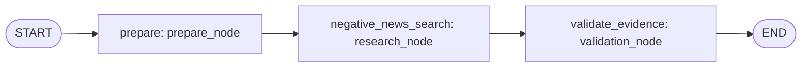

State serialized request/run_id/lookback dates/source_plan list[dict[str,str]]/research_draft/result, additive errors. `prepare_node` calls resolve_lookback(request), build_source_plan(request); preparation failure propagates to runner. `research_node` calls search_negative_news(request,lookback_start=...,lookback_end=...,source_plan=...) under callback; success draft JSON; failure errors Web research failed; finally logs negative_news_search/hosted_web_search with request/plan/output/error/tokens.

`validation_node` calls validate_negative_news(request,NegativeNewsResearchDraft.model_validate(draft)). Absent draft→_failed_result; validation exception→failed result with appended error. Failed result carries company/segment/geography/prepared dates/UTC screened_at/errors. Always logs tool deterministic_evidence_validation, candidate_count and output at log node negative_news_validation (registered graph node is validate_evidence). Tool owns deterministic trust/identity/event rules; graph must preserve this post-LLM validation stage.

Save negative_news.json wrapper `{run_id,thread_id,negative_news}`; result completed/no_verified_events maps manifest completed; other statuses preserved. Return `{run_id,thread_id,negative_news:<JSON result>,token_summary,output_dir}`. Draft provider telemetry must remain code-owned; tool overwrites model supplied route/citation observations.

### General SearchResponse

File `src/touchstone/graphs/search_response.py`.

```python
run_search_response(company_name: str, *, query: str | None = None,
                    run_id: str | None = None) -> dict
```

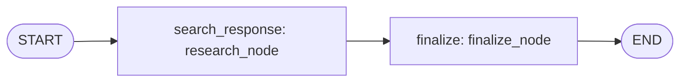

State serialized request/run_id/research_draft/result/additive errors. research_node calls search_company_web(request) under usage callback, saves draft JSON or Web search failed error; logs hosted_web_search. finalize_node: absent/invalid draft→failed result; both answer/evidence→completed; either→partial with warning (answer-only explicitly unverified; evidence-only no concise answer); neither→no_results. Query defaults literal `General current public company research`; searched_at UTC. Copies answer/queries/evidence/confidence/limitations. Evidence-vs-observed-citation checking is in tool, not graph.

Save search_response.json `{run_id,thread_id,search_response}`; completed/no_results maps manifest completed; return `{run_id,thread_id,search_response:<JSON result>,token_summary,output_dir}`.

### Pydantic schemas in models.py

All in `src/touchstone/models.py`; BaseModel subclasses, no custom global strict/extra config. List/dict defaults use factories; typed dates/timestamps serialize ISO via model_dump(mode=json), enums serialize values, computed counts included. Unmentioned constraints are standard annotated-type validation only.

#### Linkage/enrichment

| Model | Fields and validation |
|---|---|
| CompanyCheckRequest | Required parent_company:str, companies:list[str]; city:str\|null=None. No blank/count validator. |
| CompanyCheckRequestStandard | Same as request. |
| Assessment | Required company_name:str,is_related:bool,relation_type:str,confidence_score:float[0,1]; confirmation_sources/evidence/evidence_summary:list[str]=[]; evidence_urls:list[AnyUrl]=[]. |
| AssessmentBatch | Required assessments:list[Assessment], no count/order validation. |
| StandardizedNames | parent_company:str\|null=None, companies:list[str]\|null=None. |
| SearchResponse | Required generated_query:str; title/url/publisher/article_date/snippet nullable strings. After validator truncates title500/publisher200/snippet1000 (first997+ellipsis); URL tracking/fragment normalization, no HTTP type validation. |
| FinalResponse | Required input_query:str; relationship_type:RelationshipType\|null, final_answer:list[str]\|null, generated_queries:list[str]\|null,evidence:list[SearchResponse]\|null,confidence:float[0,1]\|null; all default null. |
| SourcedField | value:str\|dict[str,str]\|null, source_url:list[str]\|null,snippet:str\|null,confidence:float[0,1]\|null; all null defaults. |
| CompanyProfileResponse | legal_name,dba_name,tax_id,legal_structure,industry_codes,business_address,revenue,country_of_incorporation:SourcedField\|null; confidence:float[0,1]\|null; all null. |
| EnrichmentRequest | Required name:str; address/industry nullable strings. |

RelationshipType exact values: subsidiary, franchisee, brand_affiliate, not_related, others, not_applicable, same_companies. Important difference: Assessment.relation_type is unconstrained str, whereas FinalResponse.relationship_type is this enum.

#### Board

| Model | Fields |
|---|---|
| BoardResearchRequest | Required name:str; cik:str\|null=None. |
| DirectorRecord | Required name:str; status:DirectorStatus=unknown; evidence:list[str]=[],extraction_methods:list[str]=[]. |
| FilingReference | Required cik,form,accession_number,filing_date,primary_document,url strings; retrieved_at/content_sha256 nullable strings. |
| BoardResearchResult | Required company_name:str,status:BoardResearchStatus; cik_resolution_status:BoardCIKResolutionStatus\|null; requires_explicit_cik=False; filing:FilingReference\|null; directors:list[DirectorRecord]=[]; extraction_method/extraction_branch nullable strings; nominee_count_hint:int\|null; warnings/errors:list[str]=[]; computed director_count=len(directors). |
| DirectorNamesResponse | Required directors:list[str]. |

DirectorStatus=current|nominee|unknown. BoardResearchStatus=completed|partial|unresolved|not_found|failed. BoardCIKResolutionStatus=provided|resolved|missing|ambiguous.

#### Negative news

Enum values (case-sensitive):
- CompanySegment: Corporate, SMB. ScreeningGeography: US, UK.
- NegativeNewsStatus: completed,no_verified_events,partial,unresolved,failed.
- NegativeNewsSeverity: Critical,High,Medium,Low.
- NegativeNewsEventCategory: Owner, director, or board resignation; Merger, acquisition, demerger, or change of control; Insolvency or financial distress; Dissolution, closure, or strike-off; Financial reporting red flags; Sanctions or debarment; Litigation; Regulatory enforcement; Product safety; Data breach or cyber incident; Layoffs or site closures; Reputation.
- NegativeNewsSourceKind: official,regulator,registry,court,government,company,reputable_media,discovery_only,other.
- NegativeNewsSubjectType: company,person.
- SourceCoverageStatus: searched,no_match,unavailable,key_gated,licensed,web_only,not_applicable.

| Model | Required fields | Optional/default fields |
|---|---|---|
| NegativeNewsRequest | company_name:str length1..300, segment enum, geography enum | company_id:str\|null, identifiers:dict[str,str]={},address:str\|null,aliases:list[str]=[],lookback_start/end:date\|null |
| NegativeNewsSource | source_name:str length1..300,source_url:AnyHttpUrl,kind enum | source_record_id:str\|null max300,published_date:date\|null,snippet:str\|null,directly_matches_entity=False,supports_event=True |
| NegativeNewsResolvedCompany | requested_name:str,legal_name:str,match_confidence:float[0,1] | identifiers{},aliases[],jurisdiction/address nullable str,identity_sources:list[NegativeNewsSource]=[] |
| NegativeNewsCandidate | company_name:str,event_category enum,event_type:str,severity enum,summary:str,match_confidence:float[0,1] | event_date:date\|null,active_or_unresolved=False,subject_type=company,relationship_evidence:str\|null,relationship_at_event_verified=False,sources:list[NegativeNewsSource]=[] |
| NegativeNewsUnverifiedCandidate | candidate,why_it_may_be_relevant,why_it_is_not_verified,next_verification_step strings | source_url:AnyHttpUrl\|null |
| NegativeNewsSourceCoverage | event_category enum,source:str,status enum,query_scope:str,result:str | limitation_or_gap:str\|null |
| NegativeNewsRouteTelemetry | event_category enum,source:str min1,query:str min1 | succeeded=True,error:str\|null; code-owned observed provider search call |
| NegativeNewsCitationTelemetry | source_url:AnyHttpUrl | title/snippet nullable str; code-owned provider message metadata |
| NegativeNewsResearchDraft | None | resolved_company nullable; generated_queries[],candidates[],unverified_candidates[],source_coverage[],verification_notes[],limitations[],observed_source_urls:list[AnyHttpUrl]=[],provider_route_telemetry[],provider_citation_telemetry[] |
| NegativeNewsEvent | company_name:str,segment enum,event_category enum,event_type:str,detected_at:datetime,severity enum,summary:str,source_name:str,source_url:AnyHttpUrl,match_confidence:float[0,1] | company_id:str\|null,event_date:date\|null,source_record_id:str\|null |
| NegativeNewsResult | company_name:str,segment enum,geography enum,lookback_start/end:date,screened_at:datetime,status enum | resolved_company nullable,verified_events[],unverified_candidates[],source_coverage[],generated_queries[],verification_notes[],warnings[],errors[]; computed event_count=len(verified_events) |

News request validators: company and aliases require actual strings, collapse whitespace, require at least one letter/number using Unicode-aware name key. aliases list/tuple or null→[], reject other types. identifiers dict/null; stringify/strip keys and values; reject blank names/values. start>end rejected. Resolved company normalizes requested/legal names and aliases; candidate normalizes company. HTTP URL fields normalize fragments/tracking before validating. Optional unverified URL empty string→null. Source trust/provenance is not enforced by schemas, but deterministic validation tool.

#### General web search

| Model | Contract |
|---|---|
| CompanyWebSearchRequest | company_name required length1..300 with entity normalization; query nullable string max1000, must actual string, collapse whitespace, blank→null. |
| CompanyWebEvidence | generated_query required length1..1000,source_url required AnyHttpUrl; optional title max500,publisher max200,article_date max100,snippet max1000; normalize URL. |
| CompanyWebSearchDraft | answer:list[str]=[] max5,generated_queries:list[str]=[] max8,evidence:list[CompanyWebEvidence]=[],confidence nullable[0,1],limitations[],observed_source_urls:list[AnyHttpUrl]=[]. |
| CompanyWebSearchResult | Required company_name:str,query:str,searched_at:datetime,status; answer[],generated_queries[],evidence[],confidence nullable[0,1],limitations[],warnings[],errors[]; computed evidence_count. |

CompanyWebSearchStatus=completed|partial|no_results|failed.

#### Utility functions

`_normalize_url(url:str)->str`: urlparse; absent scheme/netloc→original; remove query keys starting utm_ case-insensitively and fragment; preserve/reencode other query; exceptions→original. This is not comprehensive URL canonicalization or a scheme/trust check.

`public_company_identifiers(identifiers:dict[str,str])->dict[str,str]`: normalize key by casefold/nonalnum removal; keep keys cik,lei,companynumber,companieshousenumber,registrationnumber,crn,ticker,stockticker,domain,website,officialwebsite,url. Preserve original keys/values. Non-allowlisted identifiers should not go into public search prompts; generic serialization does not redact them automatically.

`_entity_name_key`: NFKD/casefold/alphanumeric filtering/removes combining marks. `_normalize_entity_name(value,field_name)` requires string, collapses whitespace, rejects empty/no-alphanumeric name. `_normalize_aliases` checks list/tuple, delegates each member.

`to_jsonable(value:Any)->Any`: BaseModel→model_dump(mode=json); Enum→value; dict→string keys+recursive; list/tuple/set→recursive list; AnyUrl→str; otherwise unchanged. Standalone datetime/date/Path/bytes are not converted. Batch `_json_safe` is broader and not interchangeable.

### Sequential enrichment batch

File `src/touchstone/services/enrichment_batch.py`; exports BatchValidationError,normalize_enrichment_rows,run_enrichment_batch from services/__init__.py. No active console caller found; preserve backend API without inventing current batch UI.

```python
normalize_enrichment_rows(
    rows: Iterable[Mapping[str,Any]] | None,
    max_rows: int = DEFAULT_MAX_BATCH_SIZE,  # 20
) -> dict[str,list[dict[str,Any]]]
run_enrichment_batch(
    rows: Iterable[Mapping[str,Any]] | None, *,
    run_fn: Callable[...,Any] | None = None,
    max_rows: int = DEFAULT_MAX_BATCH_SIZE,
) -> dict[str,Any]
```

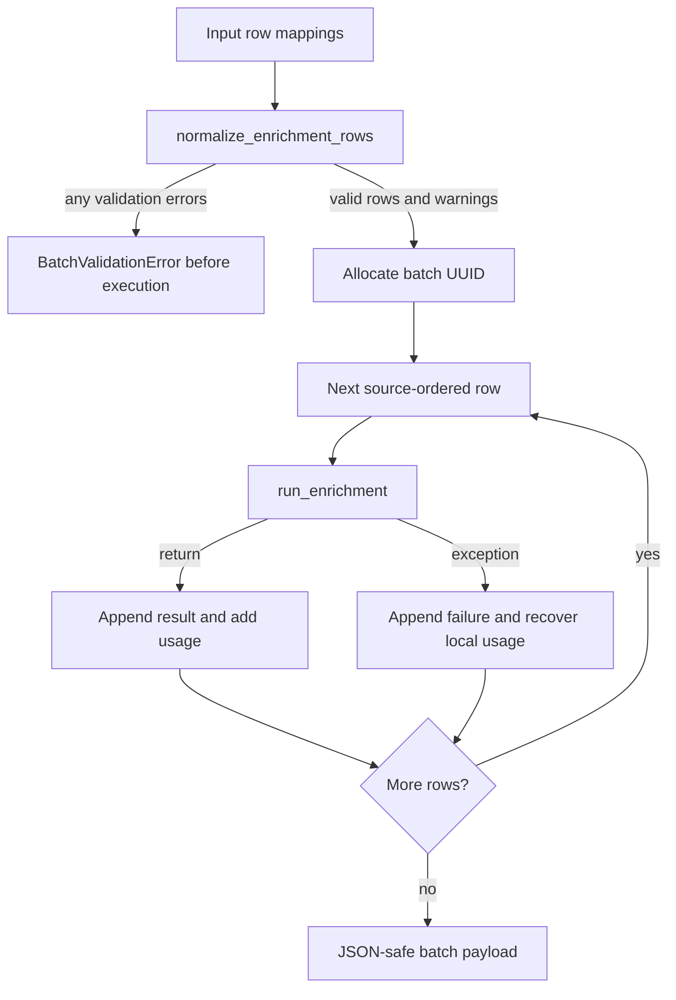

Normalization:
1. max_rows positive int, rejects bool. rows None→[]; a single Mapping raises TypeError (requires iterable mappings).
2. `_canonical_keys` stringify/strip/lowercase, hyphen/space→underscore. Company field first present key among company_name/name/company; industry first present industry/industry_hint; address only address. `_first_value` uses key presence, so null company_name does not fall through to populated name.
3. `_normalize_text`: null or float NaN→null; otherwise str/whitespace collapse; blank→null.
4. Fully blank rows ignored. Nonmapping→invalid_row; nonblank hints without name→missing_company_name; number of normalized nonblank rows>cap→batch_too_large. Collect all validation errors, then raise before any runner executes.
5. Normalized row `{row_number:<1-based original position>,company_name,address,industry}` retains original index across removed blanks.
6. Duplicate casefolded normalized names retained as independent rows and warning includes row_numbers. No dedup.

`BatchValidationError(ValueError)` holds errors list, semicolon-joined message; to_dict returns `{error:'batch_validation_failed',details:errors}`.

Execution runner is provided run_fn or `_default_run_enrichment`, which lazy-imports graphs.legal_entity_enrichment.run_enrichment (validation/unit tests need not import model stack). Batch UUID; each normalized row gets `<batch_uuid>-<position:03d>`. Runs sequentially with name positional and address/industry/run_id kwargs. Every non-raising result is marked completed regardless nested status. Success record: row input/run_id/status completed/token_summary/result `_json_safe(raw_result)`. Failure catches Exception and continues: row input/run_id/status failed/error_type/error/token_summary/output_dir.

`TOKEN_FIELDS=('input_tokens','output_tokens','total_tokens','calls')`. `_token_count` int-coerces, negatives→0, invalid/overflow→0. `_normalized_token_summary` reads Mapping result.token_summary else zeros. `_failed_run_details` checks `<output_dir>/runs/<run_id>/token_summary.json`, reads any persisted counts and run path; missing summary→zeros+existing dir path; any read exception→zeros/null. Batch sums successes and recovered failed-run counts.

Status successes+failures→completed_with_errors; failures-only→failed; no failures including empty→completed. Final `{batch_id,status,results,failures,token_summary,warnings}` is checked by json.dumps(allow_nan=False).

`_json_safe` handles primitives; finite float else null; enums; datetime/date ISO; Path/UUID str; bytes UTF8 replacement; Pydantic models; dataclasses; mappings string keys; list/tuple recursively; sets/frozensets sorted by str; unknown→str. Batch payload is returned, no service-level batch artifact file/queue/scheduler/retry policy.

## 6. Source clients, Python business logic, data and storage

### Integration boundary

These modules contain no Airflow, Dataproc, Spark, GCS, BigQuery or Pub/Sub operations. Actual integrations: direct public HTTPS to SEC, GLEIF and DuckDuckGo, plus LangChain agents backed by `get_model(...)`. Regulators/courts/sanctions services named in the negative-news matrix are research instructions/search routes, not implemented dedicated API clients.

`http.py:get_source_session()` caches one `requests.Session` per thread via `threading.local()` and hard-sets `trust_env=False` (environment proxy/netrc ignored). `clear_source_session_cache()` closes/deletes the current thread's cached session. No retry adapter, backoff, rate limiter, response cache, or application-level retry loop exists in examined clients. Every HTTP helper calls `raise_for_status()`; caller-specific catches decide results.

| Integration | Exact endpoint/contract | Timeout |
|---|---|---|
| DuckDuckGo | GET `https://html.duckduckgo.com/html/`, `q=query`, `User-Agent: Touchstone/0.1` | 20s |
| SEC submissions | GET `https://data.sec.gov/submissions/CIK{10_digit_cik}.json` | 60s |
| SEC XBRL facts | GET `https://data.sec.gov/api/xbrl/companyfacts/CIK{10_digit_cik}.json` | 60s |
| SEC archive | GET `https://www.sec.gov/Archives/edgar/data/{integer_cik}/{accession_without_hyphens}/index.json` and selected document | 60s |
| GLEIF lookup | GET `https://api.gleif.org/api/v1/lei-records`, `filter[entity.legalName]=company_name`, `page[size]=10` | 45s |
| GLEIF children | GET `.../lei-records/{lei}/direct-children` and `/ultimate-children`, `page[number]=1`, `page[size]=100` | 45s |

SEC `_headers()` strips `get_settings().sec_user_agent`; empty value raises `RuntimeError("SEC_USER_AGENT must identify the application and a monitored contact")`. Use placeholder `SEC_USER_AGENT="Touchstone <MONITORED_CONTACT>"`. No API-key headers in SEC/GLEIF clients.

### `tools/company_name_standardizer.py`

`standardize_request_names(parent_company:str,companies:list[str])->StandardizedNames` is used by customer-linkage and legal-enrichment graphs. Removes non-string candidate entries. Empty parent returns empty parent and filtered candidate strings, with no cleanup/model call. Otherwise invokes `get_model("standardization").with_structured_output(StandardizedNames, include_raw=False)` on `_prompt`; prompt requires safe legal/business canonicalization, correcting spacing/punctuation/casing/abbreviations/OCR-like artifacts, preserving legal suffixes, count/order, no invention/deduplication. Accepts schema or model-validates dict. Blank returned parent falls back to `_clean(parent)`; empty/wrong-length candidate list replaces entire list with cleaned original list. `_clean` strips, collapses whitespace and uppercases. Catch-all warning and basic-cleanup fallback on model/validation errors. Same-length model output is accepted without independent identity validation.

### `tools/web_search.py`

`@tool search_web(query:str,max_results:int=5)->str`: fetch DuckDuckGo results, BeautifulSoup `.result`, `.result__a` with href, `.result__snippet`; output JSON string of `{title,url,snippet}`, Unicode preserved. `_result_url` unwraps `uddg` query parameter and URL-decodes. Clamp result limit 1–10. Only the results page is fetched; there is no local arbitrary-page-opening tool. HTTP failures propagate.

`extract_search_tool_results(agent_result:Any)->list[dict[str,str]]`: only dict `messages`; convert Pydantic message via `model_dump(mode="json")`; trust only message `type=tool`, `name=search_web` (casefolded) whose string `content` parses as JSON list. Only dict items with HTTP(S) URLs; dedupe exact URL in encounter order. Assistant/user prose URLs do not qualify.

`_agents()` is `lru_cache(maxsize=1)`, builds all three with `get_model("research")`, `[search_web]`:

| Agent | Schema | Prompt contract |
|---|---|---|
| `RelationshipSearchAgent` | `FinalResponse` | ≤5 queries, ≤3 results/query, ≤4 evidence records unique domains, ≤3 answer bullets, stop on authoritative evidence |
| `RelationshipSearchAgentDeep` | `FinalResponse` | Same with ≤2 queries and ≤2 results/query |
| `CompanyProfileAgent` | `CompanyProfileResponse` | Legal name/DBA/tax ID/legal structure/industry codes/address/revenue/incorporation country; source URLs, snippet and confidence per populated field; unavailable null |

Relationship priority: official company, government/regulatory/registry/franchise filings, Reuters/Bloomberg/AP/BusinessWire, other secondary. Co-mention does not establish affiliation. Limits above are prompt-only, not hard agent-loop controls. Parsers accept schema or unwrap `structured_response` then Pydantic validate. `refresh_agents()` clears agent and model caches.

`get_web_subsidiaries(query)->FinalResponse` invokes ordinary relationship agent, replaces result with deep-agent response if relationship `others`/`not_applicable` or non-null confidence <0.62. Null confidence otherwise does not trigger deep pass. Invocation/parsing errors log traceback and return `not_applicable`, confidence 0, answer `Web search failed during this run.` `_agents()` construction occurs before try, so its failures propagate. Customer-linkage web workers call it.

`get_enrichment_entities(company_name,location=None,industry=None)->CompanyProfileResponse`: `_build_profile_query` adds UTC date, company, optional hints explicitly non-authoritative and subordinate to SEC/registry/company evidence. Invocation errors log and re-raise for graph observability; agent construction before try. Legal-enrichment web worker calls it.

### `tools/sec.py`

Frozen `FilingDocument(reference:dict[str,str],html:str)`. `CIKResolutionError(LookupError)` retains company/status/candidates and distinguishes missing versus ambiguous; asks for explicit CIK.

`_normalize_cik`: strip, require digits and ≤10 chars, zero-pad to 10, else ValueError. `_submission(company,*,cik=None,require_unique_cik=False)`: explicit CIK bypasses local lookup; otherwise `resolve_cik`. Unresolved logs status then strict raises `CIKResolutionError`, non-strict returns `(None,None)`. Success returns `(cik,submissions_json)`.

`get_latest_filing(company,form="DEF 14A",*,cik=None)->FilingDocument|None`: strict lookup; `_latest_filing` scans `filings.recent` parallel arrays for exact form (not amendments), skips malformed metadata, takes greatest filing-date string. Does not traverse older `filings.files` archives. No exact filing -> None; CIK/network errors propagate. URL uses integer CIK/hyphen-free accession/primary document. Reference keys: cik, form, accession_number, filing_date, primary_document, url. Board graph fetch node calls this.

`get_subsidiaries(company)->list[str]`: non-strict submission lookup, latest exact 10-K, archive index; first filename containing case-insensitive marker `ex21`, `ex-21`, `exhibit211`, `exhibit21`, `exx21`. Parse Exhibit21 tables: first nonempty cell of every row; normalize whitespace. Only if no table names found, scan text lines containing word Inc/Ltd/LLC/Corp/Company/PLC/LLP. Remove exact casefolded header name/entity/subsidiary/subsidiaries; dedupe preserving order. Missing lookup/filing/exhibit -> []; every exception logs traceback and returns [], hiding outage vs absence from graph. Customer-linkage SEC worker calls it.

`get_enrichment_attributes(company)->dict`: non-strict submissions -> cik,sic,sicDescription,ein,legalName,stateOfIncorporation,businessAddress,mailingAddress; addresses join all truthy dict values in insertion order. Fetch XBRL facts -> revenue. `_latest_revenue` scans `facts.us-gaap` concepts RevenueFromContractWithCustomerExcludingAssessedTax and Revenues, all units, rows form=10-K and val non-null; max filed string. Renders `{unit} {val} reported on {filed} for FY{fy}`; does not ensure annual duration or independently resolve competing concepts. Null fields removed. Any exception -> log and {} (including facts failure discarding existing submission fields). Legal-enrichment SEC worker calls it.

### `tools/gleif.py`

`_lookup_records(company_name)` empty -> [], else first page `data`, no exact-match filter/pagination. `get_all_children(company)->list[str]`: remove commas, collapse multiple periods, trim; for up to10 matching records, query direct and ultimate children first100 each, extract `attributes.entity.legalName.name`, order-preserving dedupe. Each child-route exception warning-caught; initial lookup failure propagates. Customer-linkage GLEIF worker.

`get_legal_entities(company_name)->list[dict]`: first five lookup records -> lei,legalName,legalAddress,headquartersAddress. `_format_address` joins addressLines then addressNumber,addressNumberWithinBuilding,city,region,country,postalCode, ignoring false values; missing -> None. API errors propagate. Legal-enrichment GLEIF worker.

### `tools/search_response.py`

Cached `_search_response_agent`: `create_agent(get_model("research"),tools=[search_web],response_format=CompanyWebSearchDraft,name="SearchResponseAgent",system_prompt=SEARCH_RESPONSE_PROMPT)`. Prompt ≤5 searches, ≤5 bullets, ≤4 unique-domain evidence, identity resolution, official evidence first, supported factual answers, explicitly general research rather than specialist adverse screening. Refresh clears agent/model caches.

`build_search_response_query(request:CompanyWebSearchRequest)->str`: UTC date, company, supplied question or default official presence/operations/ownership/material-facts research, company-name identity constraint.

`search_company_web(request)->CompanyWebSearchDraft`: invoke with `{"messages":prompt}`, unwrap structured response. `_provider_citations` starts with actual search tool outputs and recursively visits provider messages; only citation/search-result typed blocks or descendants under annotations/citations/search_results keys count. Extract URL plus title/name and snippet/description. `_canonical_url` removes trailing punctuation, fragments, utm_* query params. `_provider_queries` walks search-related type/name/function descriptors and query/search_query fields, dedupes preserving order. Overwrite draft generated_queries with provider queries if any, otherwise retain draft list; overwrite observed_source_urls with sorted actual citation URLs.

`_verified_evidence`: retain draft evidence only if canonical URL observed, one per exact lowercased netloc, max4; retain model text while fill missing title/snippet from telemetry. Fill remaining slots with unused observed URLs, using first provider query or fallback question/prompt. Thus URL observation is code-owned; factual answer entailment and existing evidence snippets are not independently verified. All failures propagate to graph, no local retry.

### `tools/negative_news_search.py` and prompts

Cached `NegativeNewsAgent`: research model, only `[search_web]`, `NegativeNewsResearchDraft`, runtime `load_negative_news_prompt(settings.root_dir)`. Refresh clears agent/model caches.

`build_negative_news_query(request,*,lookback_start:date,lookback_end:date,source_plan:list[dict[str,str]])`: JSONable request minus internal company_id; identifiers restricted by `public_company_identifiers`; ISO dates; each required source row adds `route_id=NNR-001`, etc. Ask one search/row with ID verbatim. Prompt instruction, not scheduler.

`search_negative_news(...)->NegativeNewsResearchDraft`: single invoke, schema validate, then overwrite observed_source_urls/provider_citation_telemetry/provider_route_telemetry from provider messages. Citation normalization/trust extraction same principles as general research. `_provider_search_queries` returns sorted set. `_route_telemetry`: requires exactly one distinct NNR-three-digit tag in a query, maps valid 1-based index to plan, keeps one query/route; invalid/no/multiple tags ignored. Telemetry object's schema success default is used: observing a query confirms attempted route, not result correctness. Model/transport errors propagate.

`prompts/negative_news.py:load_negative_news_prompt(root_dir:Path|None=None)->str`: use nonempty `(root_dir or cwd)/.agent/prompt/fetch-verified-negative-news.prompt.md`, strip leading YAML front matter by first two --- separators, append `_STRUCTURED_ADAPTER`; else packaged DEFAULT_NEGATIVE_NEWS_PROMPT+adapter. Preserve override for source deployments; wheel fallback is shorter. Adapter explicitly supersedes authored Markdown sections: output only NegativeNewsResearchDraft, claims not final events, resolution/queries/candidates/unverified/coverage/notes/limitations; leave observed URLs empty for code wrapper. Override is149 lines: inputs, verification standards, full US/UK Corporate/SMB matrix, severity, procedures, event schema and Markdown output. Frontmatter tools:[web] is not LangChain tool registration.

**Confirmed gap:** authored/fallback prompts require opening underlying records and prohibit snippet-only evidence, but local toolset has only DuckDuckGo results search. Validator checks provider title/snippet context. An arbitrary-page fetcher would be an enhancement, not existing functionality.

### `tools/negative_news_validation.py`

Public pure functions: `build_source_plan(request:NegativeNewsRequest)->list[dict[str,str]]`; `resolve_lookback(request,today:date|None=None)->tuple[date,date]`; `validate_negative_news(request,draft,*,screened_at:datetime|None=None)->NegativeNewsResult`. Called by negative-news graph planning/validation nodes. No I/O/model/retry.

#### Exact source-route matrix

Each cell split only at `; ` into separate `{event_category: enum.value, source: text}` plan rows, category insertion order. Enum identifiers shown below; source strings exact. These are web-query plans, not dedicated API clients.

| Category | US Corporate | US SMB | UK Corporate | UK SMB |
|---|---|---|---|---|
| board_resignation | SEC EDGAR 8-K item 5.02 | State annual reports; OpenCorporates secondary; Public-data gap | Companies House officers | Companies House officers |
| change_of_control | SEC items 5.01/2.01; SEC Form 425; SEC Schedule 13D; GLEIF | State merger filings; GDELT discovery; Weak-coverage gap | Companies House PSC; GLEIF; The Gazette | Companies House PSC |
| insolvency | SEC items 1.03/2.04; SEC NT filings; CourtListener | CourtListener bankruptcy; Liens/UCC coverage gap | The Gazette; Companies House insolvency; Companies House charges | The Gazette; Companies House charges; Insolvency Register |
| dissolution | SEC Form 15; SEC item 3.01; GLEIF | State status; OpenCorporates; City licence data | Companies House status; Gazette | Companies House status; Gazette |
| financial_reporting | SEC items 4.01/4.02; SEC NT 10-K/10-Q | Limited-public-coverage gap | Companies House overdue accounts | Companies House overdue accounts; Companies House confirmation statements |
| sanctions | US CSL; OFAC; SAM.gov; OpenSanctions | US CSL; SAM.gov; OpenSanctions | UK Sanctions List; OpenSanctions; Companies House disqualified directors | UK Sanctions List; Companies House disqualified directors |
| litigation | CourtListener; Regulator releases | CourtListener federal; State-court coverage gap | The Gazette winding-up petitions; Other-civil-claims gap | The Gazette petitions; County-court-judgment gap |
| regulatory_enforcement | SEC; DOJ; FTC; EPA ECHO; DOL; Federal Register | DOL; EPA ECHO; City open data | FCA Register; FCA releases | FCA Register; Food hygiene ratings |
| product_safety | openFDA; CPSC; NHTSA | openFDA; CPSC | UK government recall notices; GDELT discovery | GDELT discovery |
| cyber_incident | SEC item 1.05; HHS; State AG notices | HHS; State AG notices | GDELT discovery; primary verification | GDELT discovery; primary verification |
| layoffs | SEC item 2.05; State WARN notices | State WARN notices | GDELT discovery; company/government verification | GDELT discovery; company/government verification |
| reputation | GDELT; CFPB; Google Alerts discovery | GDELT; CFPB; City 311; Google Alerts discovery | GDELT; Google Alerts discovery | GDELT; Food hygiene ratings; Google Alerts discovery |

#### Deterministic business rules

1. Screening defaults UTC now; end=requested end or screening date, capped at screening date. Start defaults end minus5 calendar years; leap-day failure -> Feb28. Explicit start>end raises ValueError.
2. `_coverage_state` rebuilds plan, trusts successful `provider_route_telemetry` exact category/source, emits searched with query or unavailable/no provider search-call telemetry. Draft self-declared coverage does not affect completion. Missing count warning and partial flag; preserve/dedupe draft limitations.
3. Observed URL keys strip trailing slash. Citation context grouped from provider title/snippet. No URLs or missing citation text adds warnings.
4. Strong entity resolution needs resolved object, confidence≥0.70, and a direct-matching identity source that is public, observed, trusted host and whose title/snippet contains normalized requested/resolved name/alias/public ID (at least3 chars). Supplied public identifiers additionally require at least one exact case-insensitive `(key,value)` pair in resolved identifiers. Otherwise unresolved result preserves draft unverified/coverage/queries/notes, emits no draft candidate events.
5. `_name_key`: NFKD+casefold, keep Unicode alphanumeric excluding combining marks; does not erase non-Latin names.
6. Public sources reject username/password URLs, localhost/127.0.0.1, .local/.internal names and literal IPs private/loopback/reserved. No DNS resolution; pure filtering.
7. Identity trusted hosts: .gov, gov.uk/.gov.uk, request public ID domains with key containing domain/website/url; courtlistener.com,fca.org.uk,gleif.org,thegazette.co.uk, and subdomains. Event trusted hosts same minus gleif.org. Reputable media: apnews.com,bbc.com,bloomberg.com,cnbc.com,cnn.com,ft.com,nytimes.com,reuters.com,theguardian.com,wsj.com, subdomains. Arbitrary source_kind declarations do not establish trust.
8. Candidate company_name must exact normalized match resolved/requested name/alias and confidence≥0.70. Person events additionally need relationship_at_event_verified and nonblank relationship_evidence (model-supplied text, not independently downloaded by validator).
9. Future dates reject. Older than start allowed only active_or_unresolved insolvency/dissolution/sanctions/regulatory_enforcement. Undated requires same active-category exception plus authoritative event source.
10. Supporting sources claim directly_matches_entity and supports_event, be public and observed, provider citation text must match identity and category phrase. One trusted official source suffices; media needs≥2 independent domains. Domain approximation uses last2 labels except co.uk/org.uk/gov.uk/ac.uk -> last3, strips www. No public suffix library.
11. Rejections -> NegativeNewsUnverifiedCandidate with category/type label, original summary, exact reason, first source URL or None, next step Obtain direct authoritative evidence.
12. Severity: Critical insolvency/dissolution/sanctions; High board/control/reporting/cyber; Medium layoffs; reputation accepts Low/Medium else Low; litigation/enforcement/safety accepts Medium/High else Medium. No independent financial-materiality calculation.
13. Supporting sources sort official rank0, media1, then hostname; first retained. Final event: request company_id and segment, resolved legal_name, candidate category/type/date/summary/confidence, screened_at timestamp, normalized severity, chosen source name/URL/recordID.
14. Dedup key: casefolded resolved company, category.value, ISO date or empty, normalized event_type. Source recordID not key. Prefer official rank then higher confidence; append dedup note.
15. Status partial if missing coverage OR any unverified candidates; else completed if verified events; else no_verified_events plus note. Warnings alone do not force partial.

Category phrase lists used after `_name_key` substring normalization (lexical matching, not semantic entailment):

- board: director resign / board resign / departed the board
- control: merger / acquisition / demerger / change of control
- insolvency: insolvency / bankruptcy / financial distress / restructuring
- dissolution: dissolution / dissolved / strike off / winding up
- reporting: restatement / accounting irregular / audit qualification / late filing / overdue accounts
- sanctions: sanction / debarment / designated person / blocked person
- litigation: lawsuit / complaint / litigation / judgment / settlement
- enforcement: enforcement action / civil penalty / criminal charge / fine
- safety: product recall / safety warning / unsafe product
- cyber: data breach / cyber incident / ransomware
- layoffs: layoff / redundancy / workforce reduction / site closure
- reputation: misconduct / fraud allegation / public controversy / scandal

### `tools/board_parser.py`

1,184-line pure parser, no network/filesystem/models. Graph controls model fallback.

| API | Contract |
|---|---|
| `DeterministicExtraction` frozen dataclass | names:list[str],branch:str,expected_count:int or None,context:str,requires_llm_reconciliation:bool=False |
| `html_to_text(html:str)->str` | HTMLParser preserving line boundaries on address/article/br/div/h1-h6/header/li/p/section/td/th/tr; drops noscript/script/style/template (nested ignored depth); normalizes whitespace/NBSP/zero-width spaces; removes blank lines |
| `extract_deterministic(full_text,company)->DeterministicExtraction` | count hints + prioritized branches + sanitizer + focused context + staggered-board reconciliation flag |
| `sanitize_director_names(names,company,full_text,*,allow_section_context=False)->list[str]` | clean, filter person-like, reject company-like, textual director evidence, dedupe; empty full_text skips evidence check |
| `extract_name_evidence(full_text,name,max_chars=800,*,allow_section_context=False)->str or None` | require supported name match; bounded excerpt, sometimes heading+` [...] `+row; missing/unsupported name or nonpositive size -> None |
| `extract_llm_context(full_text,max_chars=50000)->str` | short input whole; otherwise≤4 distributed windows at election/nominee/director-since centers≥1000 chars apart, separated by bracket ellipsis; no marker -> first max_chars |

Extraction branch priority (first branch with sufficient raw candidates wins BEFORE sanitization; if sanitization empties it there is no retry of later branches):

1. `proxy_voting_card` (`_extract_ballot_names`): 8000 chars after election heading, numbered N-dash-name, remove voting labels/newline/semicolon/pipe; require sequential 1..N and≥2.
2. `intro_nominee_list` (`_extract_semicolon_nominee_names`): nominated-following-nominees intro, next3000 chars to paragraph/sentence boundary; semicolon/coordinated-list parsing.
3. `summary_table`: Name/Name and principal occupation heading in director section; ≤80000 chars, age and director-since in first20 lines; age25–99 then year19xx/20xx or new nominee within next6 lines; first plausible preceding name; stop skills/composition/compensation/executive/proposal headings;≥2.
4. `roster_table`: committee matrix≥3 first, else merge role cards/director-since cards/background cards and≥2. Committee header Name/Audit/Committee/Compensation/Committee, ≤7000 chars. Role cards need board-nominated intro, ≤30000 chars, independent/non-management/management director role, name+age25–99 within previous4 lines. Director-since metadata must short with year and age or≤10 words; bounded prior-card/window search, stop other-company-boards/committee blocks, prefer role/name then plausible name. Background requires age+director-since within preceding26 lines and one/two nearby allcaps name parts.
5. `members_block`: exact Members: line,≤55 lines, combine wrapped names, stop committee/charter/responsibilities/URL/contents headings;≥3.
6. `name_age_bio`: name+age25–99 line inside director section before non-director stop, nearby±1500 chars requires director/election words.
7. If no names and TOC≥3 surnames, `toc_nominee_roster`: N director nominees 3–30, scan next220 lines, skip pages/stopwords; map surnames to plausible full-name lines; prefer middle initial then token count/length.

Count hint: five election/nominee regex families; first4 strongly anchored accept1–30; generic N director nominees accepts3–30 only near election/proposal/annual-meeting/nomination words; reject nearby numeric artifacts; unique most-frequent count else None. TOC count fallback. Classified/staggered/continuing/class-I board language with nominee-only branches (ballot,intro,summary,TOC) flags requires_llm_reconciliation=True to include continuing directors.

Cleaning `_clean_name`: NFKC, curly apostrophe normalize, strip *†‡ footnotes,parentheticals,honorifics,our-director prefix,trailing lead-director label,medical/pro credentials and is/was-a/the clause. `_looks_like_name`:2–7 tokens,≤100 chars,no digits/slash/semicolon/colon/pipe; letters/allowed punctuation only; at least2 meaningful nonparticle/nonsuffix tokens; upper initial for meaningful tokens; explicit heading/business/person blocklists. `_canonical_name` ASCII-normalizes person names for dedupe. `_is_company_like_name` rejects meaningful candidate tokens subset of company tokens or overlapping organization phrases.

Evidence: exact case-insensitive name or first/last with0–3 middle tokens/initial variant, else honorific+surname with director context. Director section lookback≤120000 chars; executive officers/compensation/security ownership/related-party headings terminate. `_match_has_director_evidence` uses preceding≤120/following≤220 line-local chars, prevents borrowing across sentence punctuation/new named subject, allows coordinated plural subject. Reject former/retired/was director/not nominated/resigned/retiring. Plain name row under director heading is structural evidence; explicit nearby director/nominee/serves/elected wording qualifies. `allow_section_context=True` only for deterministic path enables broader section evidence; defaultFalse prevents LLM executive name from borrowing section context.

### Bundled SEC data and index

`data/sec/cik-data.zip`:24,460,887 bytes; one member `cik-data.json`,244,666,394 uncompressed bytes,24,460,691 compressed. JSON array **1,012,295 rows**,1,003,003 distinct raw names,939,862 distinct CIKs. Every row exactly five fields, ALL STRINGS: cik,cik_full,cik_int,company_name,submission_url. All cik values10 digits; cik_full='CIK'+cik (13 chars); cik_int=str(int(cik)); submission_url='https://data.sec.gov/submissions/'+cik_full+'.json'. Some empty names. Loader only uses name/cik; no refresh/download job. Equivalent reconstruction must supply comparable public index archive, not embed million rows in spec.

`data/cik_loader.py`:

- `CIKResolutionStatus`:found/missing/ambiguous; frozen `CIKResolution(status,cik=None,candidates=())`.
- `normalize_company_name`:uppercase remove nonASCII A–Z/0–9.
- `find_cik_archive`: configured existing path; explicit CIK_ARCHIVE_PATH missing -> FileNotFoundError (authoritative); otherwise source `Path(__file__).resolve().parents[3]/data/sec/cik-data.zip`; installed wheel `share/touchstone/data/sec/cik-data.zip` via distribution files or sys.path fallback for pip --target; else configure/reinstall error.
- `ensure_cik_data`: reuse nonempty settings.cik_file_path; otherwise double-check under process-local `_CIK_LOCK`, find ZIP member ending cik-data.json, stream to .json.tmp and os.replace. Missing member ValueError. ZIP member name never used as destination, so no ordinary zip extraction traversal.
- `load_cik_index`: lru_cache(1); `<cache_dir>/cik-index.json`; accept nonempty schema_version2 cache. Else ensure source, lock/double-check, load whole rows, normalized-name->unique CIK list, skip empty names/allzero CIK; compact JSON `{"schema_version":2,"index":{...}}` atomic .json.tmp replacement. Supports legacy str values in resolver. Corrupt JSON propagates; no freshness/hash invalidation of schema2/memory cache. Config settings create cache dir.
- `resolve_cik`: exact normalized hit wins (one found, multiple ambiguous sorted tuple). Else uppercase words, strip at most1 final suffix CO/COMPANY/CORP/CORPORATION/INC/INCORPORATED/LIMITED/LTD/PLC, inspect base and all suffix variants. Unique CIK union found; multiple ambiguous; none missing. No fuzzy/prefix guesses.
- `lookup_cik` returns resolution.cik, collapses missing/ambiguous to None.

Locks only within process; no interprocess protection. Existing ignored `.cache/touchstone/cik-data.json` and `cik-index.json` were present in the inspected working checkout. The loader reuses such files before regenerating from the archive; inference: a stale/local replacement cache can therefore change resolution outcomes without a source commit.

### `storage/artifact_writer.py`

`ArtifactWriter(run_id)` creates `<settings.output_dir>/runs/<run_id>`. Writer itself does not validate run_id or reject prior directories; runner owns those constraints. `_atomic_json` uses models.to_jsonable, indent2,Unicode, fallback str, newline, `<filename>.tmp`+os.replace under shared `_WRITE_LOCK`. `_append_jsonl` compact line+flush, same lock; no fsync. No upload/cloud/retention/rotation/encryption/redaction.

| Artifact | Exact writer contract/shape |
|---|---|
| input.json | `start_run(workflow,input_payload,*,thread_id=None)` JSONable request |
| manifest.json | start:run_id,thread_id(argument or run_id),workflow,status running,started_at UTC ISO,finished_at null; `finish_run(*,status,error=None)` preserves keys and sets status,finished_at,error |
| tool_calls.jsonl | `log_tool_call(*,node,tool,started_at,finished_at,input_payload,output_payload,error=None)` -> run_id,node,tool,status failed iff error truthy,timestamps,duration_ms integer,input,output,error |
| token_usage.jsonl | `log_token_usage(node,usage_metadata)` per-model metric dict -> run_id,node,model,input_tokens or prompt_tokens,output_tokens or completion_tokens,total_tokens or sum,recorded_at UTC |
| token_summary.json | `finalize_token_summary()->dict`:sum nonempty JSONL records input/output/total,calls count records; zero summary if no usage file |
| assessments.json | `save_assessments(payload)->None` |
| enrichment.json | `save_enrichment(payload)->None` |
| board_of_directors.json | `save_board_research(payload)->Path` |
| negative_news.json | `save_negative_news(payload)->Path` |
| search_response.json | `save_search_response(payload)->Path` |
| kyb_verification.json | `save_kyb_verification(payload)->Path` |
| final_state.json | `save_final_state(payload)->None` |
| sources/name | `save_source_document(name,content:str or bytes)->Path`:nonblank single safe filename, prohibit .,..,slashes/backslash/control chars; atomic UTF8 or bytes |

All six graphs use writers. Board persists SEC HTML. Payloads stored as given, including errors and inputs; no automatic secret redaction. Finish does not itself aggregate tokens/save state; runners call separately. Filesystem errors and malformed JSONL/int coercion propagate. No storage retry/recovery.

### Detailed flow diagram

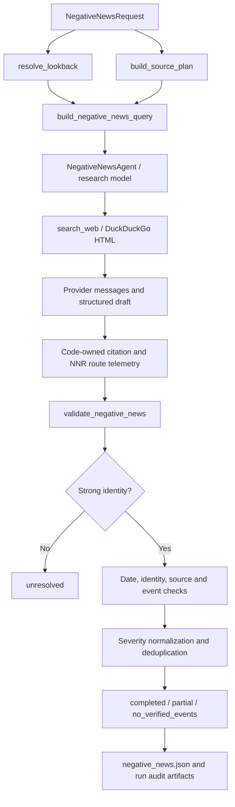


### Additional storage/schema confirmation and concrete external schema examples

Source search found no application-authored SQL statements, SQL migrations, `.sql` source files, business relational tables, BigQuery SQL or database connector code. All six graphs import `langgraph.checkpoint.sqlite.SqliteSaver`; `pyproject.toml` pins `langgraph-checkpoint-sqlite==3.0.3`. This is LangGraph-owned checkpoint storage, not a business data warehouse. A pre-existing local `outputs/checkpoints.sqlite` was inspected **read-only, schema only, no row values**. It contains exactly these two tables and their SQLite primary-key autoindexes:

```sql
-- Observed local schema generated/managed by langgraph-checkpoint-sqlite;
-- not a source-owned migration and not an instruction to replace the library.
CREATE TABLE checkpoints (
  thread_id TEXT NOT NULL,
  checkpoint_ns TEXT NOT NULL DEFAULT '',
  checkpoint_id TEXT NOT NULL,
  parent_checkpoint_id TEXT,
  type TEXT,
  checkpoint BLOB,
  metadata BLOB,
  PRIMARY KEY (thread_id, checkpoint_ns, checkpoint_id)
);
CREATE TABLE writes (
  thread_id TEXT NOT NULL,
  checkpoint_ns TEXT NOT NULL DEFAULT '',
  checkpoint_id TEXT NOT NULL,
  task_id TEXT NOT NULL,
  idx INTEGER NOT NULL,
  channel TEXT NOT NULL,
  type TEXT,
  value BLOB,
  PRIMARY KEY (thread_id, checkpoint_ns, checkpoint_id, task_id, idx)
);
```

BLOB serialization details are library-owned, not defined by Touchstone source. Rebuild through pinned SqliteSaver rather than inventing SQL business models. Local database existence/schema is an observed runtime artifact; source-only deployments initialize their own file. There are no HTTP timeout settings in parser, cache, validator or writer; only source fetches have20/45/60-second values listed above. These are `requests` timeout arguments rather than hard workflow wall-clock budgets. Agent/model timeout is outside this tool scope and defined by provider/config.

Sanitized synthetic external payload examples (illustrate only consumed fields):

```json
{
  "SEC_submissions": {
    "name": "EXAMPLE CORPORATION", "sic": "1234", "sicDescription": "Example industry",
    "ein": "<PUBLIC_TAX_IDENTIFIER>", "stateOfIncorporation": "DE",
    "addresses": {"business": {"street1":"1 Example Street","city":"Example City","stateOrCountry":"NY","zipCode":"00000"}},
    "filings": {"recent": {"form":["DEF 14A","10-K"],"filingDate":["2026-04-01","2026-02-01"],"accessionNumber":["0000000001-26-000001","0000000001-26-000002"],"primaryDocument":["proxy.htm","annual.htm"]}}
  },
  "SEC_index": {"directory":{"item":[{"name":"ex21.htm"}]}},
  "SEC_companyfacts": {"facts":{"us-gaap":{"Revenues":{"units":{"USD":[{"form":"10-K","val":1000000,"filed":"2026-02-01","fy":2025}]}}}}},
  "GLEIF_response": {"data":[{"id":"<PUBLIC_LEI>","attributes":{"entity":{"legalName":{"name":"EXAMPLE CORPORATION"},"legalAddress":{"addressLines":["1 Example Street"],"city":"Example City","country":"US","postalCode":"00000"}}}}]},
  "search_web_tool_content": [{"title":"Example official filing","url":"https://www.sec.gov/example-record","snippet":"Example Corporation annual filing"}],
  "CIK_source_row": {"cik":"0000000001","cik_full":"CIK0000000001","cik_int":"1","company_name":"EXAMPLE CORPORATION","submission_url":"https://data.sec.gov/submissions/CIK0000000001.json"},
  "CIK_cache": {"schema_version":2,"index":{"EXAMPLECORPORATION":["0000000001"]}}
}
```

`search_web` actual return is the JSON **string** encoding its list; graph/tool telemetry parses it back. SEC recent parallel arrays must remain aligned. Tax ID/LEI examples are placeholders, no production identifiers/secrets copied.

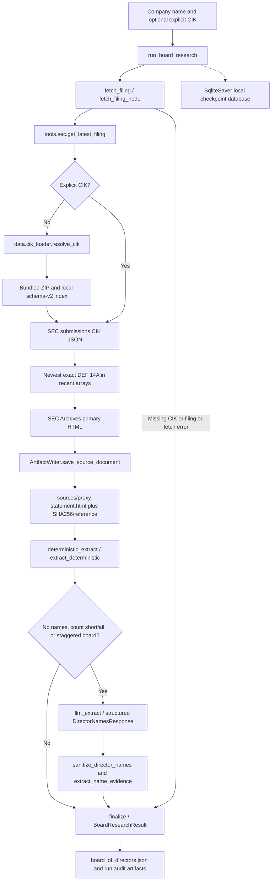

Important board graph nuance verified during diagram tracing: fallback executes when no names, staggered flag, or below reliable count. No-count with some deterministic names goes directly to finalize and returns partial because completeness is unconfirmed. `finalize_node` currently treats any true requires_llm_reconciliation flag as unresolved full-board completeness even after fallback, so flagged staggered-board results remain partial unless error rules make failed; do not imply fallback automatically clears this flag.
### End-to-end inflow/outflow map

| Input/source | Entry point and execution chain | Intermediate data | Final outflow | Failure distinction |
|---|---|---|---|---|
| Operator declaration or Python kwargs | `app.py` → `render_kyb_console` → `stream_kyb_verification` → five branch nodes → `final_kyb_aggregator` | Request dict; separate child IDs/envelopes; structured final assessment | `kyb_verification.json`, child files, checkpoints, streamed completion, UI downloads | Each branch isolated; all branches joined; synthesis fallback retains raw results. |
| Parent + candidate names | `run_company_check` → standardization → SEC/GLEIF parent lists + per-candidate identity/web routes → chunked aggregation | Standardized request, subsidiary lists, `FinalResponse` records | `assessments.json` and returned assessment list | Source failures can become empty lists; aggregation failure aborts run. |
| Company + optional address/industry | `run_enrichment` → standardize → SEC + GLEIF + web workers → structured reconciliation | Source-specific dicts and `CompanyProfileResponse` | `enrichment.json` containing `profile`; return key `enrichment` | Standardization/source fallback possible; model reconciliation error aborts. |
| Company/explicit CIK + bundled reference data | `run_board_research` → CIK/submissions → latest DEF 14A → deterministic parser → optional constrained model → finalize | Local source HTML, SHA256, reference, name evidence/count hints | `sources/proxy-statement.html`, `board_of_directors.json` | Distinct missing/ambiguous CIK, no filing, partial roster and failure statuses. |
| Company + segment/geography + identifiers/date range | `run_negative_news` → dates/source plan → research/search → code-owned observations → deterministic evidence validation | `NegativeNewsResearchDraft`, route/citation telemetry, accepted/rejected candidates | `negative_news.json` with normalized events, coverage and gaps | Search failure structured; weak identity unresolved; gaps/unverified candidates partial. |
| Company + optional research query | `run_search_response` → company-constrained agent/tool search → observed-URL filter → finalize | `CompanyWebSearchDraft`, actual queries/citations | `search_response.json`, evidence and answer | No results, partial result and research failure are separate statuses. |
| Iterable of company row mappings | `run_enrichment_batch` → row normalization → sequential `run_enrichment` calls | Source row numbers, unique run IDs, success/failure and usage records | Returned JSON-safe batch envelope plus independent per-company artifacts | Validation errors stop before work; row failures isolated; no persisted batch file. |

None of these implemented paths traverses Airflow, Dataproc, GCS or BigQuery. HTTPS sources supply JSON/HTML; Python schemas govern graph payloads; storage is local. Local fixture declarations are not external registry evidence.

## 7. Current Streamlit console and presentation behavior

### Current entry point versus README

**Confirmed:** `app.py` has exactly the current application entry sequence: import Streamlit and local presentation/config functions; `configure_logging()`; `st.set_page_config(page_title="Touchstone", page_icon="T", layout="wide")`; `apply_touchstone_theme()`; `render_kyb_console()`.

**Confirmed:** `src/touchstone/ui/kyb_console.py` is a 3,773-line operator console. It imports the backend only through `touchstone.graphs.kyb_verification.stream_kyb_verification`. It does not call the standalone enrichment batch service or expose a selector for Customer Linkage versus Legal-Entity Enrichment.

**Confirmed documentation drift:** `README.md` describes an older two-workflow interface with an editable enrichment table of up to 20 companies and independent batch artifacts. The batch backend exists, but that described UI is not the current `app.py` route. Reconstruct the KYB console from executable source, preserve the separate batch API, and do not use README prose as evidence of a still-present screen.

The README's higher-level five independent LangGraphs plus final KYB orchestrator description matches the backend routing used by this UI. It explicitly presents the active product as a local Docker application, not an Airflow/GCP pipeline.

### UI state, intake, and execution

#### State and fixture bootstrap

`render_kyb_console()` calls `_ensure_state()`, injects `CONSOLE_CSS`, renders the header, then routes to `_render_queue_view()` when `kyb_view == "Review queue"`, otherwise `_render_application_view()`.

`_ensure_state()` initializes Streamlit session state:

| Key | Initial value | Meaning |
|---|---|---|
| `kyb_view` | `"Application"` | Active console view |
| `kyb_cases` | `deepcopy(CASES)` | Per-session fixture and submitted applications |
| `kyb_selected_case` | First seeded case ID | Selected case |
| `kyb_intake_mode` | `False` | Whether application page renders the intake form |
| `kyb_runs` | `{}` | Latest UI run state per application ID |
| `kyb_decisions` | `{}` | Reviewer action per application ID |
| `kyb_threshold` | `95` | Demo threshold, configurable 85–100 |
| `kyb_queue_table_version` | `0` | Initialized but not otherwise used |

`CASES` holds three static demonstration cases: `ONB-4471` / Acme Group Inc. / United States; `ONB-4493` / Northwind Freight Corporation / United States; `ONB-4502` / Straits Marine Holdings Pte. Ltd. / Singapore. Each fixture has `id`, `name`, `market`, `received`, `product`, grouped `declared` fields, `attestation`, synthetic `agents` logs, `aggregator` logs, `news`, and grouped comparison `rows`. These synthetic logs are not proof that the corresponding external requests occurred. `_row()` constructs comparison dictionaries with `attribute`, `declared`, `found`, `match`, `source`, `evidence`, integer `weight`, and boolean `critical`.

**Confirmed:** applications, UI run snapshots, and reviewer decisions are held in `st.session_state`; there is no UI load-from-artifacts or decision persistence operation. Backend run artifacts and SQLite checkpoints persist separately. Do not claim that a browser session can recover its review queue from disk.

#### Navigation and intake

`_render_header()` shows the Touchstone internal-pilot branding, `New application`, `Review queue`, and a static `KYB Analyst / Local demo` label; this is not an authentication implementation. `New application` selects the Application view, sets intake mode, clears selected case, and reruns. `Review queue` changes the active view. Queue `Open` restores selected case, clears intake mode, and reruns.

`_next_application_id()` starts at `ONB-4601` and increments until unused in the current session. `_render_intake_view()` uses form key `new-application-intake` with these input groups:

- Legal entity: registered legal name, trading name, jurisdiction (`United States`, `Singapore`, `United Kingdom`, `India`, `Other`), legal form (default `Corporation`), country of incorporation (default selected market), commission file / registry number, tax identifier, LEI.
- Addresses/business: principal executive offices/business address, registered agent, industry, annual revenue declared, employees, subsidiaries declared.
- Ownership/disclosures: immediate parent (default `None - this is the ultimate parent`), beneficial owners at 25% or more, control person, material events in the last 12 months (default `None to disclose`), regulatory/legal proceedings (same default), certifier.

Only a nonblank registered legal name is required by the intake form. `_case_from_intake(...) -> dict[str, Any]` collapses whitespace, supplies display defaults, produces grouped declared fields, and constructs synthetic placeholder comparison rows, source logs, and one news record awaiting corroboration. US intake records synthesize registry source `SEC EDGAR`, non-US records `National registry` and a placeholder no-connector state. These placeholder values are not the output of the live graph.

On submission, insert the case at the front of `kyb_cases`, select it, leave intake mode, show Application, and rerun. A submitted application starts in the received stage; it does not automatically execute verification.

#### Actual run sequence

`_render_application_view()` renders declaration, Run verification / Replay verification control, placeholders for agents/results/news/artifacts, and a right rail. It defines local `paint()` to rerender those placeholders from `kyb_runs[case_id]` after backend events. Button is disabled only while UI state is `running`.

1. `_new_run_state(case)` allocates `run_id = f"{case['id'].lower()}-{uuid.uuid4().hex[:10]}"` and sets `status="running"`, orchestration `dispatching`, aggregator `queued`, empty results/token summary/path/events.
2. Initialize five backend branches as `running`, progress 15; initialize four display agents similarly. Store as the latest run for that application, overwriting only the UI snapshot for an earlier replay; earlier backend run directories retain distinct IDs.
3. `_kyb_request_kwargs(case, run_id)` maps the declared fields into backend inputs.
4. Synchronously iterate `stream_kyb_verification(**kwargs)` in the Streamlit script. Backend LangGraph performs the actual branch concurrency; the UI is not a scheduler or job service.
5. For each yielded event call `_apply_event(state, event)` and `paint()`.
6. On `complete`, display live final KYB result, negative-news section, download controls, scoring, discrepancies, and analyst actions.
7. Any exception escaping the stream changes UI state to `failed`, orchestration to `unable to complete`, aggregator to `not run`, and a generic message hides raw backend error details. It does not log the caught exception itself.

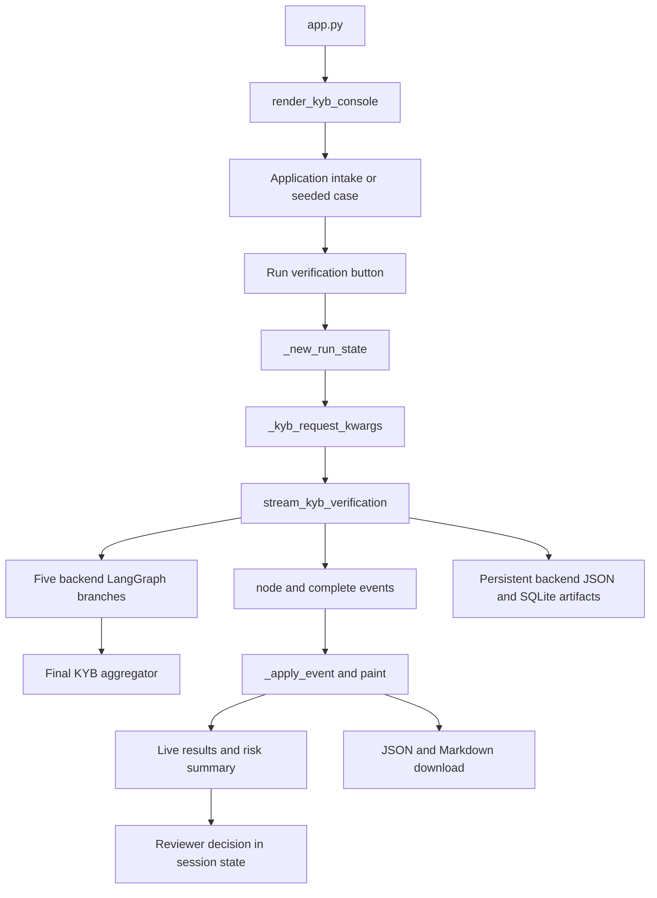

#### Exact intake-to-backend argument mapping and gaps

`_case_declared_value(case, *labels)` performs case-insensitive equality on grouped declared field labels. `_clean_optional(text)` normalizes whitespace and returns `None` for blank, strings starting `Not provided`, or strings starting `None`.

| Backend argument | UI derivation |
|---|---|
| `company_name` | `case['name']` |
| `parent_company` | Cleaned Immediate parent, otherwise company itself |
| `linkage_companies` | Company itself plus comma-separated Subsidiaries declared, preserving order and removing exact duplicates |
| `city` | Always `None` |
| `address` | Principal executive offices / alternate business-address label |
| `industry` | Industry |
| `cik` | Registry/commission file text only if `.isdigit()` |
| `identifiers` | `tax_id`, `lei`, `registry_number` keys when present |
| `aliases` | One trading name if present and different from company name |
| `lookback` | `365` |
| `query` | `<company> ownership directors adverse media corporate profile` |
| `run_id` | New UI run ID |

**Confirmed gaps:** `market` does not become a `geography` argument; segment is also omitted. The backend `stream_kyb_verification` defaults to Corporate / US, so UK and Singapore selections still run with US screening unless another caller passes a geography. Commission file/registry numbers that are only digits are sent as CIK without semantic identifier discrimination. The first fixture's `Employer identification number` label is not among the tax lookup labels (`Tax identifier` only), so its declared EIN is omitted from identifiers and the eight-field comparison. Subsidiaries is a free text input interpreted as comma-separated names, so a count such as `3` becomes a candidate company named `3`. Beneficial owners, control person, disclosures, employees, annual revenue, and other form fields are not passed as a declared-application object to the aggregator; only the mapped subset reaches the backend. These are existing limitations, not evidence of additional integrations or validation.

#### Event schema and display-agent projection

`_apply_event(state, event) -> None` deep-copies every event into `events` and recognizes:

- `{type: "node", node: "prepare", data: ...}`: orchestration complete.
- `{type: "node", node: <one of five branch names>, data: ...}`: `_apply_branch_update`.
- `{type: "node", node: "final_kyb_aggregator", data: {final_result: ...}}`: aggregator complete and retain final result.
- `{type: "complete", data: {kyb, token_summary, output_dir, ...}}`: UI `completed`, retain full `final_payload`, final result, token summary, and output directory.
- `type` of `error`, `failed`, or `run_failed`: UI failed with generic error.

A complete stream marks the UI `completed` even if the embedded KYB result has status `partial` or `failed`; source/result status remains separately available.

`_apply_branch_update` unwraps `data[f'{branch}_branch']` or uses data itself. Backend `failed` → UI failed; backend `partial` → UI alert; all other statuses → UI ok. Set progress to 100, preserve child run ID, raw result and error, compute item count, and refresh its display agent. Once none of the five branch statuses is queued/running, mark aggregator running.

| Display agent key/name | Backend branch or branches |
|---|---|
| `ownership_relationship` / Ownership and Relationship Agent | `customer_linkage` |
| `entity_intelligence` / Entity Intelligence Agent | `legal_entity_enrichment`, `board_of_directors` |
| `search_response` / Web Search Agent | `search_response` |
| `negative_news` / News Agent | `negative_news` |

`_refresh_display_agent` sums item counts, averages progress, takes first child run ID, keeps results keyed by branch, joins errors, and retains individual branch statuses. If one of a multi-branch display agent's branches is pending it remains running. All failed → failed; any failed/alert → alert; otherwise ok except negative-news with any verified event is alert. Progress is coarse 15%/100% per branch; it is not elapsed-work telemetry.

`_branch_metric` counts customer-linkage assessments; every nonempty value in the enrichment dict (including scalar profile confidence, so up to nine items for eight populated sourced fields plus confidence); directors; negative-news events; and search top-level `results` or `evidence`. These counts have different units and are labeled result items. Confirmed metric mismatch: `run_search_response()` returns evidence under `result["search_response"]["evidence"]`, whereas this metric looks only at top-level `results`/`evidence`, so the live web-search item count can show zero despite nested evidence. Display text identifies ownership as GLEIF and entity intelligence as SEC even though branch implementation uses additional sources. The News Agent source label says licensed feeds, but active public-web implementation does not establish a licensed-feed integration.

#### Result, decision, and export logic

`_backend_enrichment()` reads `final_result.branch_results.legal_entity_enrichment.enrichment`. `_backend_comparison_rows()` always produces eight rows: legal name, trading/DBA name, tax ID, legal form, country, business address, annual revenue, industry codes. `_sourced_value` extracts `value` (dict values rendered as comma-separated key/value pairs); `_sourced_evidence` prefers snippet, then first `source_url`, then a generic backend label. Missing returned value means `none`/Not returned; exact case-insensitive string equality means match; all other values mean partial, never mismatch. This is a simple presentation comparison, not a domain normalization or ownership validation algorithm.

`_render_final_kyb_result_card` renders recommendation, overall risk, executive summary, eight comparisons, each branch status, key findings, risk factors, conflicts, data gaps. `_render_backend_news_card` reads nested `negative_news.negative_news.verified_events`, shows count and up to five events, or says no verified adverse events returned; it displays nested status separately. These rendered values are HTML-escaped.

`_score_for_display` maps backend risk to display scores: low 94, medium 82, high 64, critical 35, unknown 70. Then recommendation modifies it: approve at least 96; approve_with_monitoring clamp into 88–94; manual_review at most 84; reject at most 45. Embedded partial result caps at 84; failed at 30. This score is a UI heuristic, not a returned calibrated model confidence. `_is_auto_approved` uses backend recommendation exactly equal to `approve`, ignoring slider threshold and final status whenever a recommendation exists. Otherwise it compares demo score to `kyb_threshold`.

Fallback `_score_of(case)` calculates rounded weighted score using match=1, partial=.5, mismatch/undeclared/none=0. Critical mismatch/undeclared caps 72; critical missing caps 80; high-severity adverse news caps 68. `_flags_of` flags mismatch/undeclared as bad, partial or critical none as warning. Backend `_flags_for_display` instead concatenates conflicts (critical bad), risk factors and data gaps (warning), and final errors (critical bad).

`_render_right_rail` hides score until UI completion, renders policy/threshold and discrepancies, then `_render_hitl`. Reviewer buttons map to `approve`, `docs`, `edd` and assign `kyb_decisions[case_id]`; no external onboarding action, email, document request, durable audit record, or enhanced-due-diligence system is invoked. The string saying the decision is stored locally refers only to session state. A previous decision is not cleared when replaying verification.

`_render_queue_view` calculates completed runs, auto approvals, manual-review count, and straight-through percentage. Decision presence shows Closed by colleague. **Confirmed UI drift:** adverse findings come from `_adverse_label(case)` over fixture/intake `case['news']`, not live negative-news events. Thus queue news summaries can differ from live result cards.

`_render_observability_card` exposes two browser downloads, not server-side artifact writes:

- `<application-id>-touchstone-run.json`, `application/json`, from `_download_payload`.
- `<application-id>-review-summary.md`, `text/markdown`, from `_summary_text`.

`_download_payload` returns `application` id/name/market, UI status and run ID, display `score`, flags, static/intake `results` rows and `news`, live `final_kyb_result`, `backend_output_dir`, one synthesized `tool_calls` summary per display agent, `token_usage`, complete streamed `trace`, and session decision. **Do not confuse** synthesized `tool_calls` with actual backend `tool_calls.jsonl`, or fixture `results`/`news` with live final branch data. If token summary is missing, it fabricates demo counts: input=`len(rows)*32`, output=`len(events)*18`, total sum, calls=4. These fallback values are not measured tokens. `_summary_text` renders recommendation/risk/summary and findings/conflicts/gaps when live assessment exists; otherwise demo score/flags; always agent states/item counts, event count, optional backend output directory, and reviewer decision.

**Failure UX gap:** downloads are painted only when UI status is completed; the exception message instructs users to use a downloaded artifact even though the page does not expose these controls for a failed run. Backend disk artifacts may still exist independently.

#### Markets table and presentation

`MARKET_LANGUAGE_ROWS` statically claims Global/GLEIF, US/SEC, Japan/EDINET, Italy/Registro Imprese/Cerved, Germany/Unternehmensregister, Sweden/D&B Infotorg, UK/Companies House, Mexico/Bolsa as live; Singapore/ACRA as onboarding; Ireland/client documents. No corresponding registry client implementations except SEC/GLEIF were found. Treat it as demo presentation data, not evidence of working connectors or granted access.

`src/touchstone/ui/__init__.py` exports `apply_touchstone_theme`, `render_kyb_console`. `theme.py` provides a static injected CSS string; `apply_touchstone_theme() -> None` calls `st.markdown(..., unsafe_allow_html=True)`. `kyb_console.py` injects a second, more specific `CONSOLE_CSS`, hiding Streamlit sidebar/header and using blue/navy cards, 1300px layout, serif-free text and local font fallbacks. `Libre Franklin` is named but not downloaded. Both stylesheets contain no remote imports or URLs.

`.streamlit/config.toml`: light theme, primary `#006FCF`, background `#F5F8FC`, secondary `#EAF2FB`, text `#172B43`, sans serif, `browser.gatherUsageStats=false`.

## 8. Airflow analysis: confirmed absence

A tracked-source inventory and case-insensitive searches for Airflow, DAG/operators, Dataproc, Spark, GCP and deployment references were cross-checked against `pyproject.toml`, every graph builder, Dockerfile, Compose and the source imports. There are **zero Airflow DAGs**. The six graph files implement **LangGraph StateGraphs**, even though their topologies can also be drawn as directed graphs.

| Requested Airflow attribute | Finding for every source workflow |
|---|---|
| DAG ID / DAG file | None. Actual workflow files and graph node names are in the LangGraph analysis. |
| Airflow version / providers | No declaration or imports; not determinable and not required by the active app. |
| Schedule / cron / timetable | None; UI/Python invocation starts each run. |
| Start date / catchup / backfill | No Airflow configuration. Some news inputs have lookback dates; those are screening filters, not scheduling dates. |
| Operators / sensors / task groups | None; ordinary Python node callables and LangGraph dispatch. |
| Task dependencies | LangGraph `add_edge`, `add_conditional_edges`, `Send`, and explicit KYB list-edge barrier; documented under each graph. |
| Airflow Variables / Connections / XCom | None. YAML/environment, Python state and SQLite checkpoints perform different roles. |
| Task retries / execution timeout | No Airflow retry policy; actual HTTP retries/timeouts and graph iteration limits are described separately. |
| Trigger rules / branching | No Airflow trigger rules. KYB catches branch exceptions into envelopes and waits for all five branches before aggregation. |
| Failure callback / alert | No Airflow callback. Python exceptions, tool JSONL and manifest statuses are used. |
| DAG inputs / outputs | N/A; actual runner request and result contracts are specified in the workflow sections. |
| Airflow deployment/setup | None in checkout; adding Composer/Airflow would be new work. |

## 9. Dataproc, GCS, BigQuery, and dormant cloud bootstrap

### Dataproc inventory

There is no cluster creation/deletion call, existing-cluster reference, workflow template, batch submission, job payload, Dataproc operator, Spark/PySpark program, argument parser for a cloud job, initialization action, runtime image, driver/worker sizing, autoscaling, region/zone, network specification, service-account binding, package installation script, or cluster cleanup policy.

Accordingly, Dataproc job arguments, machine types, input/output partitions, Spark transformations, cloud execution retries, cluster lifecycle and job failure recovery are **absent**, not inferred. The only `dataproc` tokens with runtime-like meaning are GCS object-name prefixes in `common/env_bootstrapper.py`.

### Exact disconnected integration surface

`initialize(config) -> None` expects an object with attributes `project_id`, `vault_host`, `vault_service_id`, `usecase_service_account`, `config_file_name`; optional `eag_base_url`, `execution_id`, and environment selection used by the credential helper. A process-global `_INITIALIZED` boolean and `_INIT_LOCK` ensure successful work runs once per process. The first successful config wins, irrespective of later configs. It marks success only after `_initialize_once()` returns, so subsequent calls can retry a failed bootstrap; this is not an automatic timed retry loop.

`_initialize_once(config)` imports these **top-level**, unresolved service modules:

```python
from services.bigquery_service import _safe_audit_log_direct
from services.gcs_service import download
from services.vault_service import read_vault
```

The actual package contains `touchstone.services.enrichment_batch`, which supplies none of them. Without externally supplying `services.*`, invoking the bootstrapper fails at import before credential loading or downloading. No supplied entry point or graph calls `initialize()`; its docstring describing deployed jobs is not evidence that those jobs exist here.

If external services were supplied, the written execution order would be:

1. Attempt best-effort audit `_safe_audit_log_direct(execution_id, "", project_id, log_type, message)`. `_audit` silently catches every exception. The destination dataset, table, schema, SQL and authentication are absent.
2. Call `load_credentials(config, read_vault)`. An empty returned mapping raises `RuntimeError('Credential loading failed.')`; audit errors are best effort. Set the four CIBIS/EAG environment values from the returned mapping with `or ''` fallback. Optionally set `EAG_BASE_URL`.
3. Download the config GCS object to `/tmp/config`; set `CONFIG_PATH` to its filename there. A download error is audited and re-raised.
4. Attempt to download the enterprise certificate to `/tmp`; failure logs a warning/audit entry and continues.
5. Attempt to download CIK JSON to `/tmp`; on success set `CIK_FILE_PATH=/tmp/cik-data.json`; failure warns and continues without setting that override.
6. Select the first existing certificate path in the precedence table below and set `AMEX_CERT_PATH`. The comment deliberately orders GCS downloads before certificate selection to avoid breaking Google TLS chains. The actual active Requests clients do not consume this variable.
7. Best-effort completion audit; `initialize()` marks the process initialized.

| GCS source template, exactly as constructed | Local destination / effect | Failure behavior |
|---|---|---|
| `gs://{project_id}/dataproc/config/{config_file_name}` | `/tmp/config/{config_file_name}` → `CONFIG_PATH` | Fatal to bootstrap. |
| `gs://{project_id}/dataproc/certs/AmexEnterpriseRootCA.cer` | `/tmp/AmexEnterpriseRootCA.cer` | Warning; may fall back to another CA path. |
| `gs://{project_id}/dataproc/resources/sec/cik-data.json` | `/tmp/cik-data.json` → `CIK_FILE_PATH` | Warning; SEC resolution may be limited. |

Here `{project_id}` is interpolated into the **bucket** position of a GCS URI. The code does not resolve a bucket from a separate configuration value, and no actual bucket/project name is supplied in the tracked local config. Do not substitute an invented cloud environment.

CA precedence is `/tmp/AmexEnterpriseRootCA.cer` → `/usr/local/share/ca-certificates/Amex_Internal_Root_CA.crt` → `/etc/ssl/certs/ca-certificates.crt`. No certificate contents are supplied.

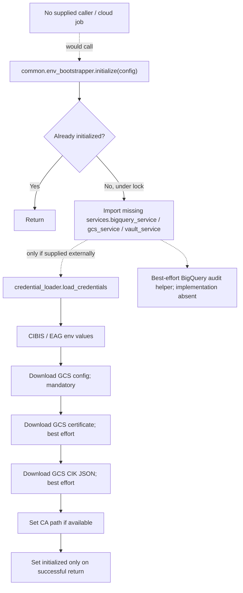

### Credential compatibility helper

`credential_loader.resolve_epaas_environment(config) -> str` imports `dotenv.load_dotenv` inside the function, calls `load_dotenv(dotenv_path=".env", override=False)`, and selects `EPAAS_ENV`, then `ENV`, then `config.environment or "e1"`, finally stripping/lowercasing. `credential_source(config)` is `"env"` only when the result is exactly `"e0"`; all other values, including an explicitly empty environment string, select Vault.

`load_credentials(config, vault_reader) -> dict[str,str]`:

- For `e0`, read and require **all four** environment keys `CIBIS_CONSUMER_INTEGRATION_ID`, `CIBIS_CONSUMER_SECRET`, `EAG_CLIENT_ID`, `EAG_SECRET`. Missing values raise a name-only `RuntimeError`. Values are `<SECRET>` in any recreated sample.
- Otherwise, call `vault_reader(config.usecase_service_account, config.vault_service_id, config.vault_host, config.project_id)` and return its mapping unchanged. The helper does not validate completeness of the Vault mapping. The bootstrapper only checks that it is nonempty, then substitutes blanks for missing keys.
- `_required_keys(environment)` currently returns the same four keys regardless of its parameter.

No service-account identifier, key, Vault secret path value, IAM binding or GCP role is supplied. **Inference/reconstruction extension only:** a completed version of these missing services would need authenticated permission to read the configured objects and secrets and write audit records. Exact IAM roles cannot be established from these call sites. There are no BigQuery data-processing queries or Pub/Sub interactions to document.

## 10. Operations, failures, observability, and recovery

The implementation distinguishes **transport failure**, **domain-result status**, **branch-envelope status**, **run-manifest status**, and **UI presentation**. They are related but not interchangeable. For example, a board workflow can successfully execute and save a domain result marked `unresolved`; a model synthesis can fail while the KYB workflow still returns a structured fallback and retained branch payloads. A tool-call record may be `success` whenever no exception string was passed, even if its payload reports a domain failure.

| Layer | Concrete behavior | Operational consequence |
|---|---|---|
| AskAmex HTTP | Two attempts, 0.5-second wait, `(10,60)` timeout; selective status retry | Network retries do not rerun an entire graph. |
| Public-source HTTP | Per-client fixed timeouts, no common retry adapter | A temporary SEC/GLEIF/search issue can become empty data, a failed tool payload, or a typed graph error depending on caller. |
| Graph iteration | Per-run `recursion_limit`; graph-specific `max_concurrency` | These bound supersteps/concurrency, not elapsed execution time or model token consumption. |
| Linkage/enrichment model nodes | Aggregation errors propagate after telemetry `finally` blocks; enrichment standardization catches failure and reuses the original name | Runner marks failure and preserves artifacts written so far. |
| Board | Typed CIK/filing failures and deterministic/LLM fallback statuses | Missing or ambiguous CIK is distinguishable from no filing or extraction failure. |
| Negative news / SearchResponse | Research and validation result envelopes with explicit partial/no-results/failed cases | Absence of verified evidence is not automatically a clean compliance result. |
| KYB branches | `_run_branch` catches exceptions, stores separate child run ID and result/error | Other branches continue; explicit barrier precedes aggregator. |
| KYB aggregation | Structured model error produces unknown-risk/manual-review fallback | Raw branch outputs survive final-model failure. |
| Batch enrichment | Sequential per-row try/except | One failed company does not discard completed companies. |
| Artifact writes | Process-wide lock, temporary file and `os.replace`; JSONL append+flush | Atomic replacement for individual files; no multi-file transaction or cross-process lock. |
| Checkpoint DB | LangGraph `SqliteSaver` context per runner | Persistent execution state; no supplied administrative resume/recovery CLI. |
| Bootstrap | Once-per-process only after success; config/credential failures fatal; cert/CIK best effort | Not exercised by active application. |

### Run identity and reprocessing

- Board, negative-news, SearchResponse and KYB enforce `^[A-Za-z0-9][A-Za-z0-9._-]{0,127}$`, reserve a fresh run directory with `exist_ok=False`, reject duplicate IDs, and use workflow/run/UUID checkpoint identities. New runs do not silently resume an old run.
- Customer linkage and enrichment use supplied or generated run IDs without the same safety/duplicate protections; their checkpoint thread ID is the run ID. Reusing IDs can reuse state, overwrite JSON files, and append telemetry. **Reconstruction recommendation:** retain this documented behavior only for compatibility; consistently validate IDs and require explicit resume semantics before exposing these runners to untrusted input.
- `ArtifactWriter` itself creates directories with `exist_ok=True` and is not a run-ID validator. Source-document filenames receive a separate safety check.
- KYB child IDs are deterministically derived from the parent ID, branch slug and a hash; each branch has its own artifact directory. The parent stores complete branch return payloads. A fresh parent run gets fresh child identities.
- Rerunning the UI verification launches a new backend execution. No result cache is used for AskAmex or public searches. CIK data/index and model/settings/session objects are cached for different purposes.
- Checkpoint persistence does not by itself mean that the app supports UI resume after crash. There is no explicit migration, cleanup/retention task, job scheduler, reprocessing queue, or scheduled retry facility.
- A failure after `start_run()` normally preserves `input.json`, a failed/partial manifest, any prior JSONL events, and token summary. Preflight validation or duplicate-directory failure occurs before a run is initialized. Result/final-state persistence follows workflow execution; returned domain failures may still be written as results.
- Generator consumers should iterate through completion: final artifact finalization is after graph streaming. **Inference:** abandoning a stream before its completion event can leave a manifest `running`, because `GeneratorExit` is not the ordinary `Exception` caught by these runners.

### Monitoring and accuracy limits

Logs go to Python logging and local `tool_calls.jsonl`, `token_usage.jsonl`, `token_summary.json`, `manifest.json`. No email, Slack, metrics exporter, tracing backend, failure callback service or alert receiver is configured. Token summaries are per run; the KYB parent summary does not recursively add all child summaries. `calls` counts usage records emitted by node/model aggregation, not a guaranteed exact number of individual provider HTTP requests.

Artifacts include source URLs, snippets, supplied business identifiers, model results and error strings. `ArtifactWriter` provides no generalized secret/PII scrubbing; callers avoid logging auth headers. Do not interpret the URL-observation filter as full source authenticity or assertion verification. Network calls and model outputs are nondeterministic external dependencies; structured schemas and deterministic filters constrain them but do not replace human verification.

UI decision controls are session state and do not implement a durable approval workflow, audit database, or access-control policy. The container exposes Streamlit on `0.0.0.0:8501`; no application authentication or multi-tenant authorization is implemented. The actual UI's demo/live data boundaries are detailed in the UI section.

## 11. Testing, local development and deployment

### Local and container deployment

`Dockerfile`:

1. Base `artifactory.aexp.com/dockerproxy/python:3.11-slim`.
2. Set `PYTHONDONTWRITEBYTECODE=1`, `PYTHONUNBUFFERED=1`, `PIP_NO_CACHE_DIR=1`, `TOUCHSTONE_ROOT_DIR=/app`.
3. Workdir `/app`; copy `pyproject.toml`, `README.md`, `src`, `data`.
4. `pip install --index-url https://artifactory.aexp.com/api/pypi/pypi/simple/ .` (production dependencies, not dev).
5. Copy `app.py`, `.streamlit`, `config`.
6. Create `/app/outputs` and `/app/.cache/touchstone`.
7. Expose 8501.
8. Command `streamlit run app.py --server.address=0.0.0.0 --server.port=8501 --server.headless=true`.

No healthcheck, non-root USER, worker service, database service, scheduler service, cloud launcher, or container retry policy is defined in Dockerfile.

`compose.yml` has one service, `touchstone`, builds current directory/Dockerfile, optionally loads `.env` via `env_file: [{path: .env, required: false}]`, maps `8501:8501`, mounts `./outputs:/app/outputs` and `./.cache:/app/.cache`, and `restart: "no"`. The optional env-file setting means startup can occur without `.env`; it does not supply credentials for model calls. Requires a Compose release supporting that mapping syntax, but no minimum Compose version is declared.

Run from repo root (populate credential values with `<SECRET>`; never put real values into the specification):

```sh
cp .env.example .env
# Edit .env privately with AskAmex credentials and an explicit SEC contact user-agent.
docker compose up --build
# Browser: http://localhost:8501
# Stop via Ctrl+C, or:
docker compose down
```

Local development sequence from README:

```sh
python -m venv .venv
source .venv/bin/activate
pip install --index-url https://artifactory.aexp.com/api/pypi/pypi/simple/ -e '.[dev]'
cp .env.example .env
streamlit run app.py
```

Use Python 3.11+ explicitly; the README says create a Python 3.11 environment while its command uses whatever interpreter `python` resolves. Network access to the corporate registry/index is required for the checked-in Docker build path, plus AskAmex credentials and SEC/GLEIF/public-web reachability for live runs. The app is locally hosted; no API server endpoint, background-job deployment, Kubernetes/Terraform manifests, Airflow environment setup, or GCP deployment procedure exists to document as current behavior.

`.dockerignore` excludes `.git`, `.github`, `.agent`, `.env*` except `.env.example`, `.streamlit/secrets.toml`, `.venv`, `venv`, Python/test caches, `.cache`, `outputs`, IDE state, `.DS_Store`, pyc/sqlite files, and `tests`. Thus tests/dev tooling and runtime artifacts are not copied into image; secrets are passed at runtime through Compose rather than baked in.

`.gitignore` excludes dotenv secrets except `.env.example`, Streamlit secrets, certificate/key files (`cer`, `crt`, `key`, `p12`, `pem`, `pfx`), environments/caches/coverage, uv lock, editor/agent state, logs, runtime `.cache`, all generated `outputs/*` except `.gitkeep`, SQLite files/journals, extracted SEC JSON and `CIK*.json/htm`. `data/sec/cik-data.zip` is tracked and packaged; cache/index/extraction files are generated.

### Tests and validation contract

20 tracked test modules contain 130 named test functions/methods (125 pytest-style top-level tests + 5 unittest methods), before parametrization expands collection. During this inspection, all 57 Python files parsed under Python 3.11.16 and the five credential-loader unittest cases passed. The full pytest suite was not executed because the available runtime lacks the declared third-party dependencies. `pytest` is the declared runner; inferred standard command after editable dev install is `python -m pytest -q`. There is no repository command wrapper or custom test configuration.

| Test file | Named tests | Behaviors requiring preservation |
|---|---:|---|
| `tests/test_artifact_writer.py` | 3 | Manifest/input/result/tool/token files; board source-document saves; rejection of unsafe source file names, parametrized |
| `tests/test_board_graph.py` | 12 | Deterministic extraction and local artifacts; evidence-checked LLM fallback; not-found versus failed; missing/ambiguous CIK; unavailable model; incomplete and staggered boards remain partial; roster without count hint cannot be completed; safe immutable run IDs |
| `tests/test_board_models.py` | 4 | Computed director count, nonshared mutable defaults, JSON serialization, partial state/count hint |
| `tests/test_board_parser.py` | 24 | HTML table cells/noncontent removal; ballots, semicolon rosters, cards, age biographies, columnar tables; new nominees; staggered-board reconciliation; bounded evidence preventing executive/next-person/former-director false positives; coordinated names; TOC/count issues; name sanitization/dedup; bounded LLM context and distant sections |
| `tests/test_cik_loader.py` | 8 | Name normalization; conservative suffix resolution; ambiguous suffix/exact-name rejection; missing status; installed-wheel fallback; explicit invalid archive is not silently ignored |
| `tests/test_credential_loader.py` | 5 | unittest class `CredentialLoaderTests`: Vault default/deployed route; dotenv local e0; `ENV` fallback; required credential checks |
| `tests/test_enrichment_batch.py` | 7 | Normalize whitespace, blank rows, aliases, duplicates; missing name and max rows; sequential unique-run execution; tokens/date/path JSON serialization; isolate failures and retain duplicates; empty batch; failed-run tokens/artifact discovery |
| `tests/test_graph_observability.py` | 3 | Usage callback data retained on standardization failure in both enrichment/linkage; enrichment falls back to original name while linkage reraises; industry forwarded by sync wrapper |
| `tests/test_http.py` | 2 | Public-source session ignores ambient environment by default and verifies TLS; SEC rejects an explicitly blank user-agent (the default is not rejected) |
| `tests/test_kyb_verification.py` | 4 | Five branches start concurrently using `threading.Barrier(5)`; full fan-in/raw results; failed branch produces partial final result while remaining branches persist; aggregation model failure preserves raw outputs and manual-review result; sync wrapper drains stream and forwards args |
| `tests/test_model_provider.py` | 4 | Selected AskAmex request/header model; per-thread session trust_env false; tool-based structured output; configured profile defaults; HTTP error excludes upstream response body |
| `tests/test_models.py` | 2 | Example assessment confidence acceptance; optional industry retained in enrichment request (test name says confidence validation, but does not test out-of-range rejection) |
| `tests/test_negative_news_graph.py` | 3 | Successful local artifacts; structured failed search result; safe and immutable run IDs |
| `tests/test_negative_news_search.py` | 6 | Packaged prompt/local override frontmatter removal; route/date/source-plan query contents; internal/unknown IDs excluded; structured model response; citations/route telemetry derived from actual tools; failures propagate |
| `tests/test_negative_news_validation.py` | 25 | Official evidence and normalized events; two independent media publishers; discovery/nonindependent/untrusted domains rejected; observed URL and relevant context required; same entity/different event rejected; provider telemetry owns coverage; entity identity and typed IDs; active/undated exceptions; lookback cap; dedup with official evidence precedence; same record ID on different sources; no-event completed versus coverage-partial/unresolved; request validation; Unicode normalization; all segment/geography source plans |
| `tests/test_search_response_graph.py` | 3 | Structured local artifacts, failure result, safe immutable run IDs |
| `tests/test_search_response_tool.py` | 3 | Company constrained query; observed tool sources/queries replace untrusted model-provided source data; errors propagate |
| `tests/test_sec_filings.py` | 7 | Newest exact form selected (not amendment); explicit zero-padded CIK; absent exact form; missing/ambiguous CIK; source error propagation; invalid explicit CIK |
| `tests/test_ui_theme.py` | 1 | Mocked `st.markdown` receives static `<style>` with unsafe HTML enabled, expected CSS selector, no `@import` or `url(` |
| `tests/test_web_search.py` | 4 | Optional address/industry hints explicitly non-authoritative; omit hint language when absent; trust only search tool output; enrichment search errors reraised |

Tests use inline synthetic data, `tmp_path`, monkeypatch, `unittest.mock`, fake model/agent classes, and local artifact directories/checkpoints. Live SEC, GLEIF, DuckDuckGo, or AskAmex connectivity and credentials are not validated by passing these unit tests. There is no automated browser test for `kyb_console.py`, no assertions for current UI argument mapping/score/queue/downloads, no container/CI integration check, no bootstrapper implementation test, and no explicit code-coverage measurement configuration. Do not label these gaps as verified production safety.

## 12. Reconstruction blueprint: implement an equivalent Touchstone

This sequence targets behavioral equivalence with the inspected local application. It does not silently add absent Airflow/Dataproc/GCP architecture. Preserve documented quirks when compatibility matters; any fixes listed below are explicit new requirements, not proof of current behavior.

### 1. Create the project and environment

Recreate `pyproject.toml`, the `src/touchstone` package, `app.py`, the tracked folder structure, and Python 3.11 baseline. Preserve version `0.1.0`, setuptools discovery and wheel SEC data mapping. Install the declared production dependencies and dev extra. Keep secrets/generated files excluded using the original ignore rules. Acquire the exact SEC reference archive or an approved equivalent snapshot with its described schema; its data is an input asset that cannot be reconstructed from code or a short Markdown description. An equivalent snapshot can change name-resolution outcomes.

**Completion criterion:** imports resolve in an editable install; configuration and data lookup work from the checkout and the intended installed location. Do not claim installed UI support solely because the backend wheel imports successfully.

### 2. Recreate dependencies and model/transport adapters

Implement `config.py` dataclasses and path/cache behavior; `model_provider.get_model/clear_model_cache`; `AskAmexChatModel.from_settings`, `bind_tools`, `_generate`, `_request_messages`, `_request`, `_headers`, `_message_from_response`; and `http.get_source_session/clear_source_session_cache`. Preserve exact gateway envelope, header-name indirection, tool schemas, usage metadata, timeout/retry behavior and per-thread sessions. Use mocked HTTP responses first; package names alone are insufficient to recreate this custom gateway.

**Completion criterion:** model-provider and HTTP tests pass, including plain chat, structured Pydantic output, model-purpose routing and sanitized HTTP errors. Live gateway access remains an external prerequisite, not something supplied by this document.

### 3. Supply configuration and authentication

Recreate `config/local.yml`, purpose aliases, `.env.example` variable names and `.streamlit/config.toml`. Store actual values outside version control; represent credentials as `<SECRET>` in any generated examples. Set a meaningful SEC contact identity even though code only validates nonblank text. Document the distinction between app root, output directory, checkpoint path, cache directory and CIK JSON path. Bootstrap before settings/agent caches are populated when changing environments.

Preserve `common/credential_loader.py` only as its documented callable compatibility API. Keep `env_bootstrapper.py` disconnected unless the missing `services.*` contracts are separately implemented and authorized. Do not substitute CIBIS/EAG secrets for AskAmex variables.

**Completion criterion:** bad model aliases fail at settings construction; missing gateway variables fail without exposing values; default local configuration does not require GCP.

### 4. Build contracts, storage and reference-data layers

Implement all `models.py` Pydantic request/result schemas, enums, default factories, URL/name normalization, constraints and computed fields. Implement KYB request/envelope/result schemas in `graphs/kyb_verification.py`. These schemas are both persisted data formats and structured model-output instructions.

Implement `storage/artifact_writer.py`: run-directory creation, atomic JSON writes, locked JSONL appends, manifests, token summaries, source-document safety and result filenames. Recreate `data/cik_loader.py` archive/wheel discovery, JSON extraction, normalized-name index versioning, ambiguity preservation and lookup caches. Use `SqliteSaver` from the declared dependency instead of inventing application SQL tables.

**Completion criterion:** schema serialization, artifact, CIK and board-model tests pass; failed initialized runs retain diagnostic files; ambiguous company names never silently choose a CIK.

### 5. Implement public-source clients and deterministic processing

Recreate `tools/sec.py` endpoint builders, CIK normalization, exact-form newest-filing selection, exhibit-21 lookup/parsing and enrichment extraction. Recreate `tools/gleif.py` legal-name lookup, LEI record retrieval, direct/ultimate child traversal and output projection. Preserve fixed timeouts, response-shape assumptions, pagination limitations and differing failure behaviors.

Implement `tools/board_parser.py` in layers: HTML-to-lines cleanup, name sanitation, bounded person-specific evidence checks, seven prioritized extraction branches, nominee count hints, staggered-board reconciliation and bounded fallback context. Implement `tools/negative_news_validation.py` with all segment/geography source-plan rules and deterministic evidence/identity/date/source/coverage/deduplication checks. These modules contain core business behavior that cannot be replaced by a generic "ask the LLM" call.

**Completion criterion:** SEC filing, CIK, board parser and negative-news validation tests pass against synthetic fixtures, including negative cases and ambiguous evidence. Treat unavailable sources as gaps, not evidence of no risk.

### 6. Implement research agents; confirm there are no Dataproc jobs to recreate

Implement `tools/company_name_standardizer.py`, `tools/web_search.py`, `tools/search_response.py`, `tools/negative_news_search.py`, and `prompts/negative_news.py`. Recreate purpose selection, `search_web` tool, DuckDuckGo HTML extraction, structured response parsing, cached agents, refresh functions and actual-tool/provider citation telemetry. Never trust model-supplied "observed" URLs or route telemetry without the wrapper overwrite. Preserve query hints and the public-identifier allowlist. For equivalence with this working checkout, recreate/provision the ignored `.agent/prompt/fetch-verified-negative-news.prompt.md` described in the prompt section; preserve Docker/wheel omission and packaged fallback behavior unless deliberately changing that deployment contract.

There is no PySpark code, job entry point, cluster config or cloud dataset transform to implement in this step. If a future deployment needs Dataproc, specify it as a separate architecture with explicit inputs, job contracts, IAM and lifecycle behavior; none can be recovered from this checkout.

**Completion criterion:** web, SearchResponse and negative-news agent tests pass with mocked agents and tool messages; failed transport/agent execution has the documented propagation/fallback behavior.

### 7. Recreate all six LangGraph workflows and public APIs

Implement independent workflows first:

1. `customer_linkage.build_graph`, its standardization/source/per-company routes and aggregation, plus `stream_company_check/run_company_check`.
2. `legal_entity_enrichment.build_graph`, its three evidence branches and structured reconciliation, plus `stream_enrichment/run_enrichment`.
3. `board_of_directors.build_graph`, conditional fetch/extract/fallback/finalize decisions, plus `run_board_research`.
4. `negative_news.build_graph`, prepare/research/validate sequence, plus `run_negative_news`.
5. `search_response.build_graph`, research/finalize sequence, plus `run_search_response`.

Then implement `kyb_verification.build_graph`, five distinct state keys, deterministic child IDs, `_run_branch`, status normalization, explicit all-branch list-edge barrier, structured final assessment, fallback assessment and sync/stream public runners. Export the original names from `graphs/__init__.py`. Recreate `services/enrichment_batch.py` as a separate sequential multi-company API; do not invent its old UI screen.

Preserve runner request schemas, output keys, graph node names, event envelopes, checkpoint identities, concurrency/recursion limits and artifact lifecycle. Do not turn separate worker edges into an undocumented sequential implementation. Conversely, distinguish dynamic LangGraph graph execution from a scheduled Airflow DAG.

**Completion criterion:** branch-isolation, parallel barrier, fallback, immutable run-ID and stream/sync tests pass. Every graph produces the documented return envelope and artifact filename.

### 8. Recreate the console and its external integration boundaries

Implement `ui/theme.py`, `ui/kyb_console.py`, exported helpers and `app.py` initialization. Rebuild intake, synthetic fixtures, per-session state, declaration-to-kwargs mapping, live event handling, five-to-four display-agent projection, result comparisons, score heuristic, news cards, review queue, decisions and downloads. Preserve visibility into actual backend statuses.

For exact compatibility, preserve and label the observed UI limitations: market/segment omission, numeric registry-to-CIK mapping, partial input forwarding, simple string comparison, nested SearchResponse count mismatch, session-only decisions, fixture-derived export/news fields and synthetic fallback token counts. **Reconstruction recommendation:** correct these in a separately tested revision before treating the console as operational review tooling. Displayed international registry/"licensed feeds" claims do not establish connectors; implement only SEC/GLEIF/public search unless new integrations are separately specified.

**Completion criterion:** a mocked successful stream paints all branches/final state and browser downloads match the documented schema; a partial embedded KYB result remains distinguishable from UI stream completion. Human decision buttons do not claim a downstream action that was never implemented.

### 9. Restore errors, observability and recovery contracts

Preserve node-level tool/timing/usage logs and write them on error paths where the original uses `finally`; preserve input/manifest files before execution; preserve parent/child artifact separation and result retention after model failure. Keep checkpoint lifecycle and run-ID rules explicit. Reprocessing uses fresh run identities unless a future explicit resume feature is added.

A centralized redactor, cross-process locking, stricter old-runner ID checks, telemetry reconciliation, durable analyst decisions, cancellation finalization, data retention policies, alerts and rate limiting would be improvements. They are not existing functions that an equivalent reconstruction may assume.

**Completion criterion:** simulated source/model/node failure has the same output/status/artifact effects as the source tests; no HTTP auth headers or real credential values are written to telemetry.

### 10. Restore and run tests in layers

Restore the 20 test modules described in the testing matrix. Start with models/storage/config/transport; then CIK/SEC/parsers; then research telemetry/validation; then individual graphs, batch behavior and KYB parallelism. Run `python -m pytest -q` from a correctly configured dev environment. The source provides mocked unit/behavior tests, not proof of live service access or rendered UI compatibility.

For a newly rebuilt application, add **separately identified** integration checks for wheel assets/config, container startup, browser UI field forwarding, full stream consumption, dependency compatibility, and optional live gateway/public-source access if allowed. Do not use real credentials in fixtures and do not execute compliance checks against real entities merely to validate plumbing.

**Completion criterion:** report the actual collected/passed/skipped/failing cases and live checks performed; never replace results with the statically counted 130 named definitions.

### 11. Deploy the local application and document external prerequisites

Recreate the Dockerfile installation/copy sequence and single-service `compose.yml`, runtime `.env`, port 8501 and output/cache bind mounts. Supply access to internal Artifactory and AskAmex plus public SEC/GLEIF/search endpoints. Run `docker compose up --build`; inspect startup, perform an authorized smoke run, then confirm parent/child artifacts and persistent checkpoint/cache volumes. Use `docker compose down` to stop.

No CI/CD or GCP release pipeline can be reconstructed because none is supplied. No Airflow setup or Dataproc provisioning command is needed for the actual application. If corporate deployment is required, the missing service implementations, credentials, IAM, cloud job/DAG definitions and deployment target must be provided as new requirements.

**Completion criterion:** the reconstructed local app exposes the current KYB console, each backend runner can be invoked independently, and persistence survives container recreation through the declared host volumes.

## 13. Known equivalence limits and unresolved external inputs

| Item | What is known | What cannot be reconstructed from this checkout alone |
|---|---|---|
| AskAmex | Client protocol, endpoint, credential names, aliases, expected response | Gateway server implementation, real credentials, model behavior/availability/access policies. |
| Public data | Endpoint/path/query contracts and deterministic parsing | Future source contents, rate/availability behavior, omitted older SEC feeds and GLEIF pagination. |
| SEC archive | Bundled format, discovery/cache algorithm and inspected snapshot properties | Million-row source content from this document alone; retain the supplied binary archive. |
| Dependencies | Top-level pins/ranges and internal index | Exact transitive environment without a lockfile/build provenance. |
| Prompts/LLMs | Prompt constraints and structured schema behavior | Bit-for-bit regenerated model responses; temperature zero is not a cross-provider reproducibility guarantee. |
| Cloud helper | URI templates, missing service call signatures, bootstrap order | Services, IAM, actual projects/buckets, audit tables, Vault implementation or cloud orchestrator. |
| UI review | Per-session state and display algorithms | Durable analyst decisions, authenticated user identity, operational case-management backend. |
| SQLite | File location and pinned `SqliteSaver` usage | No application-owned SQL schema is present; library manages checkpoint tables/serialization. |

## 14. Final coverage and verification checklist

| Requested area | Coverage and verification |
|---|---|
| Repository structure | All 68 tracked files represented; runtime-relevant ignored prompt override and generated state identified. |
| Python architecture | Entry point, public runners, models, settings, HTTP, tools, UI and persistence traced. |
| Airflow DAGs | Confirmed zero; all requested DAG attributes explicitly marked absent/N/A. |
| Task dependencies | All six actual LangGraph topologies and node functions documented with Mermaid. |
| Dataproc | Confirmed no cluster/jobs/Spark; literal GCS prefix distinguished from job execution. |
| GCP services | Exact dormant GCS/Vault/audit interface and missing implementations described. |
| Inflows/outflows | UI/Python requests, source JSON/HTML, model/tool messages, files, checkpoints and downloads. |
| End-to-end flows | Specialist and composite input→node→tool→processing→result→storage traces. |
| Python modules/functions | Behavioral analysis plus exact source symbol/signature appendix. |
| Data/storage | Request/result schemas, CIK/index structure, filenames, JSONL records, source HTML and SQLite. |
| Configuration | Manifests, YAML, environment names/defaults, assets, cache initialization and proxy/TLS behavior. |
| External integrations | AskAmex, SEC, GLEIF, public search; prompt-only and UI-only source claims distinguished. |
| Error handling | Retries/timeouts, swallowed/propagated errors, partial statuses, logs, identity and recovery limits. |
| Testing | 20 modules/130 named test definitions; source parse of 57 Python files; five credential tests passed. Full suite not executed in this analysis. |
| Deployment | Local environment, Docker/Compose, packaged assets, prerequisites and absent CI/cloud deployment. |
| Reconstruction | Eleven ordered implementation steps, completion criteria, compatibility issues and external unknowns. |
| Secrets | No actual `.env` or runtime record values read into this specification; runtime SQLite inspection was schema-only; placeholder credentials only. |

The inspection did not modify the supplied repository. All reconstruction claims are bounded by the inspected revision and the runtime components actually present there.

## Appendix A. Source symbol and signature inventory

All paths are relative to the inspected repository root. Line references identify the inspected revision; this inventory supplements the execution analysis. It lists module-level functions/classes and class methods (nested local callbacks are described in their owning workflows). Test contracts are covered in Section 11.

### `app.py`


### `src/touchstone/__init__.py`


### `src/touchstone/askamex.py`

- `AskAmexChatModel` (line 25); bases: `BaseChatModel`.
- `AskAmexChatModel.from_settings(cls, settings: AskAmexSettings, purpose: str | None=None) -> AskAmexChatModel` (line 39).
- `AskAmexChatModel._llm_type(self) -> str` (line 57).
- `AskAmexChatModel._identifying_params(self) -> dict[str, Any]` (line 61).
- `AskAmexChatModel.bind_tools(self, tools: Sequence[dict[str, Any] | type | Callable[..., Any] | BaseTool], *, tool_choice: str | None=None, **kwargs: Any) -> Runnable` (line 68).
- `AskAmexChatModel._generate(self, messages: list[BaseMessage], stop: list[str] | None=None, run_manager: Any=None, **kwargs: Any) -> ChatResult` (line 80).
- `AskAmexChatModel._request_messages(messages: list[BaseMessage]) -> list[dict[str, Any]]` (line 128).
- `AskAmexChatModel._request(self, body: dict[str, Any]) -> requests.Response` (line 138).
- `AskAmexChatModel._session_for_thread(self) -> requests.Session` (line 164).
- `AskAmexChatModel._headers(self) -> dict[str, str]` (line 172).
- `AskAmexChatModel._message_from_response(message: dict[str, Any], usage: dict[str, Any]) -> AIMessage` (line 196).

### `src/touchstone/common/__init__.py`


### `src/touchstone/common/credential_loader.py`

- `resolve_epaas_environment(config: Any) -> str` (line 15).
- `credential_source(config: Any) -> str` (line 24).
- `_required_keys(environment: str) -> tuple[str, ...]` (line 29).
- `load_credentials(config: Any, vault_reader: Callable[[str, str, str, str], dict[str, str]]) -> dict[str, str]` (line 38).

### `src/touchstone/common/env_bootstrapper.py`

- `initialize(config)` (line 41).
- `_initialize_once(config)` (line 72).

### `src/touchstone/config.py`

- `_path_from_env(name: str, default: str) -> Path` (line 18).
- `AskAmexModelSettings` (line 25); bases: `object`.
- `AskAmexSettings` (line 32); bases: `object`.
- `AskAmexSettings.resolve_chat_model(self, purpose: str | None=None) -> AskAmexModelSettings` (line 43).
- `Settings` (line 61); bases: `object`.
- `_askamex_settings(config: dict) -> AskAmexSettings` (line 75).
- `get_settings() -> Settings` (line 108).
- `configure_logging() -> None` (line 152).

### `src/touchstone/data/__init__.py`


### `src/touchstone/data/cik_loader.py`

- `CIKResolutionStatus` (line 32); bases: `str, Enum`.
- `CIKResolution` (line 39); bases: `object`.
- `normalize_company_name(name: str) -> str` (line 45).
- `_installed_cik_archive() -> Path | None` (line 49).
- `find_cik_archive() -> Path` (line 74).
- `ensure_cik_data() -> Path` (line 99).
- `load_cik_index() -> dict[str, str | list[str]]` (line 125).
- `resolve_cik(company_name: str) -> CIKResolution` (line 162).
- `lookup_cik(company_name: str) -> str | None` (line 208).

### `src/touchstone/graphs/__init__.py`


### `src/touchstone/graphs/board_of_directors.py`

- `GraphState` (line 48); bases: `TypedDict`.
- `_writer(state: GraphState) -> ArtifactWriter` (line 65).
- `_validate_run_id(run_id: str) -> str` (line 69).
- `_load_filing_text(state: GraphState) -> str` (line 78).
- `fetch_filing_node(state: GraphState) -> dict` (line 83).
- `route_after_fetch(state: GraphState) -> str` (line 144).
- `deterministic_extract_node(state: GraphState) -> dict` (line 150).
- `route_after_deterministic(state: GraphState) -> str` (line 198).
- `llm_extract_node(state: GraphState) -> dict` (line 210).
- `_name_key(name: str) -> str` (line 271).
- `_merge_names(state: GraphState) -> list[tuple[str, list[str]]]` (line 276).
- `finalize_node(state: GraphState) -> dict` (line 310).
- `build_graph()` (line 435).
- `run_board_research(company_name: str, *, cik: str | None=None, run_id: str | None=None) -> dict` (line 461).

### `src/touchstone/graphs/customer_linkage.py`

- `_keep_first(left, right)` (line 39).
- `GraphState` (line 43); bases: `TypedDict`.
- `_writer(state: GraphState) -> ArtifactWriter` (line 55).
- `orchestrator_node(state: GraphState) -> dict` (line 59).
- `standardize_company_names(state: GraphState) -> dict` (line 63).
- `route_company_workers(state: GraphState)` (line 99).
- `gleif_worker(state: GraphState) -> dict` (line 126).
- `sec_worker(state: GraphState) -> dict` (line 150).
- `same_parent_child(state: GraphState) -> dict` (line 174).
- `web_worker(state: GraphState) -> dict` (line 197).
- `_aggregator_prompt(parent: str, companies: list[str], gleif_results: list[str], sec_results: list[str], web_results: list[dict]) -> str` (line 233).
- `aggregator_worker(state: GraphState) -> dict` (line 261).
- `build_graph()` (line 344).
- `run_company_check(parent_company: str, companies: list[str], *, city: str | None=None, run_id: str | None=None) -> dict` (line 367).
- `stream_company_check(parent_company: str, companies: list[str], *, city: str | None=None, run_id: str | None=None) -> Iterator[dict]` (line 388).

### `src/touchstone/graphs/kyb_verification.py`

- `BranchStatus` (line 43); bases: `str, Enum`.
- `KYBStatus` (line 49); bases: `str, Enum`.
- `KYBRiskLevel` (line 55); bases: `str, Enum`.
- `KYBRecommendation` (line 63); bases: `str, Enum`.
- `KYBVerificationRequest` (line 70); bases: `BaseModel`.
- `KYBVerificationRequest.normalize_required_names(cls, value: Any) -> Any` (line 87).
- `KYBVerificationRequest.normalize_name_lists(cls, value: Any) -> list[str]` (line 97).
- `BranchEnvelope` (line 108); bases: `BaseModel`.
- `FinalKYBAssessment` (line 122); bases: `BaseModel`.
- `FinalKYBResult` (line 132); bases: `BaseModel`.
- `GraphState` (line 142); bases: `TypedDict`.
- `_request(state: GraphState) -> KYBVerificationRequest` (line 153).
- `_writer(state: GraphState) -> ArtifactWriter` (line 157).
- `_validate_run_id(run_id: str) -> str` (line 161).
- `_child_run_id(run_id: str, branch: str) -> str` (line 170).
- `run_search_response(company_name: str, *, query: str | None=None, run_id: str | None=None) -> dict` (line 176).
- `prepare_node(state: GraphState) -> dict` (line 190).
- `_reported_status(branch: str, result: Any) -> BranchStatus` (line 195).
- `_run_branch(state: GraphState, branch: str, runner, *args, **kwargs) -> dict` (line 228).
- `customer_linkage_node(state: GraphState) -> dict` (line 266).
- `legal_entity_enrichment_node(state: GraphState) -> dict` (line 278).
- `board_of_directors_node(state: GraphState) -> dict` (line 290).
- `negative_news_node(state: GraphState) -> dict` (line 301).
- `search_response_node(state: GraphState) -> dict` (line 323).
- `_fallback_assessment(error: str) -> FinalKYBAssessment` (line 351).
- `aggregator_node(state: GraphState) -> dict` (line 363).
- `build_graph()` (line 454).
- `stream_kyb_verification(company_name: str, *, parent_company: str | None=None, linkage_companies: list[str] | None=None, city: str | None=None, address: str | None=None, industry: str | None=None, cik: str | None=None, segment: m.CompanySegment | str=m.CompanySegment.corporate, geography: m.ScreeningGeography | str=m.ScreeningGeography.us, identifiers: dict[str, str] | None=None, aliases: list[str] | None=None, lookback: int | None=None, query: str | None=None, run_id: str | None=None) -> Iterator[dict]` (line 476).
- `run_kyb_verification(company_name: str, *, parent_company: str | None=None, linkage_companies: list[str] | None=None, city: str | None=None, address: str | None=None, industry: str | None=None, cik: str | None=None, segment: m.CompanySegment | str=m.CompanySegment.corporate, geography: m.ScreeningGeography | str=m.ScreeningGeography.us, identifiers: dict[str, str] | None=None, aliases: list[str] | None=None, lookback: int | None=None, query: str | None=None, run_id: str | None=None) -> dict` (line 588).

### `src/touchstone/graphs/legal_entity_enrichment.py`

- `GraphState` (line 32); bases: `TypedDict`.
- `_writer(state: GraphState) -> ArtifactWriter` (line 42).
- `standardize_node(state: GraphState) -> dict` (line 46).
- `sec_enrichment_worker(state: GraphState) -> dict` (line 74).
- `gleif_enrichment_worker(state: GraphState) -> dict` (line 98).
- `web_enrichment_worker(state: GraphState) -> dict` (line 122).
- `aggregator_node(state: GraphState) -> dict` (line 183).
- `build_graph()` (line 235).
- `run_enrichment(company_name: str, *, address: str | None=None, industry: str | None=None, run_id: str | None=None) -> dict` (line 254).
- `stream_enrichment(company_name: str, *, address: str | None=None, industry: str | None=None, run_id: str | None=None) -> Iterator[dict]` (line 275).

### `src/touchstone/graphs/negative_news.py`

- `GraphState` (line 31); bases: `TypedDict`.
- `_writer(state: GraphState) -> ArtifactWriter` (line 42).
- `_request(state: GraphState) -> m.NegativeNewsRequest` (line 46).
- `_validate_run_id(run_id: str) -> str` (line 50).
- `prepare_node(state: GraphState) -> dict` (line 59).
- `research_node(state: GraphState) -> dict` (line 69).
- `_failed_result(state: GraphState) -> m.NegativeNewsResult` (line 107).
- `validation_node(state: GraphState) -> dict` (line 121).
- `build_graph()` (line 155).
- `run_negative_news(company_name: str, *, segment: m.CompanySegment | str, geography: m.ScreeningGeography | str, company_id: str | None=None, identifiers: dict[str, str] | None=None, address: str | None=None, aliases: list[str] | None=None, lookback_start: date | None=None, lookback_end: date | None=None, run_id: str | None=None) -> dict` (line 167).

### `src/touchstone/graphs/search_response.py`

- `GraphState` (line 27); bases: `TypedDict`.
- `_request(state: GraphState) -> m.CompanyWebSearchRequest` (line 35).
- `_writer(state: GraphState) -> ArtifactWriter` (line 39).
- `_validate_run_id(run_id: str) -> str` (line 43).
- `research_node(state: GraphState) -> dict` (line 52).
- `_failed_result(state: GraphState) -> m.CompanyWebSearchResult` (line 82).
- `finalize_node(state: GraphState) -> dict` (line 93).
- `build_graph()` (line 139).
- `run_search_response(company_name: str, *, query: str | None=None, run_id: str | None=None) -> dict` (line 149).

### `src/touchstone/http.py`

- `get_source_session() -> requests.Session` (line 11).
- `clear_source_session_cache() -> None` (line 22).

### `src/touchstone/model_provider.py`

- `get_model(purpose: str | None=None) -> AskAmexChatModel` (line 10).
- `clear_model_cache() -> None` (line 15).

### `src/touchstone/models.py`

- `RelationshipType` (line 21); bases: `str, Enum`.
- `CompanyCheckRequest` (line 31); bases: `BaseModel`.
- `CompanyCheckRequestStandard` (line 37); bases: `BaseModel`.
- `Assessment` (line 43); bases: `BaseModel`.
- `AssessmentBatch` (line 54); bases: `BaseModel`.
- `StandardizedNames` (line 58); bases: `BaseModel`.
- `_normalize_url(url: str) -> str` (line 63).
- `_identifier_key(value: str) -> str` (line 96).
- `public_company_identifiers(identifiers: dict[str, str]) -> dict[str, str]` (line 100).
- `_entity_name_key(value: str) -> str` (line 111).
- `_normalize_entity_name(value: Any, field_name: str) -> str` (line 120).
- `_normalize_aliases(value: Any) -> list[str]` (line 129).
- `SearchResponse` (line 137); bases: `BaseModel`.
- `SearchResponse.normalize_fields(self) -> 'SearchResponse'` (line 146).
- `FinalResponse` (line 158); bases: `BaseModel`.
- `SourcedField` (line 167); bases: `BaseModel`.
- `CompanyProfileResponse` (line 174); bases: `BaseModel`.
- `EnrichmentRequest` (line 186); bases: `BaseModel`.
- `BoardResearchRequest` (line 192); bases: `BaseModel`.
- `DirectorStatus` (line 197); bases: `str, Enum`.
- `DirectorRecord` (line 203); bases: `BaseModel`.
- `FilingReference` (line 210); bases: `BaseModel`.
- `BoardResearchStatus` (line 221); bases: `str, Enum`.
- `BoardCIKResolutionStatus` (line 229); bases: `str, Enum`.
- `BoardResearchResult` (line 236); bases: `BaseModel`.
- `BoardResearchResult.director_count(self) -> int` (line 251).
- `DirectorNamesResponse` (line 255); bases: `BaseModel`.
- `CompanySegment` (line 259); bases: `str, Enum`.
- `ScreeningGeography` (line 264); bases: `str, Enum`.
- `NegativeNewsStatus` (line 269); bases: `str, Enum`.
- `NegativeNewsSeverity` (line 277); bases: `str, Enum`.
- `NegativeNewsEventCategory` (line 284); bases: `str, Enum`.
- `NegativeNewsSourceKind` (line 299); bases: `str, Enum`.
- `NegativeNewsSubjectType` (line 311); bases: `str, Enum`.
- `SourceCoverageStatus` (line 316); bases: `str, Enum`.
- `NegativeNewsRequest` (line 326); bases: `BaseModel`.
- `NegativeNewsRequest.normalize_company_name(cls, value: Any) -> str` (line 339).
- `NegativeNewsRequest.normalize_aliases(cls, value: Any) -> list[str]` (line 344).
- `NegativeNewsRequest.normalize_identifiers(cls, value: Any) -> dict[str, str]` (line 349).
- `NegativeNewsRequest.validate_request(self) -> 'NegativeNewsRequest'` (line 363).
- `NegativeNewsSource` (line 373); bases: `BaseModel`.
- `NegativeNewsSource.normalize_source_url(cls, value: Any) -> str` (line 385).
- `NegativeNewsResolvedCompany` (line 389); bases: `BaseModel`.
- `NegativeNewsResolvedCompany.normalize_names(cls, value: Any) -> str` (line 401).
- `NegativeNewsResolvedCompany.normalize_aliases(cls, value: Any) -> list[str]` (line 406).
- `NegativeNewsCandidate` (line 410); bases: `BaseModel`.
- `NegativeNewsCandidate.normalize_company_name(cls, value: Any) -> str` (line 426).
- `NegativeNewsUnverifiedCandidate` (line 430); bases: `BaseModel`.
- `NegativeNewsUnverifiedCandidate.normalize_optional_url(cls, value: Any) -> str | None` (line 439).
- `NegativeNewsSourceCoverage` (line 443); bases: `BaseModel`.
- `NegativeNewsRouteTelemetry` (line 452); bases: `BaseModel`.
- `NegativeNewsCitationTelemetry` (line 462); bases: `BaseModel`.
- `NegativeNewsCitationTelemetry.normalize_source_url(cls, value: Any) -> str` (line 471).
- `NegativeNewsResearchDraft` (line 475); bases: `BaseModel`.
- `NegativeNewsEvent` (line 498); bases: `BaseModel`.
- `NegativeNewsResult` (line 514); bases: `BaseModel`.
- `NegativeNewsResult.event_count(self) -> int` (line 537).
- `CompanyWebSearchStatus` (line 541); bases: `str, Enum`.
- `CompanyWebSearchRequest` (line 548); bases: `BaseModel`.
- `CompanyWebSearchRequest.normalize_company_name(cls, value: Any) -> str` (line 554).
- `CompanyWebSearchRequest.normalize_query(cls, value: Any) -> str | None` (line 559).
- `CompanyWebEvidence` (line 570); bases: `BaseModel`.
- `CompanyWebEvidence.normalize_source_url(cls, value: Any) -> str` (line 580).
- `CompanyWebSearchDraft` (line 584); bases: `BaseModel`.
- `CompanyWebSearchResult` (line 593); bases: `BaseModel`.
- `CompanyWebSearchResult.evidence_count(self) -> int` (line 608).
- `to_jsonable(value: Any) -> Any` (line 612).

### `src/touchstone/prompts/__init__.py`

### `src/touchstone/prompts/negative_news.py`

- `load_negative_news_prompt(root_dir: Path | None=None) -> str` (line 63).

### `src/touchstone/services/__init__.py`


### `src/touchstone/services/enrichment_batch.py`

- `BatchValidationError` (line 21); bases: `ValueError`.
- `BatchValidationError.__init__(self, errors: list[dict[str, Any]])` (line 24).
- `BatchValidationError.to_dict(self) -> dict[str, Any]` (line 29).
- `_normalize_text(value: Any) -> str | None` (line 35).
- `_canonical_keys(row: Mapping[Any, Any]) -> dict[str, Any]` (line 44).
- `_first_value(row: Mapping[str, Any], *keys: str) -> Any` (line 51).
- `normalize_enrichment_rows(rows: Iterable[Mapping[str, Any]] | None, max_rows: int=DEFAULT_MAX_BATCH_SIZE) -> dict[str, list[dict[str, Any]]]` (line 58).
- `_default_run_enrichment(company_name: str, *, address: str | None, industry: str | None, run_id: str) -> Any` (line 167).
- `_json_safe(value: Any) -> Any` (line 186).
- `_token_count(value: Any) -> int` (line 212).
- `_normalized_token_summary(result: Any) -> dict[str, int]` (line 219).
- `_failed_run_details(run_id: str) -> tuple[dict[str, int], str | None]` (line 228).
- `run_enrichment_batch(rows: Iterable[Mapping[str, Any]] | None, *, run_fn: EnrichmentRunner | None=None, max_rows: int=DEFAULT_MAX_BATCH_SIZE) -> dict[str, Any]` (line 250).

### `src/touchstone/storage/__init__.py`


### `src/touchstone/storage/artifact_writer.py`

- `_utc_now() -> str` (line 16).
- `_json_default(value: Any) -> str` (line 20).
- `ArtifactWriter` (line 24); bases: `object`.
- `ArtifactWriter.__init__(self, run_id: str)` (line 27).
- `ArtifactWriter._atomic_json(self, path: Path, payload: Any) -> None` (line 32).
- `ArtifactWriter._append_jsonl(self, name: str, payload: Any) -> None` (line 46).
- `ArtifactWriter.start_run(self, workflow: str, input_payload: Any, *, thread_id: str | None=None) -> None` (line 56).
- `ArtifactWriter.log_tool_call(self, *, node: str, tool: str, started_at: datetime, finished_at: datetime, input_payload: Any, output_payload: Any, error: str | None=None) -> None` (line 76).
- `ArtifactWriter.log_token_usage(self, node: str, usage_metadata: Any) -> None` (line 105).
- `ArtifactWriter.finalize_token_summary(self) -> dict[str, int]` (line 136).
- `ArtifactWriter.save_assessments(self, payload: Any) -> None` (line 157).
- `ArtifactWriter.save_enrichment(self, payload: Any) -> None` (line 160).
- `ArtifactWriter.save_board_research(self, payload: Any) -> Path` (line 163).
- `ArtifactWriter.save_negative_news(self, payload: Any) -> Path` (line 168).
- `ArtifactWriter.save_search_response(self, payload: Any) -> Path` (line 173).
- `ArtifactWriter.save_kyb_verification(self, payload: Any) -> Path` (line 178).
- `ArtifactWriter.save_source_document(self, name: str, content: str | bytes) -> Path` (line 183).
- `ArtifactWriter.save_final_state(self, payload: Any) -> None` (line 206).
- `ArtifactWriter.finish_run(self, *, status: str, error: str | None=None) -> None` (line 209).

### `src/touchstone/tools/__init__.py`


### `src/touchstone/tools/board_parser.py`

- `DeterministicExtraction` (line 130); bases: `object`.
- `_FilingTextParser` (line 140); bases: `HTMLParser`.
- `_FilingTextParser.__init__(self) -> None` (line 164).
- `_FilingTextParser.handle_starttag(self, tag: str, attrs: list[tuple[str, str | None]]) -> None` (line 169).
- `_FilingTextParser.handle_startendtag(self, tag: str, attrs: list[tuple[str, str | None]]) -> None` (line 178).
- `_FilingTextParser.handle_endtag(self, tag: str) -> None` (line 185).
- `_FilingTextParser.handle_data(self, data: str) -> None` (line 191).
- `html_to_text(html: str) -> str` (line 196).
- `extract_deterministic(full_text: str, company: str) -> DeterministicExtraction` (line 213).
- `sanitize_director_names(names: Iterable[str], company: str, full_text: str, *, allow_section_context: bool=False) -> list[str]` (line 273).
- `extract_name_evidence(full_text: str, name: str, max_chars: int=800, *, allow_section_context: bool=False) -> str | None` (line 305).
- `extract_llm_context(full_text: str, max_chars: int=MAX_LLM_CONTEXT) -> str` (line 362).
- `_clean_text_line(line: str) -> str` (line 414).
- `_clean_name(name: str) -> str` (line 418).
- `_name_tokens(text: str) -> list[str]` (line 442).
- `_canonical_name(name: str) -> str` (line 446).
- `_looks_like_name(candidate: str) -> bool` (line 453).
- `_company_core_tokens(company: str) -> set[str]` (line 484).
- `_is_company_like_name(candidate: str, company: str) -> bool` (line 492).
- `_find_name_matches(full_text: str, name: str) -> list[re.Match[str]]` (line 515).
- `_has_person_evidence(full_text: str, name: str, *, allow_section_context: bool=False) -> bool` (line 539).
- `_director_section_start(full_text: str, position: int) -> int | None` (line 569).
- `_match_has_director_evidence(full_text: str, match: re.Match[str], *, allow_section_context: bool=False) -> bool` (line 580).
- `_dedupe_preserve_order(names: Iterable[str]) -> list[str]` (line 673).
- `_extract_ballot_names(full_text: str) -> list[str]` (line 686).
- `_extract_semicolon_nominee_names(full_text: str) -> list[str]` (line 720).
- `_extract_committee_matrix_names(full_text: str) -> list[str]` (line 745).
- `_extract_role_card_names(full_text: str) -> list[str]` (line 765).
- `_caps_to_name_case(text: str) -> str` (line 796).
- `_extract_director_since_card_names(full_text: str) -> list[str]` (line 808).
- `_extract_background_card_names(full_text: str) -> list[str]` (line 882).
- `_extract_roster_table_names(full_text: str) -> list[str]` (line 923).
- `_extract_summary_table_names(full_text: str) -> list[str]` (line 936).
- `_extract_members_block_names(full_text: str) -> list[str]` (line 1002).
- `_extract_name_age_bio_names(full_text: str) -> list[str]` (line 1041).
- `_extract_nominee_count_hint(full_text: str) -> int | None` (line 1077).
- `_extract_toc_nominee_surnames(full_text: str) -> list[str]` (line 1115).
- `_extract_full_names_from_surnames(full_text: str, surnames: Iterable[str]) -> list[str]` (line 1156).

### `src/touchstone/tools/company_name_standardizer.py`

- `_clean(name: str) -> str` (line 12).
- `_prompt(parent_company: str, companies: list[str]) -> str` (line 16).
- `standardize_request_names(parent_company: str, companies: list[str]) -> StandardizedNames` (line 29).

### `src/touchstone/tools/gleif.py`

- `_get_json(url: str, *, params: dict[str, str] | None=None) -> dict[str, Any]` (line 14).
- `_lookup_records(company_name: str) -> list[dict[str, Any]]` (line 22).
- `_relationship_children(lei: str, relationship: str) -> list[str]` (line 32).
- `get_all_children(company: str) -> list[str]` (line 50).
- `_format_address(address: dict[str, Any] | None) -> str | None` (line 69).
- `get_legal_entities(company_name: str) -> list[dict[str, Any]]` (line 87).

### `src/touchstone/tools/negative_news_search.py`

- `_canonical_url(value: str) -> str` (line 38).
- `_all_urls(value: Any) -> set[str]` (line 50).
- `_citation_urls(raw: Any) -> list[str]` (line 60).
- `_citation_telemetry(raw: Any) -> list[NegativeNewsCitationTelemetry]` (line 89).
- `_provider_search_queries(raw: Any) -> list[str]` (line 133).
- `_route_telemetry(raw: Any, source_plan: list[dict[str, str]]) -> list[NegativeNewsRouteTelemetry]` (line 170).
- `_negative_news_agent()` (line 190).
- `refresh_negative_news_agent() -> None` (line 201).
- `_parse_response(raw: Any) -> NegativeNewsResearchDraft` (line 206).
- `build_negative_news_query(request: NegativeNewsRequest, *, lookback_start: date, lookback_end: date, source_plan: list[dict[str, str]]) -> str` (line 214).
- `search_negative_news(request: NegativeNewsRequest, *, lookback_start: date, lookback_end: date, source_plan: list[dict[str, str]]) -> NegativeNewsResearchDraft` (line 239).

### `src/touchstone/tools/negative_news_validation.py`

- `build_source_plan(request: m.NegativeNewsRequest) -> list[dict[str, str]]` (line 77).
- `resolve_lookback(request: m.NegativeNewsRequest, today: date | None=None) -> tuple[date, date]` (line 202).
- `_name_key(value: str) -> str` (line 218).
- `_hostname(source: m.NegativeNewsSource) -> str` (line 227).
- `_is_public_source(source: m.NegativeNewsSource) -> bool` (line 236).
- `_raw_host(source: m.NegativeNewsSource) -> str` (line 248).
- `_url_key(value: object) -> str` (line 252).
- `_host_matches(host: str, allowed: set[str]) -> bool` (line 256).
- `_government_host(host: str) -> bool` (line 260).
- `_requested_domains(request: m.NegativeNewsRequest) -> set[str]` (line 268).
- `_trusted_identity_source(source: m.NegativeNewsSource, request: m.NegativeNewsRequest) -> bool` (line 282).
- `_trusted_event_source(source: m.NegativeNewsSource, request: m.NegativeNewsRequest) -> bool` (line 295).
- `_is_reputable_media(source: m.NegativeNewsSource) -> bool` (line 308).
- `_source_rank(source: m.NegativeNewsSource, request: m.NegativeNewsRequest) -> int` (line 314).
- `_citation_context(draft: m.NegativeNewsResearchDraft) -> dict[str, list[str]]` (line 324).
- `_citation_binds_entity(source: m.NegativeNewsSource, context: dict[str, list[str]], names: set[str], identifiers: set[str]) -> bool` (line 334).
- `_citation_binds_event(source: m.NegativeNewsSource, context: dict[str, list[str]], candidate: m.NegativeNewsCandidate) -> bool` (line 350).
- `_supporting_sources(candidate: m.NegativeNewsCandidate, request: m.NegativeNewsRequest, observed_urls: set[str], citation_context: dict[str, list[str]], names: set[str], identifiers: set[str]) -> tuple[list[m.NegativeNewsSource], str | None]` (line 362).
- `_severity(candidate: m.NegativeNewsCandidate) -> m.NegativeNewsSeverity` (line 414).
- `_review_candidate(request: m.NegativeNewsRequest, resolved: m.NegativeNewsResolvedCompany, candidate: m.NegativeNewsCandidate, start: date, end: date, observed_urls: set[str], citation_context: dict[str, list[str]]) -> tuple[str | None, list[m.NegativeNewsSource]]` (line 444).
- `_unverified(candidate: m.NegativeNewsCandidate, reason: str) -> m.NegativeNewsUnverifiedCandidate` (line 514).
- `_event(request: m.NegativeNewsRequest, resolved: m.NegativeNewsResolvedCompany, candidate: m.NegativeNewsCandidate, source: m.NegativeNewsSource, screened_at: datetime) -> m.NegativeNewsEvent` (line 527).
- `_event_key(event: m.NegativeNewsEvent) -> tuple[str, ...]` (line 551).
- `_coverage_state(request: m.NegativeNewsRequest, draft: m.NegativeNewsResearchDraft) -> tuple[list[m.NegativeNewsSourceCoverage], list[str], bool]` (line 560).
- `_result_base(request: m.NegativeNewsRequest, resolved: m.NegativeNewsResolvedCompany | None, start: date, end: date, screened_at: datetime) -> dict` (line 599).
- `validate_negative_news(request: m.NegativeNewsRequest, draft: m.NegativeNewsResearchDraft, *, screened_at: datetime | None=None) -> m.NegativeNewsResult` (line 617).

### `src/touchstone/tools/search_response.py`

- `_canonical_url(value: str) -> str` (line 46).
- `_all_urls(value: Any) -> set[str]` (line 56).
- `_provider_citations(raw: Any) -> dict[str, dict[str, str | None]]` (line 66).
- `_provider_queries(raw: Any) -> list[str]` (line 106).
- `_search_response_agent()` (line 148).
- `refresh_search_response_agent() -> None` (line 159).
- `_parse_response(raw: Any) -> CompanyWebSearchDraft` (line 164).
- `build_search_response_query(request: CompanyWebSearchRequest) -> str` (line 172).
- `_verified_evidence(draft: CompanyWebSearchDraft, citations: dict[str, dict[str, str | None]], provider_queries: list[str], fallback_query: str) -> list[CompanyWebEvidence]` (line 187).
- `search_company_web(request: CompanyWebSearchRequest) -> CompanyWebSearchDraft` (line 230).

### `src/touchstone/tools/sec.py`

- `FilingDocument` (line 25); bases: `object`.
- `CIKResolutionError` (line 32); bases: `LookupError`.
- `CIKResolutionError.__init__(self, company: str, status: CIKResolutionStatus, candidates: tuple[str, ...]=()) -> None` (line 35).
- `_headers() -> dict[str, str]` (line 53).
- `_get_json(url: str) -> dict[str, Any]` (line 62).
- `_get_text(url: str) -> str` (line 70).
- `_normalize_cik(cik: str) -> str` (line 78).
- `_submission(company: str, *, cik: str | None=None, require_unique_cik: bool=False) -> tuple[str, dict[str, Any]] | tuple[None, None]` (line 85).
- `_latest_filing(submission: dict[str, Any], form: str) -> dict[str, str] | None` (line 112).
- `get_latest_filing(company: str, form: str='DEF 14A', *, cik: str | None=None) -> FilingDocument | None` (line 138).
- `_latest_10k(submission: dict[str, Any]) -> dict[str, str] | None` (line 173).
- `_find_exhibit_21(index_payload: dict[str, Any]) -> str | None` (line 193).
- `_extract_subsidiaries(html: str) -> list[str]` (line 202).
- `get_subsidiaries(company: str) -> list[str]` (line 229).
- `_address_text(address: dict[str, Any] | None) -> str | None` (line 251).
- `_latest_revenue(company_facts: dict[str, Any]) -> str | None` (line 257).
- `get_enrichment_attributes(company: str) -> dict[str, Any]` (line 278).

### `src/touchstone/tools/web_search.py`

- `_result_url(href: str) -> str` (line 54).
- `search_web(query: str, max_results: int=5) -> str` (line 61).
- `extract_search_tool_results(agent_result: Any) -> list[dict[str, str]]` (line 89).
- `_agents()` (line 131).
- `refresh_agents() -> None` (line 163).
- `_parse_relationship(raw) -> FinalResponse` (line 168).
- `_parse_profile(raw) -> CompanyProfileResponse` (line 176).
- `get_web_subsidiaries(query: str) -> FinalResponse` (line 184).
- `_build_profile_query(company_name: str, location: str | None=None, industry: str | None=None) -> str` (line 209).
- `get_enrichment_entities(company_name: str, location: str | None=None, industry: str | None=None) -> CompanyProfileResponse` (line 235).

### `src/touchstone/ui/__init__.py`

### `src/touchstone/ui/kyb_console.py`

- `_row(attribute: str, declared: str, found: str, match: str, source: str, evidence: str, weight: int, critical: bool) -> dict[str, Any]` (line 102).
- `render_kyb_console() -> None` (line 1998).
- `_ensure_state() -> None` (line 2010).
- `_all_cases() -> list[dict[str, Any]]` (line 2029).
- `_next_application_id() -> str` (line 2033).
- `_render_casebar(*, title: str, subtitle_parts: list[tuple[str, str]], stage: str) -> None` (line 2049).
- `_render_steps(current_step: int) -> None` (line 2073).
- `_render_header() -> None` (line 2094).
- `_render_application_view() -> None` (line 2130).
- `_case_from_intake(*, app_id: str, legal_name: str, trading_name: str, market: str, legal_form: str, country: str, file_number: str, tax_id: str, lei: str, principal_address: str, registered_agent: str, industry: str, annual_revenue: str, employees: str, subsidiaries: str, immediate_parent: str, beneficial_owners: str, control_person: str, material_events: str, proceedings: str, certifier: str) -> dict[str, Any]` (line 2225).
- `_render_intake_view() -> None` (line 2456).
- `_render_queue_view() -> None` (line 2562).
- `_render_market_language_support() -> None` (line 2671).
- `_render_declaration_card(case: dict[str, Any]) -> None` (line 2700).
- `_render_agent_card(case: dict[str, Any], state: dict[str, Any]) -> None` (line 2727).
- `_render_results_card(case: dict[str, Any], state: dict[str, Any] | None=None) -> None` (line 2815).
- `_render_news_card(case: dict[str, Any], state: dict[str, Any] | None=None) -> None` (line 2860).
- `_render_observability_card(case: dict[str, Any], state: dict[str, Any]) -> None` (line 2912).
- `_backend_assessment(state: dict[str, Any] | None) -> dict[str, Any]` (line 2946).
- `_backend_recommendation(state: dict[str, Any] | None) -> str` (line 2954).
- `_score_for_display(case: dict[str, Any], state: dict[str, Any] | None=None) -> dict[str, int | str | None]` (line 2959).
- `_is_auto_approved(case: dict[str, Any], state: dict[str, Any] | None=None) -> bool` (line 2989).
- `_flags_for_display(case: dict[str, Any], state: dict[str, Any] | None=None) -> list[dict[str, Any]]` (line 2997).
- `_render_right_rail(case: dict[str, Any], state: dict[str, Any] | None) -> None` (line 3015).
- `_render_flags(case: dict[str, Any], completed: bool, state: dict[str, Any] | None=None) -> None` (line 3078).
- `_render_hitl(case: dict[str, Any], auto: bool) -> None` (line 3114).
- `_new_run_state(case: dict[str, Any]) -> dict[str, Any]` (line 3137).
- `_apply_event(state: dict[str, Any], event: dict[str, Any]) -> None` (line 3177).
- `_apply_branch_update(state: dict[str, Any], branch: str, data: dict[str, Any]) -> None` (line 3210).
- `_refresh_display_agent(state: dict[str, Any], agent_key: str) -> None` (line 3251).
- `_display_agent_summary(agent_key: str, branch_states: list[dict[str, Any]], live: dict[str, Any]) -> str` (line 3290).
- `_case_declared_value(case: dict[str, Any], *labels: str) -> str` (line 3306).
- `_clean_optional(value: str) -> str | None` (line 3315).
- `_kyb_request_kwargs(case: dict[str, Any], run_id: str) -> dict[str, Any]` (line 3324).
- `_branch_status_label(branch: str) -> str` (line 3359).
- `_branch_metric(branch: str, result: Any) -> int` (line 3373).
- `_branch_summary(branch: str, envelope: dict[str, Any], *, partial: bool=False) -> str` (line 3394).
- `_sourced_value(field: Any) -> str` (line 3411).
- `_sourced_evidence(field: Any) -> str` (line 3422).
- `_backend_enrichment(state: dict[str, Any]) -> dict[str, Any]` (line 3433).
- `_backend_comparison_rows(case: dict[str, Any], state: dict[str, Any]) -> list[dict[str, Any]]` (line 3440).
- `_render_final_kyb_result_card(case: dict[str, Any], state: dict[str, Any]) -> None` (line 3467).
- `_render_backend_news_card(state: dict[str, Any]) -> None` (line 3515).
- `_selected_case() -> dict[str, Any]` (line 3542).
- `_stage_label(is_completed: bool, is_running: bool, case: dict[str, Any]) -> str` (line 3552).
- `_case_status_label(case: dict[str, Any]) -> str` (line 3563).
- `_card_header(title: str, meta: str) -> str` (line 3574).
- `_agent_status(agent: dict[str, Any]) -> str` (line 3581).
- `_flat_rows(case: dict[str, Any]) -> list[dict[str, Any]]` (line 3596).
- `_score_of(case: dict[str, Any]) -> dict[str, int | None]` (line 3603).
- `_flags_of(case: dict[str, Any]) -> list[dict[str, Any]]` (line 3632).
- `_news_count(case: dict[str, Any], category: str) -> int` (line 3660).
- `_adverse_label(case: dict[str, Any]) -> str` (line 3664).
- `_download_payload(case: dict[str, Any], state: dict[str, Any]) -> dict[str, Any]` (line 3674).
- `_summary_text(case: dict[str, Any], state: dict[str, Any]) -> str` (line 3722).

### `src/touchstone/ui/theme.py`

- `apply_touchstone_theme() -> None` (line 319).