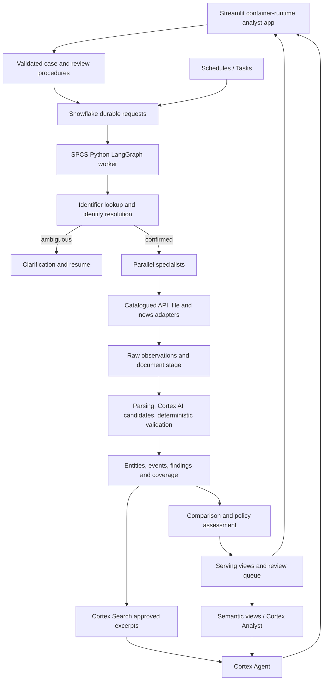

# TrustSignal Complete Implementation Plan

> Direction update (2026-10-04): the hackathon scope is closed. This design is
> retained for architectural context; hackathon deadlines, submissions and demo-only
> defaults are superseded. Use [future scope](future-scope.md),
> [project context](project-context.md) and [development backlog](development-backlog.md)
> for current open-source decisions and actionable work. Dated implementation
> claims and estimates below are not current verification or delivery commitments.

**Planning baseline:** 2 October 2026. This is the authoritative execution backlog for the worldwide TrustSignal solution and Snowflake CoCo hackathon release. Estimates assume two engineers with access to the required Snowflake features and selected source accounts; they are planning estimates, not delivery commitments.

## 1. Delivery objective

Build an analyst workspace that accepts a legal party, confirms its identity, runs bounded specialist research in parallel, preserves the evidence in Snowflake, compares findings, computes an explainable assessment under a versioned policy, and records a human decision. Monitoring refreshes the same evidence model after new source publications. Analyst questions use Cortex Agent over governed case facts and cited documents.

The first release supports a credible global foundation and a small working source set: GLEIF, UK Companies House, Norway's organization registry, UN sanctions, and one approved news provider or official-newsroom adapter. Demonstrate two independently resolved companies from different jurisdictions; also demonstrate a relationship across borders if the selected official records support it. All eight specialist lanes appear in the board, with unsupported lanes explicitly marked as coverage gaps.

Full global coverage is an ongoing connector program. The MVP ships three or more working research lanes plus an identity stage; it does not require every country or court system to be integrated before the workflow works.

## 2. Current implementation baseline

| Area | Present in repository | Remaining work |
|---|---|---|
| Domain | Pydantic request, finding, branch, comparison and assessment contracts | Resolved parties, evidence links, events, coverage, attempts, reviewer actions, versioned input |
| Workflow | LangGraph input gate, parallel fixture branches, join, branch isolation | Identity lookup before specialist fan-out, persistent attempts, deadlines, recovery, cancellation |
| Live sources | Exact-LEI GLEIF adapter | Other adapters, discovery, polling, provenance persistence, source health |
| Comparison | Groups findings by claim type | Semantic claim keys, contradictions, event clusters, chronology and evidence independence |
| Assessment | Routes incomplete cases or sends to review without scoring | Approved policy, dimensions, explanations and review transitions |
| Snowflake | V001 foundation and V002 request/serving DDL | Applying DDL, complete grants, repositories, procedural entry points, extended data model |
| UI | Local Streamlit and initial Snowflake intake/read UI | Durable case progress, board, evidence, reviewer actions, relationships, Agent panel |
| Deployment | Bootstrap templates and warehouse-runtime CLI app definition | Container-runtime UI, SPCS worker, image/release pipeline, account validation |

Existing scaffolding is local code and SQL; account deployment and live end-to-end Snowflake integration have not been verified. The GLEIF branch currently consumes an observation to construct a finding but does not retain the raw response durably. Persist that observation before extraction in the first connector implementation package.

## 3. Target architecture and technology decisions



| Decision | Implementation choice |
|---|---|
| Application language | Python 3.11-compatible code, uv lockfile, Pydantic contracts |
| Required parallel research | LangGraph workflow with explicit branch completion barrier |
| Worker deployment | Snowpark Container Services service; external container with scoped OAuth/key-pair identity is the fallback |
| UI deployment | Streamlit in Snowflake container runtime for the complete Cortex Agent experience |
| Durable state | Snowflake raw/core/ops/serve tables; graph recovery through persisted attempts and checkpoints |
| Small API responses | Parameterized repository writes; avoid introducing streaming infrastructure for small request batches |
| Bulk snapshots | Internal stage plus COPY; retain original artifact and checksum when permitted |
| Future push feeds | Snowpipe Streaming only after a source feed and measured latency requirement justify it |
| Declarative projections | SQL views first; Dynamic Tables for independently refreshed entity/event/search projections |
| Imperative scheduling | Tasks/procedures for enqueueing refresh work; worker performs long research runs |
| Extraction | Cortex AI structured candidates, validated before verified status |
| Analyst conversation | Cortex Agent with Cortex Search and Cortex Analyst semantic tools |
| Developer workflow | CoCo assists Python, SQL, tests and reviewable deployment configuration |

Snowflake currently directs Streamlit applications calling Cortex Agents APIs to use a container runtime. The current warehouse-runtime project definition remains an interim intake/read prototype. Container-runtime apps can use restricted caller's rights for supported viewer-context operations; warehouse-runtime apps cannot. Validate the selected package versions and feature availability during account preflight. References: [Cortex Agents](https://docs.snowflake.com/en/en/user-guide/snowflake-cortex/cortex-agents) and [Streamlit restricted caller's rights](https://docs.snowflake.com/en/developer-guide/streamlit/features/restricted-callers-rights).

## 4. Repository structure to implement

Keep `src/` as the source root and `trust_signal/` as the Python import namespace. The following tree is the target; directories without existing files are planned additions.

```text
trust-signal/
  app.py                              # local UI launcher
  src/trust_signal/
    config.py                         # typed runtime/environment settings
    models.py                         # existing contracts, split when necessary
    domain/                           # identity, evidence, event, review contracts
    resolution/                       # identifier validators and candidate resolver
    orchestration/                    # identity -> fan-out -> compare -> assess
    agents/                           # eight bounded specialist lanes
    connectors/
      base.py                         # capability-based adapter protocols
      gleif.py
      companies_house.py
      norway_registry.py
      un_sanctions.py
      news.py
    ingestion/                        # polling, rate limits, checkpoints, raw landing
    processing/                       # documents, extraction, validation, event clusters
    scoring/                          # policy loader, dimensions, routing
    persistence/                      # Snowflake session and repository interfaces
    worker/                           # request loop, attempts, deadlines, health
    cortex/                           # extraction client and Agent client
    ui/pages/                         # intake, cases, case detail, review, sources
    ui/components/                    # board, timeline, evidence, relationship view
  snowflake/
    bootstrap/                        # account setup and EAI templates
    migrations/                       # ordered DDL and grants
    procedures/                       # submit, clarify, review, retry, enqueue
    transformations/                  # serving views and Dynamic Tables
    tasks/                            # refresh scheduling and source health
    cortex/                           # Search, semantic views, Agent definitions
    app/                              # thin Snowflake Streamlit entry point
    spcs/                             # worker Dockerfile, service spec, compute setup
    seeds/                            # source catalog and synthetic demo policy
    snowflake.yml
  tests/unit/
  tests/connector_contracts/
  tests/integration/
  tests/e2e/
  tests/fixtures/                      # synthetic/captured permitted samples
  scripts/                            # preflight, migrate, validate, demo replay
  .github/workflows/                   # checks and reviewed environment promotion
  docs/
```

Use the same UI components locally and in Snowflake. Separate backend wiring through injected services so source, workflow, and assessment logic never lives in page rendering code.

## 5. Work packages and implementation order

### WP00: account and delivery configuration

Create `config.py`, a secret-free configuration example, and an account preflight command. Validate connection/authentication, selected database, role, warehouses, model access, Cortex services, Streamlit container runtime, compute pool eligibility, EAI privileges, and source credentials. Record the selected demo entities and source list in deployment configuration.

**Deliverables:** typed settings, environment naming, feature report, source-owner mapping, CoCo development notes. **Depends on:** nothing. **Complete when:** an authenticated development connection can execute a bounded query and the chosen deployment topology is confirmed.

### WP01: Snowflake foundation and access

Apply V001/V002 in DEV after reviewing bootstrap object names. Add a migrations ledger, dedicated UI-owner and AI-reader roles, fully specified grants, stage, image repository, compute pool and source-specific EAI/secret references. Give the UI role only serving access and validated request/review procedures. Promote the same migration set to DEMO after integration checks.

**Deliverables:** grants migration, migration runner with checksums, SPCS setup templates, stage definitions. **Depends on:** WP00. **Complete when:** authorized reads/writes work and unauthorized raw access and case writes fail in role tests.

### WP02: contracts and durable case lifecycle

Extend contracts with `ResolvedParty`, `IdentityCandidate`, `SourceCoverage`, `EvidenceReference`, `Event`, `BranchAttempt`, `ReviewAction`, and policy metadata. Support queued/running/awaiting-details/awaiting-review/recommendation-ready/closed states, plus failed and cancelled execution states. Distinguish case ID, input version, research run ID, branch attempt ID and finding ID.

Add tables for identity candidates/decisions, entity identifiers, relationships, events, evidence links, per-case source coverage, processing runs and request attempts. Add `LEASE_OWNER`, `LEASE_EXPIRES_AT`, `ATTEMPT`, `INPUT_VERSION` and recovery metadata to requests as needed. Add evidence mode and model/prompt/extraction metadata where the current schema lacks them.

**Deliverables:** Pydantic/JSON schemas, data-model migrations, transition rules. **Depends on:** WP01. **Complete when:** invalid transitions fail and new input/evidence creates a new version with prior history intact.

### WP03: Snowflake persistence and procedural commands

Implement repositories for requests, cases, observations, branch attempts, findings, comparisons, assessments and actions. Use bound parameters and batch writes. Add validated `SUBMIT_CASE`, `CLARIFY_CASE`, `RECORD_REVIEW_ACTION`, `RETRY_BRANCH` and `ENQUEUE_REFRESH` procedures or equivalent server commands. The server assigns tenant and actor context, validates input, and enforces expected case version for updates.

The single-worker MVP serializes request claiming and idempotent writes. Branches may fetch concurrently; the coordinator serializes result persistence. Before scaling workers, introduce a queue/claim implementation with demonstrated atomic ownership and unique request enforcement. Snowflake standard-table keys and a conditional UPDATE alone must not be assumed to provide exactly-once delivery. Test concurrent claims and use at-least-once processing with idempotent effects.

**Deliverables:** persistence interfaces, Snowflake implementations, command procedures and rollback/error semantics. **Depends on:** WP02. **Complete when:** replay of a request produces one effective case version and one effective finding per stable source/version key; interrupted writes recover consistently.

### WP04: production-shaped worker and orchestration

Refactor the current input gate into an actual identity stage. Confirm identifiers against official records, then pass immutable resolved-party context to specialists. Run all applicable branches concurrently with source concurrency limits and explicit join. Store branch start/completion and partial results; classify failures without exposing credentials or response bodies.

Implement per-call timeout, branch deadline, case deadline, transient retry with jitter and Retry-After, cancellation checks, worker heartbeat and attempt recovery. Initial recovery can replay unfinished branches from persisted inputs/observations. Integrate a supported durable LangGraph checkpointer when cross-node resume is needed; select and validate its storage separately rather than inventing an untested Snowflake checkpointer.

**Deliverables:** worker CLI/service loop, health endpoint, execution budgets, recovery tests. **Depends on:** WP03. **Complete when:** closing the UI or restarting the worker does not lose the case; one source outage leaves other completed branches visible.

### WP05: reusable connector framework and raw landing

Replace the universal `fetch_by_lei` protocol with capability-specific identity lookup, search, snapshot and document-fetch interfaces. Each adapter declares jurisdictions, identifiers, event classes, auth requirements, rate budget, allowed hosts, retention and freshness policy. Save raw observations before parsing, and preserve malformed permitted payloads with an error reference for replay.

For files, store the original bytes in a governed stage and its hash/reference in the observation; do not force XML/PDF into a JSON dictionary. Parse XML with a hardened parser and bound input size. Persist source checkpoints, ETag/Last-Modified when provided, source version and pagination state. Scope caches to source/license and tenant boundaries.

**Deliverables:** capability protocols, shared HTTP client/retry policy, observation writer, file loader, catalog seed. **Depends on:** WP03; can proceed alongside WP04. **Complete when:** pagination, 404, 429, source timeout, malformed response and changed payload behave predictably in contract tests.

### WP06: first global connector set

Implement the sources in the table below. GLEIF first closes the current raw-persistence gap; Companies House and Norway demonstrate jurisdiction-specific resolution; UN sanctions adds official event coverage; the news adapter adds dated reporting and official-source follow-up.

**Deliverables:** five adapters, fixtures, source catalog entries, access settings and health checks. **Depends on:** WP05. **Complete when:** each enabled adapter has a verified real retrieval in DEV, stored provenance and a visible coverage state; disabled credentials/access show an explicit gap.

### WP07: specialists and identity/event validation

Implement registry/legal, ownership/linkage, financial/filings, board/leadership, news/adverse, sanctions/debarment, litigation/insolvency and operational/product/cyber lanes. Each lane calls only its configured adapters. Unsupported lanes return `not_supported` or `not_applicable`, with the distinction recorded. Registry, leadership and sanctions/news must work for the demo source set.

Add jurisdiction-specific identifier normalization, Unicode/alias normalization, candidate match features, analyst confirmation and negative-match fixtures. An exact identifier lookup with a conflicting submitted name requests clarification; name similarity alone cannot establish an adverse match. Preserve direct versus inferred relationship links.

**Deliverables:** specialist envelopes, resolver, evidence validator, coverage matrix. **Depends on:** WP04 and WP06. **Complete when:** same-name companies and unrelated subsidiaries cannot inherit the target's adverse findings and every finalized case records every selected branch's terminal status.

### WP08: Cortex extraction and event normalization

Create a Cortex client for structured extraction/classification and translation assistance. Process permitted excerpts/documents with explicit schema, document reference, model, prompt version and timestamps. Extract subject, event type, event date, procedural state and cited span. Reject unsupported IDs, missing evidence links, invalid dates and ungrounded claims.

Normalize allegation/investigation/charge/order/judgment/appeal/dismissal/withdrawal separately. Keep source-native wording and language alongside normalized fields. Store verification outcomes and reasons; failed extraction must leave the original observation available.

**Deliverables:** structured extraction schema, client, validation rules and labeled evaluation set. **Depends on:** WP05 and WP07. **Complete when:** model candidates cannot bypass evidence/identity validation and model failure still yields a readable case with gaps.

### WP09: comparison and scoring

Replace claim-type grouping with keys for entity, predicate, value/event and effective period. Cluster syndicated duplicates, preserve conflicting official values, recognize chronology changes and distinguish independent corroboration from repeated reporting. Write explicit comparison items linked to findings and evidence.

Implement a schema-validated policy artifact with effective dates, approved owner, dimension weights, coverage gates, event-state factors, thresholds and reason codes. Produce identity/evidence/coverage confidence separately from risk. Unresolved identity or insufficient required coverage yields `not_scored`. Any hard-stop recommendation cites a rule and validated evidence. Synthetic policy tests may exercise all routes; the demo must label an unapproved illustrative policy clearly.

**Deliverables:** comparison service, policy loader/engine, dimension and explanation tables/views. **Depends on:** WP07/WP08. **Complete when:** repeated articles do not inflate the score, dismissals update current interpretation, and each route is reproducible from stored policy/evidence.

### WP10: full analyst UI

Build shared Streamlit pages described in section 9. Replace direct table insertion with the validated case-command boundary. Add case selection, polling bounded by active case state, empty/error/loading states, candidate confirmation, progress, evidence filtering and citation display. Persist review actions with actor, rationale and expected version.

**Deliverables:** usable intake-to-review UI in local and Snowflake environments. **Depends on:** WP03; board/review requires WP07/WP09. **Complete when:** an analyst can submit, clarify, inspect, review and reopen a case without CLI access, and reruns/browser refresh do not lose state.

### WP11: Cortex Search, semantic views and Agent

Create the approved evidence-excerpt projection, Search service and semantic views for cases, assessments, coverage and timeline. Define one analyst Agent with read-only Search/Analyst tools, citation rules and procedural/freshness instructions. Bind thread history to case, actor and tenant; recheck authorization on every request.

Do not rely on a client-supplied Search filter for tenant isolation: tool access and indexed data must enforce the intended boundary. For the single-tenant hackathon, use a dedicated demo index. Add cancellation, streaming response rendering, error recovery, reference resolution and answers that abstain when evidence is unavailable.

**Deliverables:** versioned Search/semantic/Agent definitions, client, QA evaluation suite. **Depends on:** WP08/WP10. **Complete when:** questions return citations to stored evidence, unsupported questions abstain, and unauthorized cases cannot appear in responses.

### WP12: monitoring and incremental refresh

Add subscriptions, refresh configuration, schedule state and notification outbox. Source-specific schedules enqueue refresh requests; connectors detect changed versions/hashes and re-evaluate affected entity cases. Preserve previous assessment versions and show a dated change summary. Debounce duplicate changes and make notification delivery idempotent.

**Deliverables:** refresh Tasks/procedures, subscriptions, outbox adapter, freshness indicators. **Depends on:** WP09/WP10. **Complete when:** a recorded upstream change creates a new evidence/assessment version and one notification; a stale source produces a coverage warning instead of a clean result.

### WP13: deployment, verification and demo delivery

Build the worker image and SPCS service spec, migrate the UI project to the chosen container runtime, and add CI for Ruff, tests, contract/schema checks, image build and integration validation. Deploy DEV first, then promote the same image digest and commit to DEMO. Run role checks, failure/recovery tests and the two-jurisdiction acceptance cases.

**Deliverables:** automated deployment scripts, environment manifest, runbooks, rollback procedure and hackathon walkthrough. **Depends on:** all MVP packages. **Complete when:** a clean deployment from the reviewed commit reproduces the demo and captures the source evidence, Snowflake records, UI and CoCo contribution.

## 6. Source connections and expansion

| Source | Connection and identifiers | Initial implementation | Boundary |
|---|---|---|---|
| [GLEIF](https://www.gleif.org/en/lei-data/access-and-use-lei-data) | Public LEI API; LEI | Exact lookup, persisted observation, relationships where supplied; later name candidates | Covers entities with LEIs |
| [Companies House](https://developer.company-information.service.gov.uk/overview/) | Authenticated API; company number | Company, officers, filing history; PSC after field/access review | UK register; not all global organizations |
| [Norway registry](https://data.brreg.no/enhetsregisteret/api/dokumentasjon/en/index.html) | Official open-data API; organization number | Exact organization lookup and allowed updates | Role/personal fields may require separate access |
| [UN sanctions](https://main.un.org/securitycouncil/en/content/un-sc-consolidated-list) | Official list file; regime/reference IDs | Snapshot/version parsing and candidate entity matching | Name hit requires identity confirmation |
| Approved news provider | Licensed API/feed; article/source IDs | Query confirmed aliases and identifiers; preserve canonical URL and permitted excerpt | Reporting class remains distinct from official findings |

Companies House currently documents a limit of 600 requests in five minutes. Implement a shared credential-level rate budget below that limit and respect 429 responses; independent agents must not each consume the full allowance. [Official developer guidelines](https://developer.company-information.service.gov.uk/developer-guidelines/).

Expansion order: France INSEE, Canada federal register, Australia ABN/ASIC routes, India MCA permitted datasets, Singapore ACRA, Japan corporate-number/EDINET, New Zealand NZBN, South Africa CIPC, then further jurisdictions from the [official source catalog](official-source-catalog.md). Each adapter is a separate deliverable with owner, machine-access evidence, source terms, supported identifier/event coverage, contract fixtures and freshness measurement.

Add OFAC/EU/UK/DFAT sanctions, World Bank/SAM debarment, regulator notices, court/insolvency and safety sources by event lane. Keep jurisdiction context such as FATF separate from company findings. Portal-only sources can support manual evidence upload/verification until an authorized machine channel exists.

## 7. Snowflake object map and migration plan

Names below are proposed additions; exact version filenames are assigned when implementation starts. Never edit an already-applied migration to add new behavior.

| Object group | Planned objects | Purpose |
|---|---|---|
| Identity | `ENTITIES`, `ENTITY_IDENTIFIERS`, `IDENTITY_CANDIDATES`, `IDENTITY_DECISIONS`, `RELATIONSHIPS` | Canonical identity and time-aware connections |
| Evidence | `EVIDENCE_DOCUMENTS`, `FINDING_EVIDENCE`, `EVENTS`, `EVENT_FINDINGS`, `PROCESSING_RUNS` | Trace claim -> excerpt/document -> original observation |
| Execution | Request leases/attempts, `CASE_RUNS`, `CASE_INPUT_VERSIONS`, `CASE_SOURCE_COVERAGE` | Replay, recovery and explicit coverage |
| Policy/review | Existing policies/actions plus `ASSESSMENT_DIMENSIONS`, reviewer assignments | Explainable dimensions and human decisions |
| Operations | Migration ledger, connector checkpoints, subscriptions, notification outbox | Repeatable deployments and refresh delivery |
| Serving | `V_ENTITY_PROFILE`, `V_CASE_PROGRESS`, `V_COMPARISON_BOARD`, `V_EVIDENCE_TIMELINE`, `V_REVIEW_QUEUE`, `V_CASE_COVERAGE` | UI contracts with tenant/version boundaries |
| AI | Excerpt projection, Search service, semantic views, analyst Agent | Governed retrieval and questions |
| Platform | Document stage, image repository, compute pool, worker service, UI | Snowflake hosting |

Migration sequence: grants/ledger -> execution and identity -> evidence and coverage -> review/policy dimensions -> serving procedures/views -> refresh/outbox. Provision Search, Agent and containers through versioned deployment definitions after their data contracts exist. Dynamic Table target lag must reflect measured source cadence, not a global real-time claim.

## 8. Command and service contracts

| Command | Inputs | Result / validation |
|---|---|---|
| Submit case | Party, scope, requested sources, client request token | Server case ID/version and queued status; tenant/actor assigned from authentication |
| Clarify identity | Case ID, expected version, candidate ID or corrected identifiers | New input version and resume; candidate belongs to same case/tenant |
| Get case | Authorized case ID and optional run/version | Profile, progress, findings, comparison, assessment and coverage |
| Retry branch | Case/run/branch ID, expected version, reason | New branch attempt; previous results retained |
| Record review | Case/version, action, rationale | Immutable action and validated transition; stale version rejected |
| Subscribe | Entity/case, schedule and notification preference | Subscription ID and declared monitoring scope |
| Ask Agent | Case ID, question, authorized thread ID | Cited response, source scope and errors; case/tenant checked before tool access |

For the Snowflake demo, these are procedure/client contracts and repository methods. Add REST endpoints later if external integrations or users need them; use the same validation and authorization services rather than duplicating business logic.

## 9. UI implementation specification

Use navigation for **New Case**, **Cases**, **Review Queue**, **Sources**, and **Monitoring**. Each case opens with legal name, jurisdiction/identifiers, identity state, current run progress, coverage freshness and proposed disposition. Use tabs for Comparison, Timeline, Relationships, Assessment and Review; place the Agent panel beside or below the case detail without obscuring evidence.

| UI area | Build requirements | Key states |
|---|---|---|
| Intake | Party identifiers, aliases/address where needed, lookback/scope controls, optional permitted documents | Invalid input, accepted/queued, ambiguous candidates |
| Cases | Compact searchable table, status/jurisdiction/date filters and stable selection | Empty, running, awaiting-details, completed-with-gaps |
| Progress | Identity stage and all selected branch states, timeout and retry indicators | Queued, running, partial, failed, skipped, unsupported |
| Comparison | Dimension rows/specialist columns, evidence counts, conflicts and source gaps | Available evidence, conflict, insufficient coverage |
| Timeline | Date, event/procedural label, source, verification and citation; filter by lane/source | Unverified candidate, verified event, superseded correction |
| Relationships | Inspectable parent/subsidiary/officer links and evidence | Direct, inferred, unresolved relationship |
| Assessment | Dimensions, coverage/confidence, contributing event clusters, policy/version and reason codes | Not scored, scored, recommendation pending review |
| Review | Rationale, request-details/approve-monitor/reject commands and immutable history | Authorized, unauthorized, stale-version conflict |
| Sources | Supported jurisdictions, last success, age, errors, license/access state | Healthy, stale, restricted, disabled, not configured |
| Monitoring | Subscriptions, next check, last material change, notification outcome | Active, paused, failed delivery |
| Agent | Questions, streaming answer, source references and thread history | Loading, cancelled, unavailable, insufficient evidence |

Use stable table/board dimensions, mobile stacked branch sections, visible status labels, accessible contrast and keyboard navigation. Test long international legal names, multilingual source text and empty datasets. Browser automation must verify screenshots, actual source links, filters, clarification, retry and review flows on desktop and mobile.

## 10. Deployment implementation

Create `TRUST_SIGNAL_DEV` and `TRUST_SIGNAL_DEMO`, separate application/pipeline warehouses, and dedicated compute pools or appropriately isolated services for the worker and UI. Configure auto-suspend and credit budgets for warehouse, containers and AI/search usage separately.

Deploy in this sequence: account objects and least-privilege roles -> migrations and procedures -> approved source/policy seed -> secret references/EAI -> worker image/service -> serving transformations -> Streamlit container app -> Search and semantic views -> Agent -> schedules and notifications. Keep schedules paused until smoke tests succeed. Use image digests and immutable commit identifiers in the release manifest.

SPCS uses a service specification for containers and secrets and supports SQL authentication through its service identity/session-token mechanism; implement that authenticated connection rather than embedding a personal credential. Configure explicit outbound source access and verify it from the actual service. References: [SPCS service specification](https://docs.snowflake.com/en/developer-guide/snowpark-container-services/specification-reference) and [SPCS SQL execution](https://docs.snowflake.com/en/developer-guide/snowpark-container-services/spcs-execute-sql).

Rollback restores the prior worker image, UI artifact and Agent definitions. Database changes use compatible additive migrations and corrective forward migrations; never delete evidence to roll back an application release. Record active requests before worker replacement and validate recovery after restart.

The warehouse Streamlit prototype's `CURRENT_USER()` and owner-context permissions require account validation. Default owner rights are not automatically viewer authorization; warehouse context functions can require READ SESSION, and container owner-context connections are unsuitable for user-specific row policies. Implement a verified viewer identity/tenant path before attributing review actions. [Snowflake Streamlit security guidance](https://docs.snowflake.com/en/developer-guide/streamlit/object-management/security).

## 11. Verification and operational requirements

| Test layer | Required checks |
|---|---|
| Unit | Identifier validation, transitions, procedural classification, duplicate clustering, policy routing |
| Connector contracts | Auth errors, pagination, rate limits, malformed payload, file size, 404 and changed versions |
| Snowflake integration | Migrations, bound writes, replay, tenant-scoped reads, allowed/denied role access, procedure actions |
| Worker recovery | Stop after raw landing, stop before finalization, expired attempt, branch timeout, duplicate delivery |
| AI evaluation | Grounded extraction, source-span validity, same-name false matches, allegation/judgment confusion, injected instructions |
| UI end to end | Submit -> clarify -> research -> comparison -> assessment -> review -> refresh -> Agent citations |
| Performance/cost | Measure warm/cold UI and query latency, branch/case completion and per-case credits/model usage |

Start with a minimum 30 labeled scenarios spanning two jurisdictions, false identity matches, corrections, duplicate news, sanctions ambiguity, unavailable sources and model failures. Report raw counts and failures; small demo datasets do not establish production accuracy. All factual findings shown as verified must have resolvable evidence references.

Record case/run/branch/source IDs in logs and measure request age, branch failures, source age, publication-to-ingestion lag, retry volume, extraction validation failures, reviewer overrides and notification failures. Alert on expired requests, sustained source failure and exhausted credit/run budgets. Bound HTTP, document size/pages, source query count and model tokens per case. Restrict source text to evidence processing so embedded instructions cannot trigger tool calls or policy changes.

## 12. Delivery estimate and critical path

With two engineers, reserve approximately four to six weeks for the hackathon slice, depending on source/account availability. One engineer should plan roughly six to ten weeks. Broader global adapters and production multi-tenant delivery need separate estimates based on source complexity and evaluation results.

| Window | Engineering focus | Demonstrable result |
|---|---|---|
| Week 1 | WP00-WP03, UI layout in parallel | Snowflake-backed request and case/action history |
| Week 2 | WP04-WP06 | Worker survives restart; real GLEIF/registry records stored |
| Week 3 | WP07-WP09 and UI board | Parallel specialists, cited evidence, comparison and policy explanation |
| Week 4 | WP10-WP11 | Analyst completes review and asks cited Cortex questions |
| Weeks 5-6 | WP12-WP13, quality and demo rehearsal | Monitored update, repeatable deployment and recovery demonstration |

Critical path: account access -> durable persistence -> identity resolution -> source evidence -> validated findings -> comparison/policy -> review UI -> Cortex retrieval -> deployment validation. UI layout and connector fixtures can proceed while account objects are prepared. Do not add unrelated technologies to the critical path simply because they are available.

## 13. Release acceptance and post-hackathon work

Release acceptance requires two real companies from different jurisdictions, at least three operational research lanes, a source outage demonstration, durable evidence/case history, an ambiguous identity that pauses research, a comparison conflict/duplicate example, an explainable assessment or justified not-scored state, recorded human review, cited Cortex QA and one refresh/version demonstration. Fixture demonstrations remain visibly labeled. Replaying a stored case must reproduce comparison and policy outputs without fresh external calls.

The production backlog then adds multi-worker claim/queue verification, customer identity/tenant administration, region-specific processing/retention, additional licensed official sources, larger multilingual evaluation, disaster recovery, service-level objectives and external API integrations. Snowflake Native App packaging can follow if distributing the product into customer Snowflake accounts becomes a concrete requirement.

## 14. First implementation batch

Start with WP00-WP03: typed configuration, account feature report, complete grants/migration ledger, extended request/attempt contracts, Snowflake repositories and validated case commands. Then wire the existing fixture graph to that durable path and prove that the deployed UI can queue and retrieve a completed case. This batch establishes the integration contract that all live connectors, specialist agents and Cortex tools will share.
