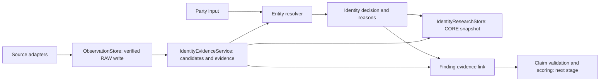

# Entity resolution and evidence implementation

This is the first implemented identity policy (`identity-0.1`). It supports global
names and identifiers through portable Python contracts. Country-specific registry
validation, temporal entity merging and analyst-confirmed associations are later steps.

## Flow and boundaries



The source registry and ingestion pipeline remain independent. The resolver accepts
`PartyInput` and `IdentityCandidate` objects without fetching data or connecting to
Snowflake. `IdentityEvidenceService` accepts normalized `EntityLookup` responses and
an injected `ObservationStore`; it persists and verifies raw responses before
returning a resolution and evidence documents. Storage errors stop that operation.
Already stored RAW responses remain available for recovery.

`IdentityResearchStore` saves the complete research snapshot with tenant, case,
input version and policy version. Its Snowflake CLI implementation verifies the
stored JSON after writing. The stored input makes decisions reproducible.

## Identity rules

| Information | Outcome |
|---|---|
| Exact LEI and normalized legal name or explicit alias, without conflicts | Confirmed candidate |
| Exact registration number, name, jurisdiction and issuing registry | Confirmed candidate |
| Exact name, alias, or name similarity of at least 0.8, without identifier confirmation | Candidate requiring review |
| Conflicting comparable identifiers, jurisdiction, or name with an exact identifier | Conflict requiring review |
| Multiple confirmed records, or a confirmed record plus a conflicting record with the same submitted identifier | Ambiguous; no attribution |
| No suitable candidate | No match; no clean-risk conclusion |

Registration numbers retain leading zeros and punctuation. Set
`PartyInput.registration_authority` to the source registry ID for registration-based
matching. A country alone cannot identify the issuing registry. LEI comparisons do
not require that field. Country/subdivision compatibility supports `US` versus
`US-WA` for LEI matching; different explicit subdivisions produce a conflict.

Names use Unicode NFKC, case folding and normalized separators. Scripts and accents
are retained; legal suffixes are not removed. Similarity is a discovery heuristic,
not a calibrated confidence or a trust score. Addresses provide supporting reasons,
not independent identity confirmation. A changed address does not by itself prove
a different legal party. Unknown aliases and transliterations require review.

Repeated copies of one source record are deduplicated by the service. Conflicting
versions of that record stop the operation for temporal review. Distinct records
that both confirm the input remain ambiguous in this policy; automatic cross-source
merging is not yet implemented.

## Evidence rules

An evidence document links a subject candidate to an immutable observation ID,
source record, URL, connector version, SHA-256 hash and retrieval timestamp. The
receipt must match the observation's deterministic ID and hash, and the original
response must still match its parsed payload. Publication and event timestamps
are separate optional fields; retrieval time is never substituted for them.

Registry adapters own normalized field extraction. The service checks source and
record consistency; it does not independently re-parse every registry schema.
Inputs should come from trusted, tested adapters. Contracts are internal component
interfaces, not authorization boundaries for untrusted API submissions.

`registry_evidence()` creates registry candidates and documents.
`sanctions_evidence()` creates listing candidates and documents from a verified
snapshot. Snapshot observation IDs and individual listing IDs remain separate.
UN country text is not assumed to be an ISO registry jurisdiction. A name/alias hit
on a sanctions list therefore remains pending identity confirmation.

`link_finding()` records confirmed, pending or excluded attribution and validates
the candidate's source and observation association. It always leaves scoring
disabled and claim verification as `not_validated`: confirming identity does not
validate an allegation, procedural state, or scoring rule.

## Snowflake integration

Apply migrations through `V005__identity_evidence.sql` in the intended DEV database.
It creates `CORE.IDENTITY_DECISIONS` (using the repository's `TRUST_SIGNAL_CORE`
schema name), plus serving views for candidates and evidence. Each snapshot embeds
the submitted input, candidate decisions and document provenance as VARIANT data.
The evidence view joins to RAW through `OBSERVATION_ID`.

The adapter follows the existing single-writer CLI approach: sequential replay is
idempotent, but standard-table uniqueness is not a concurrency guarantee. Tenant
and case are retained on each row; role grants and enforced tenant isolation must
be configured before sharing these serving views with application users.

Example using a locally authenticated named connection:

```python
from trust_signal.connectors.gleif import GleifAdapter
from trust_signal.models import PartyInput
from trust_signal.persistence.identity import SnowflakeCliIdentityResearchStore
from trust_signal.persistence.snowflake_cli import SnowflakeCliObservationStore
from trust_signal.resolution.service import IdentityEvidenceService

party = PartyInput(legal_name="Microsoft Corporation", lei="INR2EJN1ERAN0W5ZP974")
with GleifAdapter() as source:
    lookup = source.fetch_by_lei(party.lei)
service = IdentityEvidenceService(SnowflakeCliObservationStore("trust_signal_dev"))
research = service.resolve(party, [lookup] if lookup else [])
decision_id = SnowflakeCliIdentityResearchStore("trust_signal_dev").store(
    "demo", "case_microsoft", 1, research
)
```

This path is explicit and separate from the current local case graph. The live
GLEIF branch now uses the resolver and exposes structured decisions in case JSON,
and the graph resolves identity before dispatching any additional live specialists,
but continues to perform retrieval without durable storage. It creates no verified
evidence documents. Local fixture runs remain illustrative and unscored.

## Verification and remaining work

Unit tests cover identifiers and registry scopes, conflicting countries and names,
Unicode names, aliases, ambiguity, duplicate observations, mismatched hashes and
receipts, sanctions attribution, and CORE write/readback failures. Snowflake calls
are mocked in these tests. This migration and CORE adapter have not been verified
against a live account in this implementation step.

Next integrate persisted identity into the worker before specialist fan-out;
map persisted collection/search records to candidates; add temporal entities and
analyst confirmation; implement claim/event validation and durable finding links;
then enable a reviewed scoring policy. Canonical entity IDs and automated
cross-source consolidation are deliberately not inferred in this first policy.
