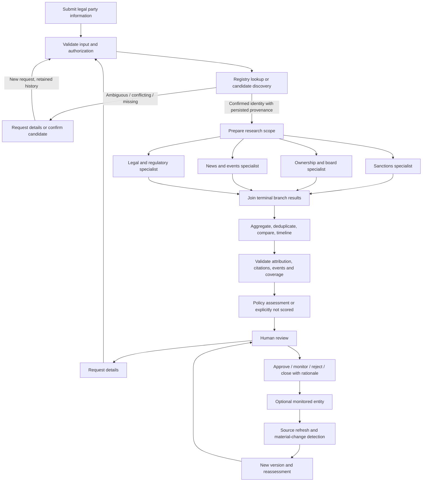
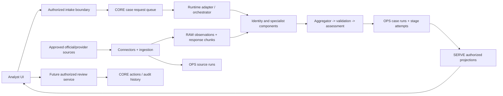

# TrustSignal: Product, Workflow, and Backend Design Handoff

Prepared on 2026-10-03 for designers, Figma collaborators, frontend engineers,
backend engineers, and hackathon reviewers. This is a design brief, not a claim
that every described feature is deployed. Source code and versioned contracts
take precedence over older architectural documents.

For a shorter prompt suitable for a design tool, see
[Figma design prompt](figma-design-prompt.md).

## 1. Product Definition

**TrustSignal is a global legal-entity research and monitoring workspace.**
An analyst identifies a company, organization, or other legal party, confirms
the correct entity, and gathers traceable evidence from official registries,
sanctions authorities, regulators, courts, permitted news sources, and other
approved providers. Independent specialists research different dimensions in
parallel. An aggregator creates a comparison board, evidence timeline, and
coverage report. Validated findings will eventually support policy-based risk
assessment and accountable human decisions.

The first screen is the working application, not a marketing landing page.
The core question is: **"What do we know about this exact legal party, which
sources support it, what is missing, and what should a reviewer do next?"**

### Product Boundaries

- Global ambition does not mean complete worldwide source coverage today.
- A legal identity, an allegation, a finding, and a decision are separate objects.
- A source response stored successfully is not automatically a verified claim.
- A sanctions snapshot is not a sanctions match against the submitted company.
- A news mention is not proof of fraud or wrongdoing.
- No results, failed checks, partial checks, and verified absence are distinct.
- "Real time" means source-specific publication, retrieval, and processing latency.
- AI may assist extraction and explanation; it does not establish legal truth.
- A recommendation is not an automatic approval or rejection of a business.
- No synthetic data is inserted as live evidence. Prototype-only examples must
  be visibly labeled and kept outside production evidence storage.

## 2. Readiness Legend and Current Baseline

Use these labels in Figma annotations, backlog tickets, and implementation notes:

| Label | Meaning |
| --- | --- |
| Built | Repository code or schema exists; deployment may still be required |
| Recorded DEV verification | A dated repository report records a successful live check; not a fresh verification in this handoff |
| Scaffold | UI, tables, or stage structure exists but its full behavior is not connected |
| Planned | Design target; a backend capability must be implemented |
| Blocked | Access, rights, account capability, or other approval prevents use |

| Capability | Current baseline | Design consequence |
| --- | --- | --- |
| Account-independent configuration | Built: `.env.example`, private `.env`, encrypted keys, setup/initialization generators | Never expose keys or an administrator role in analyst screens |
| Official-source ingestion | Built; multiple sources have recorded DEV retrieval/storage verification | Source health and evidence provenance are useful now |
| Raw evidence and chunk storage | Built, with hash/payload readback and source-run history | Show retained evidence references, not a blanket "verified company" badge |
| Legal-entity resolution | Built: exact identifiers, name conflicts, candidate discovery | Confirmation is an explicit gate before attribution |
| Local workflow | Built: LangGraph and Streamlit demo; live GLEIF identity path | Keep demo and live modes clearly separate |
| Standalone aggregator | Built: claim grouping, exact-content deduplication, comparison, timeline, branch coverage | A comparison does not calculate a risk score |
| Durable workflow | Built: queue claims, attempts, cached stage outputs, result persistence, task graph | Needs eligible runtime and integration to support live hosted research |
| Four deployed specialists | Scaffold: sanctions, ownership, news, legal stages return skipped outputs | Do not display completed research or invented findings |
| Claim/event validation | Planned; runtime explicitly returns `not_validated` | Show "Validation not configured" |
| Risk scoring | Planned; `risk_score` remains null | Show "Not scored", never zero or a green score |
| Hosted analyst UI | Streamlit scaffold exists; result-view wiring is incomplete | Design the real workflow result reader, not just legacy tables |
| Review actions, monitoring, alerts, exports | Planned | Annotate interactions as backend work, not working endpoints |
| Cortex services | Planned and capability/permission/budget gated | Do not imply a live Cortex assistant exists |
| Multi-tenancy | Not production-ready | Current hosted scaffold is a single hackathon demo tenant |
| Non-Snowflake provider | Future adapter boundary only | Do not offer a working Google Cloud connection in the current UI |

Recorded DEV account reports describe a trial-account deployment with the task
root suspended and live external access unavailable inside Snowflake. The selected
near-term path is manually invoked external source fetching with Snowflake storage.
That external ingestion path is not yet connected to the durable case task graph.
See [deployment readiness](deployment-readiness.md) and
[trial deployment](trial-deployment.md). No account was queried for this handoff.

## 3. Users, Jobs, and Permissions

These are proposed application personas, not currently implemented authorization roles.

| Persona | Main job | Intended permissions |
| --- | --- | --- |
| Requester | Submit an entity and supply missing details | Submit/view authorized cases; respond to clarification |
| Analyst | Investigate identity, sources, conflicts, and coverage | Inspect findings; propose resolutions; prepare review |
| Reviewer | Make a documented business decision | Record decision, rationale, conditions, and overrides |
| Operator | Keep connectors and workflows healthy | Inspect runs; reconcile failures; authorized retries |
| Account administrator | Install and govern an account | Provision resources, grant roles, approve connectivity and cost controls |
| Auditor | Reconstruct who knew what and when | Read authorized evidence, versions, attempts, and action history |

Derive tenant/user context from authenticated server-side identity. Never trust
an editable tenant ID. Operators must not silently gain reviewer authority;
analysts must not receive task ownership or account administration privileges.
Separate operational status from the business assessment throughout the UI.

## 4. Information Architecture

### Primary Navigation

1. **Cases**: queue, filters, assignments, new case, investigation detail.
2. **Entities**: confirmed identity profiles and historical investigations; planned.
3. **Monitoring**: watchlists, subscriptions, changes, alert inbox; planned.
4. **Sources**: capabilities, jurisdiction coverage, freshness, access limitations.
5. **Operations**: run/stage history and recovery, visible only to operators.
6. **Administration**: account readiness, policy, permissions, governance; gated.

### Case Detail Tabs

Overview, Identity, Research, Comparison, News & Events, Ownership & Board,
Legal & Sanctions, Evidence, Review, and History.

Tabs are different views of the same case/run, not independent disconnected
applications. Preserve selected case, run, evidence, filters, and scroll position
when moving between a comparison row and the corresponding source evidence.

### Suggested Figma File Pages

- `00 Brief & Readiness`: scope, terminology, capability legend, assumptions.
- `01 Foundations`: tokens, typography, layout, icons, accessibility.
- `02 Components`: tables, status chips, stage rows, evidence drawers, dialogs.
- `03 Analyst MVP`: intake, identity, progress, result, evidence, source coverage.
- `04 Review & Monitoring`: future decisions, alerts, reassessment journeys.
- `05 Operations & Setup`: privileged screens and deployment boundaries.
- `06 Responsive & Edge States`: mobile, empty, failed, blocked, partial, stale.
- `07 Engineering Contracts`: mappings, examples, events, acceptance checklist.

## 5. End-to-End Stage Flow

### Intended Product Flow



Validation, scored assessment, durable reviewer decisions, monitoring, and
material-change detection in this diagram are design targets, not completed services.

### Current Durable Snowflake Graph

```text
CORE.CASE_REQUESTS queued
  -> TS_CLAIM
  -> TS_IDENTITY
       unresolved / invalid / lookup unavailable -> terminal result, no fan-out
       confirmed -> TS_SANCTIONS   -- currently skipped
                 -> TS_OWNERSHIP   -- currently skipped
                 -> TS_NEWS        -- currently skipped
                 -> TS_LEGAL       -- currently skipped
                   join -> TS_AGGREGATE
                        -> TS_VALIDATE -- not configured
                        -> TS_ASSESS   -- unscored analyst review
  TS_FINALIZE reconciles interrupted work and preserves terminal results
```

The graph claims one case per run, is configured not to overlap graph runs, and
allows sibling specialist tasks to execute in parallel. Its root remains suspended
in the recorded trial deployment. The local LangGraph path is a separate execution
adapter; the Snowflake handlers do not launch another nested LangGraph fan-out.

### Stage-to-UI Mapping

| Stage | Inputs and output | Analyst experience | Failure/edge behavior |
| --- | --- | --- | --- |
| Intake | `PartyInput` -> `CaseRequest` | Name, identifiers, jurisdiction, optional supporting details | Field validation; queued receipt is not a research result |
| Identity | Official observations -> candidates and resolution | Candidate comparison; exact identifier/name evidence | No match, conflict, ambiguous, source unavailable |
| Scope | Confirmed identity + approved capabilities; planned | Show relevant jurisdictions/source coverage | Unsupported jurisdiction is a visible gap |
| Specialists | Request + confirmed identity -> `BranchResult` | Independent stage rows and evidence counts | One unavailable branch becomes a gap, not a clean check |
| Aggregate | Branches -> `AggregationResult` | Comparison matrix, groups, duplicates, timeline | Preserve conflicting claims; never pick a winner automatically |
| Validate | Claims/provenance -> eligibility; planned | Claim-specific validation details | Current output is `not_validated` |
| Assess | Eligible findings + policy -> `Assessment`; scoring planned | Rationale, policy version, coverage, score availability | Null score is "Not scored" |
| Review | Assessment + human rationale -> action; planned | Clarify, review, monitor, reject, close | Disabled until durable authorization/action storage exists |
| Monitor | Subscription + refreshed evidence; planned | Changes, alert detail, version comparison | Stale source and delivery failure remain visible |

## 6. Multi-Agent and Modular Component Model

"Agent" means a bounded specialist with typed inputs/outputs and approved tools,
not an unrestricted chatbot. Current specialist stage slots are not equivalent
to completed AI research agents.

| Component | Responsibility | Dependency / interface | UI representation |
| --- | --- | --- | --- |
| Intake service | Authorized, validated, idempotent submission; full service planned | `CaseRequest`; queue storage | Form, receipt, validation |
| Orchestrator | Claim, identity gate, fan-out/join, recovery | `WorkflowStore`, `StageRunner`, stage outputs | Stage progress and attempt history |
| Source registry | Declare operations, access gates, jurisdictions | `SourceRequest`, source definitions | Capability/coverage table |
| Connector | Fetch and parse one provider | `SourceBatch`, source observations | Source detail, last attempt |
| Ingestion | Retain raw response, verify storage, log coverage | `ObservationStore`, `SourceRunStore` | Observation and run receipts |
| Identity resolver | Explain candidate matches and attribution eligibility | `IdentityResolution` | Candidate table and conflict panel |
| Sanctions specialist | Match exact party against approved snapshots; planned | Confirmed identity + retained listings | Potential/confirmed match evidence, not list totals |
| Ownership/board specialist | Explain parent links, roles, dates, exceptions; planned | Registry relationship/role evidence | Relationship table/graph and director rows |
| News/events specialist | Discover permitted articles and classify sourced events; planned | Confirmed identity + licensed metadata/documents | News list and event timeline |
| Legal/regulatory specialist | Separate allegations, proceedings, judgments, notices; planned | Permitted primary documents | Legal event list with procedural status |
| Aggregator | Group, deduplicate, compare, preserve coverage | `AggregationService.aggregate(branches, identity)` | Comparison board and timeline |
| Validator | Check attribution, citation support, scope and dates; planned | Typed findings + observations | Verification details per claim |
| Assessment engine | Apply a reviewed deterministic policy; planned | Eligible findings + policy version | Explainable assessment |
| Review service | Persist authorized, auditable decisions; planned | Case/run version + reviewer action | Review panel and history |
| Monitoring service | Refresh, detect changes, notify; planned | Subscription, source cadence, prior version | Watchlist and alerts |
| Storage/serving adapter | Persist contracts and expose authorized projections | SQL executor/repositories; Snowflake today | No storage credentials in analyst view |

Components must remain replaceable behind contracts. Do not merge connectors,
aggregation, scoring, or review into the orchestrator. Replacing a news provider
should not require redesigning the case screen; replacing storage must preserve
evidence identifiers, audit semantics, and authorization guarantees.

### Dependency Rules

1. Source retrieval is independent of UI and can run standalone.
2. Ingestion verifies persistence before releasing records for downstream use.
3. Entity attribution depends on confirmed identity, not name similarity alone.
4. Specialists do not depend on each other's success; the aggregator joins their
   terminal outputs and limitations.
5. Aggregation does not fetch, call an LLM, validate legal truth, or score risk.
6. Scoring must depend on eligible validated findings and an approved policy.
7. Human waiting is persisted state, not a permanently running task.
8. Monitoring produces new versions; it must not overwrite historical decisions.

### AI-Specific Design Constraints

Show citations, structured conclusions, model/prompt versions when available,
tool execution records, and limitations. Do not display hidden chain-of-thought
or a fabricated "agent thinking" transcript. A planned evidence assistant must
answer within authorized case evidence, cite findings/observations, decline
unsupported conclusions, and request confirmation before any consequential action.
External text is untrusted input, not instructions for agents or the UI.

## 7. Screen Specifications

### A. Cases / Work Queue

Default application screen. Use a compact table with legal name, jurisdiction,
identifier, identity state, workflow state, score availability, recommendation,
coverage gaps, last update, and case/run reference. Proposed assignment and review
due-date columns require new backend support.

Provide New case, search, filters, sortable columns, pagination, saved-view design,
and a clear row-to-detail action. Design queued, running, needs information,
completed with gaps, awaiting review, and failed variants. Saved views, assignment,
and several queue states are planned, not existing persisted enums.

Do not hide all queued cases simply because no legacy `CASES` row exists yet.
The queue reader needs authorized request data as well as workflow projections.

### B. New Case / Intake

Use legal name as required, jurisdiction and identifiers as strongly encouraged.
Expose LEI or registration ID + authority, plus optional website, registered
address, and aliases. Support name-first discovery as a distinct route, not proof
of identity. Optional organization type, case purpose, scope, and attachments are
planned extensions, not current `PartyInput` fields.

Show relevant source coverage before submission; unsupported regions do not get
a promise of comprehensive checks. Inline errors follow current lengths:
legal name 2-240; LEI exactly 20; jurisdiction 2-8; registration ID/authority
up to 120; website up to 500; registered address up to 1000 characters.
Trim blank optional fields to null. Alias and URL validation need further backend
rules; do not imply the current contract already verifies them.

### C. Identity Confirmation

Use a comparison table rather than a conversational guess. Columns: official
legal name, aliases, jurisdiction, LEI, registry identifier/authority, address,
source, match status, reason codes, and evidence link. Show submitted input next
to the official record. Offer select candidate, edit details, and inspect source.

Current matches expose name similarity and attribution eligibility, not a
calibrated probability. Never label similarity as "99% verified identity".
Selecting a candidate is a planned durable UI command: the current backend
supports explicit LEI resubmission, not a finished candidate-confirmation API.

### D. Research Progress

Show a stable stage diagram or list with the four parallel branches visibly
sharing the identity gate. Each branch shows status, timing, attempt, sources,
findings, and limitations. Detail expands to an operator-safe run summary.
Do not invent completion percentages or exact remaining time. A source response
can be stored while later attribution/validation is still pending.

### E. Case Overview

Persistent compact entity header: official name, jurisdiction, identifiers,
case/run IDs, identity state, last refresh. Below: assessment state, recommendation,
coverage summary, material findings, conflicts, and latest events.

Risk, identity confidence, claim verification, and source coverage are different
dimensions. Do not compress them into one "trust" number. Today show an unscored
assessment with reasons; a future score panel must state scale direction, policy
version, assessment time, factor contributions, and coverage constraints.

### F. Comparison Board

Group rows by subject, claim key, event/effective period, and evidence mode.
Show claim value, branch, source, event date, verification/procedural state,
finding references, duplicate grouping, and relation. Expand side-by-side evidence.

Map current relations exactly:

| Backend value | Display label | Interpretation |
| --- | --- | --- |
| `consistent_claims` | Consistent claims | Matching normalized assertions; not proof of independent corroboration |
| `potential_conflict` | Potential conflict | Different values for an explicitly single-valued claim in the same scope |
| `duplicate_evidence` | Duplicate evidence | Repeated content/claim; retain all references |
| `combined_members` | Combined members | Multiple valid members, such as different directors; not contradiction |
| `unstructured_claims` | Requires inspection | Free text grouped without semantic truth/contradiction inference |

Different event dates and different entities must not collapse into a conflict.
Unknown dates stay unknown. Conflict resolution and reviewer notes need a future
write contract; current aggregation is read-only and preserves original claims.

### G. News & Events

Rows include title, publisher, language, event date if known, publication time,
retrieval time, event/procedural classification, identity-match state, and citation.
Use metadata and links until document rights permit more. Full article text,
publisher images, translations, clustering, and fraud classification are not
automatically licensed or implemented. An official announcement is not necessarily
a final enforcement decision. Syndicated coverage must not inflate evidence counts.

### H. Ownership & Board

Table-first relationships with optional graph: entity/person, role, direct or
ultimate parent, source, effective dates, current/historical flag, identifiers,
and exceptions. Graph nodes open evidence details. Distinguish accounting parent
relationships from legal ownership percentages and beneficial ownership.
Never infer a director, ownership percentage, or sanctions ownership-rule result
from an absent field. Missing public disclosure is not "no owner".

### I. Legal & Sanctions

Separate sanctions, debarment, insolvency, litigation, investigations, and
enforcement. Show authority, jurisdiction, subject identifiers, aliases, measures,
dates, proceeding/reference IDs, and procedural status. Label candidate matches
as candidates pending identity review. Do not brand an entity fraudulent because
it appears in a search result, snapshot, allegation, or unrelated proceeding.

### J. Evidence Explorer

Reusable drawer/full-page inspector linked from every finding. Show claim and
subject, source/canonical URL, source record ID, finding ID, observation IDs,
source-run ID, connector version, response hash, verification scope, procedural
status, event/publication/retrieval/ingestion times where available, and limitations.
Authorized operators may inspect retained raw content or chunks through a future
read interface; do not expose unrestricted RAW SQL or private payloads to analysts.
Render external content as escaped text, not executable HTML.

### K. Review & Decision

Proposed controls: request more information, send for analyst review, approve,
approve with monitoring, reject, close, or override with rationale. Require
permissions, mandatory reasons, current run/policy version, confirmation for
consequential actions, and append-only audit records. Current disposition enums
are recommendations only; no durable decision service exists yet.

Keep future controls disabled or clearly separated in implementation-preview
designs. A dialog closing or a toast appearing is not a persisted decision.

### L. Monitoring & Alerts

Planned watchlist with source-specific freshness, scope, owner, next expected
check, latest change, and subscription state. Alert detail compares previous and
new evidence, summarizes impact, and links to reassessment. Design snooze,
acknowledge, assign, unsubscribe, delivery failure, and stale-data states with
explicitly planned contracts. Do not promise continuous coverage everywhere.

### M. Sources and Coverage

Table: source, authority/provider, jurisdiction, operations, source class,
configured/access state, last fetch, last success, expected cadence, checked scope,
coverage, failure category, connector version, rights restrictions. Filters by
jurisdiction, purpose, capability, and availability. Show both catalog capability
and actual case-specific checked coverage; they are not interchangeable.

### N. Operations and Account Readiness

Privileged views for request/run IDs, latest stage attempts, retry history,
sanitized errors, task-root/schedule state, queue backlog, source failures, and
storage verification. Current backend supports operator recovery, not an analyst
"retry all" button. Requeue requires quiescence and creates a new run.

Setup design: prerequisites -> private configuration -> keys -> reviewed plan ->
administrator apply -> read-only checks -> bounded real-source smoke -> readiness
report. Keep secret entry out of the general Figma prototype; show masked status
and credential references only. Scheduling, spending, account-wide AI residency,
and external access require administrator approval, never automatic UI activation.

## 8. Backend Integration: What Can Be Used Today

There is no implemented HTTP product API. Figma designs must not claim that
illustrative REST routes already exist. Current entry points are Python functions,
CLI commands, and Snowflake SQL/Snowpark projections.

### Local Backend Invocation

```python
from trust_signal.models import CaseRequest
from trust_signal.orchestration.case_graph import run_case

request = CaseRequest.model_validate({
    "schema_version": "1",
    "party": {
        "legal_name": "Microsoft Corporation",
        "lei": "INR2EJN1ERAN0W5ZP974",
        "jurisdiction": "US",
    },
    "source_mode": "gleif_live",
})
result = run_case(request)
payload = result.model_dump(mode="json")
```

This executes live ingestion when configured and can incur source/warehouse use.
It is a synchronous local function, not a hosted async API. Use a background
execution boundary before attaching long-running work to a production UI.
Never create fixture evidence as a fallback when live research fails.

### Standalone Source Operations

```bash
uv run --locked --extra snowflake python -m trust_signal.ingestion.pipeline \
  --list-sources --env-file .env

uv run --locked --extra snowflake python -m trust_signal.ingestion.pipeline \
  --requests examples/microsoft_identity.json --env-file .env \
  --output outputs/live/microsoft-identity.json
```

These commands list capabilities or ingest evidence; they do not complete
policy scoring, review actions, monitoring, or every specialist stage.
Connection/initialization instructions remain in
[application connection](application-connection.md) and
[Snowflake initialization](snowflake-initialization.md).

### Snowflake Submission and Read Paths

| UI need | Current object | Important boundary |
| --- | --- | --- |
| Submit/queue | `TRUST_SIGNAL_CORE.CASE_REQUESTS` | Scaffold inserts directly; validated authorized submission procedure is needed before broader use |
| Durable final report | `TRUST_SIGNAL_SERVE.V_WORKFLOW_RESULTS` | `RESULT` contains complete case JSON or input failure; filter by authorized tenant/case/run |
| Latest stage progress | `TRUST_SIGNAL_SERVE.V_WORKFLOW_PROGRESS` | Latest attempt per stage; queued stages may have no attempt row yet |
| Historical attempts | `TRUST_SIGNAL_OPS.STAGE_ATTEMPTS` | Needs restricted serving projection for an audit UI |
| Source health | `TRUST_SIGNAL_SERVE.V_SOURCE_HEALTH` | Requires populated source catalog; not proof a source checked a particular case |
| Identity candidates/evidence | `V_IDENTITY_CANDIDATES`, `V_IDENTITY_EVIDENCE` | Separate identity projections; verify writer integration per runtime |
| Legacy normalized summary/findings | `V_CASE_SUMMARY`, `V_CASE_FINDINGS` | Durable stage adapter does not populate their underlying normalized tables |
| Review history | `TRUST_SIGNAL_CORE.CASE_ACTIONS` schema | Durable authorized action writer/UI integration is not implemented |

The hosted Streamlit scaffold currently reads legacy summary/findings views.
The redesigned UI must read the durable workflow projections or wait for a
normalized publication repository; otherwise completed workflow results can
remain invisible. Views alone do not enforce production tenant isolation.

### Canonical Frontend Data Mapping

| Contract / field | UI use |
| --- | --- |
| `CaseRequest.case_id`, `party`, `source_mode`, `requested_at` | Intake receipt and input snapshot |
| `IdentityResolution.status`, `selected_candidate_id`, `matches`, `reason_codes` | Identity decision and candidate explanation |
| `CandidateMatch.status`, `name_similarity`, `eligible_for_attribution` | Match labels and attribution gate; not probability |
| `BranchResult.branch_id`, `status`, `sources_checked`, `limitations`, timing | Specialist progress/coverage |
| `Finding.claim`, `claim_type`, `subject_id`, structured value/key/cardinality | Claim row and comparison context |
| `Finding.source_*`, `observation_ids`, `content_hash`, `connector_version` | Citation/provenance inspector |
| `Finding.evidence_mode`, `verification_status`, `procedural_status` | Independent evidence badges |
| `AggregationResult.groups`, `comparison_board`, `timeline`, `coverage` | Comparison and joined coverage |
| `Assessment.risk_score`, `score_status`, `reasons`, `policy_version`, `disposition` | Assessment panel and recommendation |
| `CaseResult.status`, `identity_status`, `branches`, `aggregation`, `assessment` | Whole investigation; aggregation may be null |
| `WorkflowInputFailure.error_category`, `reason_codes` | Invalid input terminal view; not a normal company result |

Do not treat `created_at` as source freshness. Do not use `Finding.risk_weight`
to calculate a client-side score; the presence of that field does not establish
a validated scoring policy. Current findings do not expose every publication/
ingestion field, so an evidence projection is required for the richer inspector.

### Proposed Future HTTP Boundary

These are design proposals only. A React/custom frontend needs this or an
equivalent secure backend-for-frontend; do not connect a browser directly with
Snowflake credentials.

| Proposed command/query | Intent |
| --- | --- |
| `POST /v1/cases` | Authenticated validated intake with idempotency key |
| `GET /v1/cases` | Authorized filtered/paginated request and case queue |
| `GET /v1/cases/{case_id}` | Latest authorized case projection |
| `GET /v1/cases/{case_id}/runs/{run_id}` | Immutable run/report snapshot |
| `GET /v1/cases/{case_id}/runs/{run_id}/progress` | Stage state and timestamps |
| `POST /v1/cases/{case_id}/identity-confirmations` | New validated request with selected identifier and audit context |
| `GET /v1/cases/{case_id}/evidence/{observation_id}` | Rights- and tenant-checked evidence projection |
| `POST /v1/cases/{case_id}/actions` | Version-checked reviewer decision with rationale |
| `GET /v1/sources` | Approved capability/health projection |
| `POST /v1/operator/runs/{run_id}/requeue` | Authorized recovery after runtime safety checks |
| `POST /v1/subscriptions` | Monitoring registration; later phase |

Specify versioned schemas, pagination, validation errors, request IDs, permission
errors, idempotency semantics, stale-version conflicts, retry guidance, and audit
logging before implementation. Tenant IDs come from authentication, not request
body authority. Current Snowflake standard tables do not guarantee uniqueness
merely because an idempotency key is recorded. Initial UI can poll progress with
bounded intervals/backoff; streaming is a future choice, not an existing feature.

## 9. Status and Failure Vocabulary

Keep display labels separate from persisted values. Do not write a proposed
UI state into an existing enum without changing the contract.

| Domain | Current values / behavior | Display rule |
| --- | --- | --- |
| Case result | `needs_more_information`, `completed`, `completed_with_gaps` | A completed run can still be unscored and require review |
| Branch result | `completed`, `failed`, `skipped` | Skipped is not a clean result |
| Stage attempts | `running`, `succeeded`, `completed_with_gaps`, `skipped`, `failed` | Show latest attempt and retain history |
| Source coverage | `available`, `no_matches`, `partial`, `blocked`, `failed` | No matches only describes checked source scope |
| Identity resolution | `resolved`, `ambiguous`, `needs_review`, `no_match` | Show reasons and retained candidates |
| Candidate match | `confirmed`, `candidate`, `conflict`, `no_match` | Avoid certainty inflation |
| Evidence mode | `live_source`, `demo_fixture` | Prominent, unambiguous mode separation |
| Disposition | `request_details`, `analyst_review`, `monitor_recommendation`, `reject_recommendation` | Recommendation, not saved final decision |
| Score | Null plus explicit `score_status` | "Not scored" with reasons; never substitute zero |

Required prototype variants: empty installation; no cases; submission queued;
malformed input; multiple candidates; exact-match conflict; no record; identity
source unavailable; skipped specialist; partial paging; HTTP 429; blocked license;
stale snapshot; storage outcome unknown; interrupted attempt; unconfigured scoring;
permission denied; stale review version; failed export; monitoring delivery failure.

For an unknown storage outcome, direct an operator to reconciliation. Do not
offer an unconditional automatic retry that could duplicate writes. One branch
failure remains visible while other branches finish. Previously reviewed evidence
remains accessible when a new run fails.

## 10. Source Ecosystem and Coverage

This summarizes the checked-in source register, not a new live endpoint audit.
Exact source IDs and operations come from `default_registry()`/`--list-sources`.

| Family / source | Scope and useful data | Current limitation |
| --- | --- | --- |
| GLEIF | Global LEI identity, candidate discovery, parent relationships | Not every legal party has an LEI; relationship exceptions/caps matter |
| Norway registry | Official organization record and organizational roles | Norway only; privacy limits remain for raw payloads |
| Companies House | UK company profile adapter | Deliberately paused; officers/ownership expansion not ready |
| UN sanctions | Entity-list snapshot | Individuals are not parsed by this adapter; entity matching pending |
| OFAC SDN | US designation snapshot with listed subjects | Not all OFAC lists or ownership-rule screening |
| UK FCDO | UK sanctions list and measures | Snapshot does not establish party match |
| EU financial sanctions | Consolidated financial sanctions | Not all EU restrictive measures |
| Australia DFAT | Consolidated workbook | Parser/storage capture verified in recorded tests; adapter HTTP reliability unresolved |
| World Bank | Debarment data | Listing classification/subject attribution needed |
| FCA newsroom | Official recent announcement metadata | Not necessarily final enforcement findings |
| UK Gazette | Corporate notice search | Bounded paging; identity matching pending |
| Find Case Law | Court metadata search adapter | Computational-analysis permission gate remains blocked |
| GDELT | Multilingual news discovery metadata | Rate limits, publisher trust, content rights, and attribution unresolved |
| SEC EDGAR | US issuer filings | Planned connector, not current registry integration |
| Other national registries | France, Canada, Australia, India, Singapore, Japan, New Zealand, South Africa and more | Catalogued expansion; adapters/access not implemented |

Global map visuals, if used, show capability and gaps, not an implied all-green
world. Registry/legal status is authoritative only within its jurisdiction and
scope. GDELT is a discovery provider, not a government authority. An entity's
own press release is a primary statement by that entity, not independent proof.
See [source status](source-integration-status.md),
[source operating guide](source-connectors.md), and
[official source catalog](official-source-catalog.md).

## 11. Snowflake Data Flow and Service Responsibilities



In the selected trial path, the fetch node runs outside Snowflake; connecting it
to durable case orchestration is still work to do. The diagram describes component
ownership and target connectivity, not a currently complete hosted pipeline.

| Snowflake technology | Intended responsibility | Project readiness |
| --- | --- | --- |
| Databases and schemas | RAW/CORE/OPS/SERVE ownership boundaries | Built |
| Virtual warehouse | SQL and warehouse-backed procedure/task compute | Configured DEV; queries cost credits |
| Snowpark Python procedures | Adapt portable Python stages to supplied Snowflake session | Five procedures recorded deployed in restricted mode |
| Tasks/task graphs | Dependencies, parallel siblings, retry, finalizer | Built/deployed graph; recorded root suspended |
| External access integrations and secrets | Approved outbound source requests from eligible Snowflake runtimes | Trial path blocked; source-specific approval required |
| Stages | Versioned Python workflow artifact storage | Workflow code stage built |
| Streamlit in Snowflake | First hosted analyst UI option | Scaffold; projection and action wiring pending |
| Cortex Code / CoCo | Development assistance for code, SQL, tests, deployment work | Development tool, not today's evidence-fetching pipeline |
| Cortex AI | Planned structured extraction, summarization, translation with citations | Not integrated; entitlement/residency/budget checks required |
| Cortex Search | Planned retrieval over approved retained evidence | No deployed project Search service |
| Cortex Agents | Planned bounded research/assistant tool orchestration | No deployed project Agent integration |
| Cortex Analyst | Optional future governed analytics over structured data | Not a source connector or current requirement |
| Streams / Dynamic Tables / dbt | Optional future refresh/change/transformation work | No working project deployment; do not design as mandatory |
| Snowpark Container Services | Optional later hosted runtime for heavier jobs | Not implemented |
| Snowsight Git repository / dbt projects | Development/versioning or transformation options | Not runtime orchestration merely because a menu item exists |

Use Tasks as the current Snowflake dependency-graph mechanism, not an invented
Airflow/Composer deployment. Do not add both a Snowflake graph and another parallel
agent graph for the same run without a deliberate ownership boundary.

Official capability references: [task graphs](https://docs.snowflake.com/en/user-guide/tasks-graphs),
[Streamlit](https://docs.snowflake.com/en/developer-guide/streamlit/about-streamlit),
[Cortex Code](https://docs.snowflake.com/en/user-guide/cortex-code/cortex-code-in-your-editor),
[Cortex Agents](https://docs.snowflake.com/en/user-guide/snowflake-cortex/cortex-agents),
and [trial-account limitations](https://docs.snowflake.com/en/user-guide/admin-trial-account).
These describe platform capabilities, not proof of project integration.

## 12. Deployment and Environment Perspectives

| Environment | UI/runtime design | Safety/readiness boundary |
| --- | --- | --- |
| Local demo | Local Streamlit + fixtures | Visible demo label; not evidence-backed company assessment |
| Current real-data DEV trial | Manual external worker + key-pair connection + Snowflake evidence/audit storage | Root suspended; external worker/task integration pending |
| Eligible-account hackathon slice | Approved EAI, procedures/task graph, connected Streamlit | Bounded smoke, reviewed grants/budget, real identity evidence; specialists still need handlers |
| Pilot | Hosted workers or eligible Snowflake runtime, validated policies, reviewer actions | Authentication, tenant isolation, rights, monitoring and evaluation gates |
| Production / bring your own account | Reproducible onboarding and versioned upgrades, supported provider adapters | No administrator credentials in browser; cost/residency/rollback/retention approvals |

Portable installation is a reviewed plan/apply process, not an unrestricted
"paste a password and provision anything" action. Show connection readiness,
schema/migration state, privileges, source access, runtime state, and UI readiness
separately. Do not use a single green "Ready" badge when only authentication works.
Account initialization can partially commit DDL; recovery belongs to an operator.

## 13. Design System and Interaction Rules

- Quiet operational design: compact navigation, scanning-friendly tables,
  constrained typography, and unframed page sections. No marketing hero.
- Neutral white/gray surfaces; restrained teal/blue actions; amber gaps;
  red conflicts/failures; green only for a specifically completed/confirmed state.
  No dominant single-hue theme or decorative gradients/orbs.
- Use Auto Layout, component variants, constraints, and variables/tokens.
  Standard frame targets: 1440 desktop, 1024 compact/tablet, 390 mobile.
- Keep table density useful; use a drawer for evidence and a full-page view
  where comparison requires width. Mobile keeps priority columns and explicit
  expansion rather than crushing every table column into tiny text.
- Icons for familiar tools with accessible names/tooltips; tabs for views;
  checkboxes/toggles for binary settings; menus for option sets. Radius <= 8px
  unless a future established design system dictates otherwise.
- Persistent context, stable stage rows, explicit timestamps/time zones,
  keyboard navigation, visible focus, non-color status cues, WCAG 2.2 AA target.
- Never obscure a source gap behind a generic success notification.
- Use text such as "Identity confirmed", "Potential match", "Partial coverage",
  "Source unavailable", "Not scored", "Analyst review recommended".
- Avoid "Trusted company", "Fraud detected", "All clear", or "Globally verified"
  unless a reviewed, precisely scoped evidence/policy contract justifies the claim.
- Use actual product tables, evidence, timelines, and sourced assets only where
  rights permit. Avoid decorative stock imagery in the research workspace.

## 14. Prototype Journeys and Acceptance Criteria

### Required Journeys

1. Exact company identifier -> confirmed identity -> source coverage -> unscored
   result -> evidence inspection. Microsoft/GLEIF is the reference real-source path.
2. Name-first search -> multiple candidates -> inspect identifiers -> resubmit
   explicit identity -> research. Preserve original request/run history.
3. Name/identifier conflict -> no specialist fan-out -> request correction.
4. Confirmed identity -> one blocked/failed source -> other branches finish ->
   completed-with-gaps view with an explicit unscored assessment.
5. Comparison -> potential conflict -> side-by-side evidence -> reviewer note;
   note persistence is a planned capability.
6. Review recommendation -> reasoned decision -> audit receipt; clearly future.
7. Watched entity -> new official event -> version comparison -> reassessment;
   clearly future.
8. Operator failure -> inspect attempts -> quiesce/reconcile -> authorized requeue;
   not an unrestricted analyst retry.
9. New account -> generated reviewed plan -> smoke check -> partial/full readiness;
   never silently turn on recurring compute.

### Acceptance Checklist

- Every actionable finding opens its provenance and original source reference.
- Identity cannot be implied by name similarity or the existence of a raw response.
- All prototype screens identify built/scaffold/planned/blocked dependencies in
  designer annotations; product screens avoid explanatory architecture essays.
- Risk score is null/"Not scored" throughout current-backend journeys.
- No clean outcome is inferred from skipped, failed, blocked, or partial checks.
- Candidate confirmation, decisions, exports, and monitoring have explicit
  pending write/query contracts rather than invented existing APIs.
- Queue/progress/results use request/workflow projections, not exclusively legacy
  normalized tables that the current runtime does not publish.
- Read-only analysts do not see credentials, RAW payloads by default, or recovery
  controls. Multi-tenant sharing is blocked until policies/auth are implemented.
- Dates distinguish occurrence, publication, retrieval, ingestion, and decision;
  absent timestamps are not invented.
- Desktop/mobile, loading/empty/error, permissions, stale versions, and partial
  completion states are all represented and reachable in the prototype.

## 15. Delivery Sequence and Open Decisions

**First design slice:** Cases, intake, identity confirmation, progress, unscored
case result, evidence drawer, source coverage, and restricted operator history.
**Second slice:** Real specialist findings, comparison/conflict workflows,
claim validation, reviewed score policy, authorized reviewer actions.
**Third slice:** Monitoring, alerts, exports, evidence assistant, production
tenancy, and account onboarding UX backed by complete services.

Before implementation, decide:

- Hosted Streamlit first or custom frontend with a new authenticated API?
- Exact application roles and tenant isolation mechanism?
- Which jurisdictions/source families define the supported first release?
- Which sanctions match and ownership rules, legal-event classes, and news rights?
- Policy meaning/direction, eligible evidence, weights, thresholds, overrides?
- Who is authorized to approve/reject, and what retention/appeal policy applies?
- Which account/runtime can host fetching; how will external workers claim work?
- Inference geography, permitted models, source/token/case budgets, refresh cadence?
- Notification/export formats and permitted redistribution of evidence?

Do not delay wireframes for all of these, but mark unresolved behavior instead of
silently choosing defaults with legal, security, or financial consequences.

## 16. Engineering Reference Map

| Topic | Source of truth |
| --- | --- |
| Request, finding, branch, assessment/result | `src/trust_signal/models.py` |
| Identity decisions | `src/trust_signal/domain/identity.py` |
| Aggregation contracts/rules | `src/trust_signal/domain/aggregation.py`, `src/trust_signal/aggregation/service.py` |
| Local orchestration | `src/trust_signal/orchestration/case_graph.py` |
| Durable stage behavior | `src/trust_signal/domain/workflow.py`, `src/trust_signal/orchestration/stages.py` |
| Snowflake runtime/queue | `src/trust_signal/orchestration/snowflake_runtime.py`, `src/trust_signal/persistence/workflow.py` |
| Source capabilities | `src/trust_signal/connectors/registry.py` |
| Verified ingestion | `src/trust_signal/ingestion/pipeline.py` |
| SQL schemas/views | `snowflake/migrations/V001` through `V007` SQL files |
| Task dependencies | `snowflake/tasks/WORKFLOW_GRAPH.json` |
| Hosted UI scaffold | `snowflake/app/streamlit_app.py` |
| Local UI | `app.py` |
| Broader design and backlog | [system design](system-design.md), [implementation plan](complete-implementation-plan.md) |

Recheck this handoff when source handlers, policies, schemas, runtime topology,
or authorization change. A Figma prototype is not evidence that a feature works.
