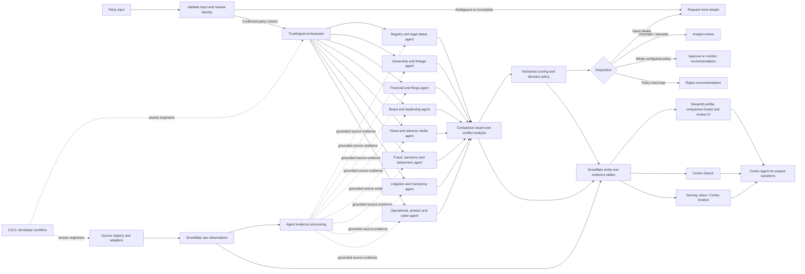
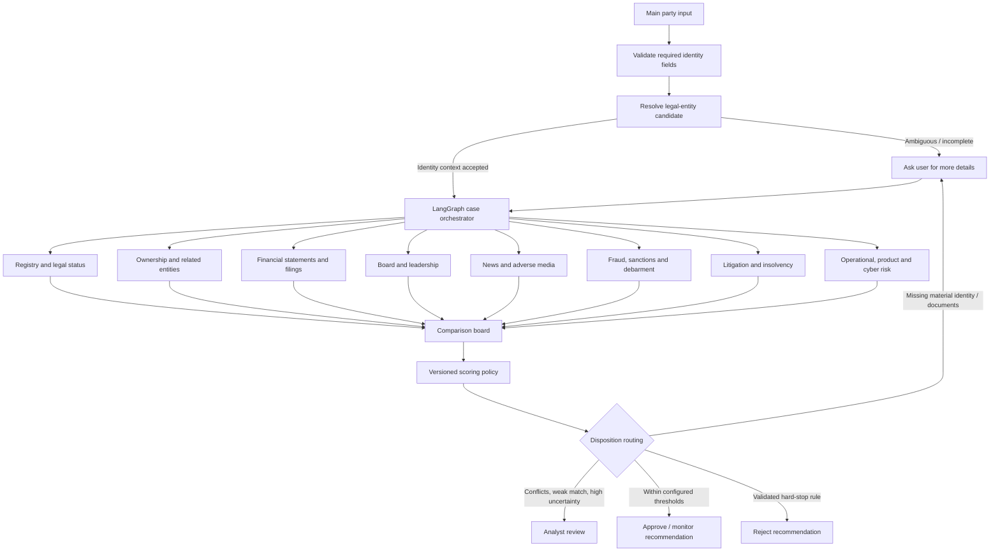

# TrustSignal Global Product and Technical Design

**Status:** Target design for the worldwide Snowflake COCO hackathon project
**Scope:** Legal-entity resolution, trusted-source monitoring, verified evidence, and explainable organization trust signals.

For the complete operational plan, including state management, security, deployment, evaluation, and open decisions, see [system-design.md](system-design.md).

## 1. Product definition

TrustSignal helps a user determine whether a company, nonprofit, public body, or other organization is the legal party they intend to assess, what verifiable developments have occurred, and how strong and current the evidence is.

The product combines official legal identity records with regulator, court, sanctions, insolvency, procurement, safety, company-disclosure, and reputable-news evidence. It presents a dated evidence trail and source coverage. It does not declare a party "safe" based on silence, treat allegations as findings, or hide uncertainty inside one unexplained score.

### Core users and jobs

| User | Need |
|---|---|
| Analyst / reviewer | Resolve an entity, inspect evidence and conflicts, record a decision with an audit trail. |
| Procurement / onboarding team | Confirm counterparty identity and monitor material changes. |
| Risk / compliance team | Search across organizations, event classes, jurisdictions, and evidence dates. |
| Product/API consumer | Request entity profile, evidence, source coverage, and change notifications in a stable format. |

### Product outcomes

- Resolve a legal party by registration identifier, LEI, tax identifier, name, jurisdiction, address, and aliases, showing candidate matches and match reasons.
- Maintain a current organization profile and a time-aware graph of parent, subsidiary, branch, director, officer, and ownership relationships where sources support them.
- Find and monitor relevant adverse or material events, with primary-source evidence wherever possible and secondary reporting clearly labeled.
- Show what was checked, where, and when, including access failures, source gaps, and last-successful retrieval.
- Provide concise summaries with citations that open the underlying evidence.

## 2. Principles and boundaries

1. **Identity precedes event matching.** News about a same-name company must not be attributed without identity evidence.
2. **Preserve what the source said.** Keep immutable source observations and extracted claims separately. Corrections create new observations; they do not erase history.
3. **Separate evidence classes.** Official record, official allegation, court filing, judgment, company disclosure, reputable reporting, and unverified lead are not interchangeable.
4. **Record source freshness.** Publish source publication time, observed/fetched time, ingestion time, and verification time independently.
5. **Expose coverage.** A source that is blocked, unavailable, paid, not licensed, or not checked is a coverage state, not a negative result.
6. **Use the source's lawful access channel.** APIs, downloads, public portals, subscriptions, and access restrictions vary. Do not evade controls or assume public visibility grants bulk-reuse rights.
7. **Keep human review meaningful.** Any score is a navigation aid; evidence and applicable policy remain visible, and consequential decisions can be reviewed and corrected.

### Not in the initial scope

- Universal coverage of every jurisdiction or every local court and registry.
- A guarantee that all events arrive in real time.
- Legal advice, a credit rating, an automatic onboarding decision, or a conclusion that an allegation is true.
- Unauthorized access to restricted beneficial-ownership or personal data.

## 3. Target architecture



### Components and ownership

| Component | Responsibility | Preferred implementation |
|---|---|---|
| Product UI / API | Intake, search, profile, timeline, citations, analyst review, subscriptions | Retain Streamlit for hackathon speed; later expose a versioned service/API if the workflow needs integrations or multi-user access. |
| Entity resolver | Normalize names/identifiers, produce candidates, explain match confidence, prevent cross-entity attribution | Deterministic identifier and jurisdiction rules first; multilingual normalization and model-assisted candidate ranking as support. |
| Multi-agent orchestrator | Validate party context, fan out specialist research in parallel, join all branch envelopes, preserve partial failures, and launch comparison/scoring | Keep the existing LangGraph approach for explicit parallel fan-out/fan-in and checkpoints. Run it as a Python orchestration service/worker; the Streamlit UI submits a case and reads its state. |
| Specialist agents | Research registries/legal status, ownership, filings/financials, board, news, fraud/sanctions, litigation/insolvency, and operational events | Each specialist uses approved source adapters and structured Cortex AI extraction. Agents return cited findings and source-coverage status, not free-form verdicts. |
| Comparison board | Align specialist results, surface corroboration, duplicates, conflicting facts, event chronology, confidence, and missing coverage | Deterministic comparison over shared schemas, with model assistance only for concise explanation. Preserve disagreement rather than flattening it. |
| Scoring and disposition policy | Convert verified evidence and coverage into versioned dimension scores and next-action recommendations | Explicit rules/configuration with an auditable explanation. An LLM may explain the result but does not directly set a reject outcome. |
| Case routing and review | Request missing details, queue uncertain cases, recommend approve/monitor, or recommend rejection under policy | Persist case state and reviewer decisions in Snowflake with actor, timestamp, policy version, and rationale. |
| Source registry | Canonical list of sources, jurisdictions, event classes, access rules, formats, cadence, licensing, health | Snowflake configuration tables managed through reviewed migrations. |
| Source adapters | Fetch official APIs, feeds, files, or permitted portal content; preserve raw responses and source metadata | Small Python connector interface. Run outside Snowflake or in a Snowflake execution service appropriate to outbound networking and credentials. |
| Ingestion landing | Durable, idempotent arrival of source observations | Snowpipe Streaming for event-like low-latency input; file stages / Snowpipe for bulk and periodic snapshots. |
| Evidence processing | Parse, normalize, hash, deduplicate, extract claims, classify, validate | Snowflake SQL and Dynamic Tables for relational transformations; Streams/Tasks or procedures for imperative work and event-driven branches; Cortex AI for extraction/classification with structured output. |
| Evidence retrieval | Retrieve excerpts and documents with source references and filters | Cortex Search over permitted source text and parsed documents. |
| Analyst question agent | Let an analyst ask follow-up questions across the completed case, structured records, and cited documents | Cortex Agent over governed semantic views and Cortex Search. It complements the deterministic parallel case orchestrator; do not depend on its tool planning to guarantee that every specialist branch ran. |
| Monitoring | Detect changed records, maintain source health and freshness, notify subscribers | Snowflake Tasks/Alerts and an external notification adapter; use source-specific polling/feeds. |
| Development assistant | Help author and maintain SQL, connector code, tests, and Cortex Agent configuration | Snowflake Cortex Code (CoCo), with human review for generated migrations, access grants, and data transformations. |

Snowflake product capabilities and constraints are documented in [Cortex Agents](https://docs.snowflake.com/en/user-guide/snowflake-cortex/cortex-agents), [Cortex Search](https://docs.snowflake.com/en/user-guide/snowflake-cortex/cortex-search/cortex-search-overview), [Snowpipe Streaming](https://docs.snowflake.com/en/user-guide/snowpipe-streaming/data-load-snowpipe-streaming-overview), [Dynamic Tables decision guide](https://docs.snowflake.com/en/user-guide/dynamic-tables/decision-guide), [Triggered Tasks](https://docs.snowflake.com/en/user-guide/tasks-triggered), and [CoCo getting started](https://docs.snowflake.com/en/user-guide/snowflake-cortex/cortex-agents-get-started).

Snowflake Cortex Agent toolsets let one agent inherit another agent's tools; the documentation describes the effective tool set as a union of tools. For this product's required fixed parallel branch execution and join barrier, keep that control in the LangGraph case workflow. Use Cortex Agent for the analyst's flexible questions over the completed, governed case. See [Cortex Agent toolsets](https://docs.snowflake.com/en/user-guide/snowflake-cortex/cortex-agents-toolsets).

### Proposed repository structure

```text
trust-signal/
|-- app.py                         # Streamlit entry point
|-- src/trust_signal/
|   |-- ui/
|   |   |-- pages/                 # Search, entity profile, review queue, coverage
|   |   `-- components/            # Identity, evidence, timeline, coverage, alerts
|   |-- domain/                    # Entities, identifiers, relationships, events, evidence
|   |-- orchestration/
|   |   |-- case_graph.py          # Validate, parallel fan-out, join, score, route
|   |   |-- state.py               # Case and branch state contracts
|   |   `-- comparison_board.py    # Cross-agent evidence and conflict alignment
|   |-- connectors/
|   |   |-- base.py                # Shared source adapter contract
|   |   |-- global_sources/        # GLEIF, UN and regional lists
|   |   `-- jurisdictions/         # SEC, Companies House, INSEE, ACRA, and others
|   |-- agents/
|   |   |-- base.py                # Common specialist result contract
|   |   `-- specialists/           # Registry, linkage, finance, board, news, fraud, legal
|   |-- ingestion/                 # Polling, checkpoints, retries, raw landing
|   |-- resolution/                # Candidate matching and review routing
|   |-- processing/                # Parsing, extraction, validation, deduplication
|   |-- snowflake/                 # Repositories and query helpers
|   `-- cortex/                    # Cortex Agent tools and instructions
|-- snowflake/
|   |-- migrations/                # Roles, schemas, tables, grants
|   |-- transformations/           # Views and Dynamic Tables
|   |-- tasks/                     # Poll, refresh, and notification workflows
|   `-- cortex/                    # Search, semantic views, Agent configuration
|-- tests/
|   |-- unit/
|   |-- connector_contracts/
|   `-- integration/
|-- docs/
`-- pyproject.toml
```

`src/` is the source root; `trust_signal/` is the importable Python package (`import trust_signal`). Keep that package namespace rather than placing application modules directly in `src/`. The existing repository already follows this layout. Keep adapters independent from UI and workflow code so the same connector can run on demand or on a schedule. Add a separate public API only when integrations, external users, or workload isolation require it.

### UI structure

Use four predictable destinations: **Search**, **Cases**, **Review queue**, and **Sources & coverage**. A case is the unit of the orchestrated multi-agent assessment; monitored entities can be a saved filter within Cases.

An entity case should open with a compact party header containing legal name, jurisdiction, registration identifiers, lifecycle status, and identity-match confidence. Show a persistent case progress strip for identity resolution, parallel research, comparison, scoring, and disposition. Below it, use tabs or clearly separated sections for:

- **Comparison board:** specialist agents as columns and dimensions/findings as rows; show status, evidence count, key conclusion, confidence, conflicts, and source gaps. Selecting a cell opens its cited records. On mobile, collapse each agent column into a stacked section rather than forcing an unreadable wide table.
- **Evidence timeline:** verified events and unverified leads, each with event/procedural status, source, dates, and a citation link.
- **Relationships:** parent, subsidiary, branch, officer, or ownership links with evidence and a direct/inferred distinction.
- **Risk and disposition:** separate dimension scores, policy version, explanation, and the proposed next action: request more information, analyst review, approve/monitor, or reject recommendation.
- **Source coverage:** checked sources, last successful retrieval, freshness, and unavailable/restricted/not-supported gaps.
- **Review:** analyst notes, requested information, reviewer decisions, and prior decision history.

The intake accepts main-party information, identifiers, aliases, address, jurisdiction, and optional known related parties/documents. Show which fields are missing before launching the run. When several legal-entity candidates remain, show identifiers and match reasons side by side and ask the user to clarify before specialist agents search. During execution, show each specialist's queued/running/completed/partial/failed state. A failed branch must not erase results from other agents.

The comparison board is the central review surface, not a set of disconnected chat transcripts. It compares claims and evidence across agents, shows agreement or conflict, and lets the analyst inspect source records. Avoid a single unexplained risk gauge; show dimensions and evidence first.

### Real-time meaning

Use a per-source service objective, not a global promise. Examples: process an event feed within seconds of receipt; refresh a permitted source API every few minutes or hours within its rate limits; load a bulk registry snapshot on the source's published cadence. Show `source_published_at`, `first_seen_at`, `last_checked_at`, `last_success_at`, and the measured ingestion lag. Snowpipe Streaming may expose received rows to queries in seconds, but it cannot make an upstream government portal publish sooner.

## 4. Canonical data model

All core records carry stable internal IDs, jurisdiction, source provenance, and valid/system time where applicable. Store the source payload as received, subject to permitted retention and privacy rules. Use relational columns for queryable facts and `VARIANT` for evolving raw payloads.

| Object | Important fields |
|---|---|
| `SOURCE` | `source_id`, authority, jurisdiction, source_class, supported_events, access_mode, license, canonical_url, format, expected_cadence, language, active, notes. |
| `SOURCE_RUN` | `run_id`, `source_id`, started/finished times, outcome, records seen/accepted, lag, error category, connector version. |
| `SOURCE_OBSERVATION` | `observation_id`, `source_id`, source record key, URL, raw payload/document reference, content hash, published/modified/observed/ingested times, language, collection method, license snapshot. Append-only. |
| `ENTITY` | `entity_id`, entity type, primary legal name, native-script names, legal form, jurisdiction, lifecycle state, registered address, profile version. |
| `IDENTIFIER` | `entity_id`, identifier scheme, issuing jurisdiction/authority, normalized value, validity dates, source observation, verification status. Includes LEI and jurisdiction-specific company numbers. |
| `ENTITY_ALIAS` | entity, name, language/script, alias type, valid dates, supporting observation. |
| `ENTITY_MATCH` | input request, candidate entity, match method, feature evidence, confidence, reviewer outcome, resolver version. |
| `RELATIONSHIP` | subject entity, object entity/person, relation type, valid dates, source, confidence, evidence; record whether direct or inferred. |
| `CLAIM` | subject, predicate, normalized value, assertion status, event/effective dates, evidence references, extraction model/version, deterministic validation status. |
| `EVENT` | event ID, event class, affected entity/person, event date, publication date, severity/impact labels, procedural posture, current status, deduplication cluster. |
| `EVIDENCE` | event/claim link, observation, exact excerpt/page, source class, match rationale, verifier, verification result, citation URL. |
| `CASE_RUN` | main party input snapshot, resolved `entity_id`, run status, started/completed times, graph version, correlation ID. |
| `AGENT_RUN` | case run, specialist key, run status, source coverage, start/end time, error/timeout, token/cost details. |
| `AGENT_FINDING` | case run, specialist key, finding type, normalized claim, event/relationship references, confidence, status, evidence IDs. |
| `COMPARISON_ITEM` | comparable subject/claim key, agent findings, agreement/conflict status, resolution state, reviewer note. |
| `SOURCE_COVERAGE` | entity/query, source, event class, check interval, status (`searched`, `no_match`, `unavailable`, `restricted`, `not_licensed`, `not_supported`), result count, limitation. |
| `ASSESSMENT` | case run, entity, as-of time, separate dimension and overall risk scores, explanation, evidence IDs, coverage gaps, scoring-policy version, route recommendation. |
| `CASE_ACTION` | case run, action (`request_details`, `analyst_review`, `approve`, `monitor`, `reject`), actor, rationale, required fields, timestamps, prior action. |

Treat assertions as time-aware. Keep source-reported facts distinct from TrustSignal inferences. Never overwrite a historical company name, status, or relationship in a way that hides when the record was true or when TrustSignal learned it.

## 5. Multi-agent case orchestration

### Case flow



The orchestrator is a TrustSignal application workflow, implemented with LangGraph because the existing project already uses it and the case requires explicit parallel fan-out, separate branch state, a join barrier, checkpointing, and partial completion. Each agent returns a typed branch envelope; it does not write a final decision. Use a common result shape such as:

```text
branch, status, subject_entity_id, findings[], evidence_ids[],
source_coverage[], conflicts[], limitations[], error, started_at, completed_at
```

Each finding carries its class, normalized claim, source observation/evidence IDs, event date, procedural status, identity-match rationale, confidence, and verification state. Agent branches write to distinct state keys so parallel results cannot overwrite one another. The join waits until each branch is completed, partial, failed, skipped, or timed out; a failed branch remains a coverage gap while successful results continue.

### Specialist responsibilities

| Specialist | Scope |
|---|---|
| Registry and legal status | Official existence, legal name, form, jurisdiction, active/dissolved status, filings, and registered changes. |
| Ownership and related entities | Parent/subsidiary, branch, affiliate, direct/indirect control, beneficial-ownership evidence when lawfully available. |
| Financial statements and filings | Disclosures, restatements, overdue filings, financial distress indicators, and sourced changes. |
| Board and leadership | Directors, officers, departures, appointments, disqualifications, and linkages to the identified party. |
| News and adverse media | Relevant reporting, deduplicated by underlying event and clearly distinguished from primary evidence. |
| Fraud, sanctions, and debarment | Official sanctions, procurement exclusions, regulator alerts, fraud findings, and unverified name-match candidates. |
| Litigation and insolvency | Court filings/proceedings, judgments, insolvency, restructuring, and procedural status. |
| Operational, product, and cyber risk | Verified recalls, safety actions, material breaches, closures, and other supported events. |

These are logical agents and can be enabled per entity type and available source coverage. For example, securities-filings research may be not applicable to a small private nonprofit; record that branch as `not_applicable`, not as a successful clean check.

### Comparison board and scoring

The comparison board normalizes and groups findings about the same claim, person, entity relationship, or event. It marks corroboration, conflicting values, duplicate reports, different procedural states, and identity uncertainty. It shows each agent's result side by side with its evidence and source coverage. It must not average conflicting claims into one value or let syndicated copies appear to be independent corroboration.

Keep **identity confidence**, **evidence confidence**, **source coverage**, and **risk severity** as separate inputs. The initial configurable risk dimensions can include legal standing, financial distress, sanctions/debarment, litigation, leadership/ownership, adverse news, and operational/product/cyber events. The scoring policy records:

- versioned dimension weights, event rules, recency treatment, source-authority treatment, and thresholds;
- which verified findings contributed and how procedural status changes the treatment;
- a separate identity/coverage gate, so weak matching or missing sources cannot be disguised by a low risk score;
- dimension scores plus an optional composite risk score, reason codes, conflicts, and evidence references.

The policy router can return `request_details`, `analyst_review`, `approve`, `approve_with_monitoring`, or `reject_recommendation`. Missing critical identifiers or documents routes to more details; material conflicts or partial coverage route to review; a verified policy hard stop can produce a reject recommendation. Do not let a generative model independently reject a party. Persist the policy version and explanation with each outcome; keep final approval/rejection actions auditable and role-controlled.

## 6. Evidence and assessment logic

### Event lifecycle

`observed -> parsed -> candidate -> entity-matched -> verified / unverified / rejected -> assessed -> reviewed`

- A model may propose an event and extract candidate details from a document. The model output is not itself evidence.
- Validation checks citation availability, allowed source class, publication/effective dates, identity identifiers, match rationale, duplicate linkage, and required corroboration for the event class.
- Preserve negative and exculpatory updates, corrections, dismissals, appeals, resolved sanctions, and changed entity status as subsequent events or claims.
- Use explicit procedural language: allegation, investigation, charge, filing, judgment, settlement, appeal, sanction, recall, or company statement.
- Store both primary-source evidence and corroborating reporting when available. A media report can be relevant, but must not be presented as a regulator or court finding.

### Trust presentation

Prefer a compact set of explainable dimensions over one opaque numeric grade:

- **Identity confidence:** strength of link to the intended legal party.
- **Legal standing:** registry status and formal corporate changes.
- **Regulatory / sanctions exposure:** source-backed designations, enforcement, debarment, or restrictions.
- **Legal / insolvency events:** proceedings and outcomes with procedural status and dates.
- **Operational / product / cyber events:** sourced recalls, breaches, closures, and other material developments.
- **Evidence freshness and coverage:** time since last successful check and sources not covered.
- **Relationship confidence:** evidence behind ownership/control/affiliate connections.

If the UI needs a combined signal, compute it from versioned deterministic policy rules and display the contributing dimensions, evidence, weights or thresholds, and gaps. Do not count allegations as final findings or let repeated syndicated stories inflate severity. The first hackathon version can use labelled categories such as `verified event`, `unverified lead`, `no verified event found in checked sources`, and `insufficient coverage` without an overall score.

## 7. Data flow

### On-demand entity check

1. Collect main-party name, jurisdiction, identifiers, aliases, address, known related parties, and optional documents. Validate required identity inputs.
2. Resolve the legal entity before broad news research. If identifiers conflict or multiple entities remain plausible, pause and request more details or analyst selection.
3. Create a case run and pass the accepted party context, allowed identifiers, source scope, and lookback period to the orchestrator.
4. Fan out the configured specialist agents concurrently. Each agent uses its assigned source adapters, stores raw observations in Snowflake, and returns a typed branch envelope with evidence IDs and source coverage.
5. Apply deterministic validation to extracted claims and events: source authenticity, entity match, date, procedure status, corroboration, and deduplication. Keep unverified candidates separate.
6. Join all branch results at an explicit barrier. Mark timed-out, failed, or inapplicable branches; preserve successful results.
7. Build the comparison board: align findings, identify agreement/conflict, group duplicate reports, compare event status and chronology, and show coverage gaps.
8. Calculate versioned dimension scores and optional composite risk score from validated findings. Keep identity confidence and source completeness separate.
9. Route to request details, analyst review, approve/monitor recommendation, or reject recommendation under configured policy rules.
10. Persist the board, evidence, branch states, scores, policy version, and route in Snowflake. The Cortex Agent answers follow-up questions over the saved case using Cortex Search and governed structured data.
11. Show the user the comparison board, source-by-source evidence, scores/reasons, and the next action. Record human decisions and further information as new case events.

### Continuous monitoring

1. Each connector reads its source on the approved schedule or consumes its official feed/webhook.
2. Store each response/snapshot as an immutable observation; deduplicate with source key plus payload hash, while retaining meaningful updates.
3. Transform new records into normalized observations and candidate events.
4. Resolve event parties using identifiers and aliases, with confidence thresholds and review queues for ambiguous matches.
5. Validate, link evidence, update entity/event views, then generate alert candidates for subscribed users.
6. Deliver notifications with change summary, source attribution, freshness, and a deep link to the evidence record.
7. Update source health and report delayed, failed, restricted, or stale sources.

### Latency and operational semantics

Use source-specific polling and backoff, ETags/modified-since where offered, pagination checkpoints, idempotency keys, retry limits, rate-limit handling, and dead-letter/error tables. Dynamic Tables suit declarative relational transformations; Snowflake documentation notes that their `TARGET_LAG` is a freshness goal and not a fixed schedule. Use Tasks/Streams for procedural connectors, external API calls, and custom retry behavior. Persist each source transition directly to append-only observations; a Stream on a Dynamic Table represents net changes and should not be used as the source audit log.

## 8. Snowflake account layout and governance

Suggested logical layout (physical account/database names can be adapted):

```text
TRUSTSIGNAL_RAW      source registry, source runs, raw observations, staged documents
TRUSTSIGNAL_CORE     entities, identifiers, aliases, relationships, claims, events, evidence
TRUSTSIGNAL_SERVING  profile views, assessment views, coverage, analyst semantic views
TRUSTSIGNAL_OPS      connector health, task history, cost/freshness metrics, review audit
```

Use separate roles for ingestion, transformation, model/agent service, analyst, and administrator. Apply least privilege, row/access policies where tenant or jurisdiction boundaries require them, secret objects for connector credentials, and audited changes to source configuration and scoring policy. Keep credentials out of SQL text, model prompts, source payloads, and logs. Apply retention rules to raw data and personal data based on source terms and applicable jurisdictional requirements. Store only personal information necessary for the declared purpose.

Keep raw observation retention and searchable document retention configurable by source. Track license/terms and attribution on every source record so search, display, export, and downstream reuse can respect restrictions. Never infer that an official page or downloadable file is open for bulk ingestion or republication.

## 9. Existing implementation and migration

Current code provides a useful prototype foundation: Streamlit intake/review UI, LangGraph KYB orchestration, SEC and GLEIF clients, public search, structured result models, negative-news validation, and local run artifacts. The current master workflow runs linkage, enrichment, board, negative-news, and general-search branches, then synthesizes a result. The full inventory and implementation gaps are in [current-state-reconstruction.md](current-state-reconstruction.md).

Migration direction:

1. Preserve current user-facing research capabilities while separating source connectors from LangGraph nodes.
2. Define the normalized source, entity, evidence, event, coverage, and assessment contracts before adding countries.
3. Replace US-only assumptions with `jurisdiction` plus a source-adapter registry. Make US/UK screening values data/configuration, not global code enums.
4. Retain SEC and GLEIF as first adapters; add one accessible non-US registry and one global/regional official event source for the hackathon demonstration.
5. Land observations and outputs in Snowflake; keep the UI thin and read from governed serving views/APIs.
6. Add persistent alerts and cross-run history only after source ingestion and event identity are reliable.

## 10. Success measures

- Correct entity resolution rate on a labelled cross-jurisdiction test set; false attribution rate is measured separately and minimized.
- Fraction of displayed claims with clickable retained evidence and correct event/procedural labels.
- Freshness lag measured per source, with visible failure and stale-source rates.
- Coverage reporting completeness: every planned source check has a status, even when no result is returned.
- Duplicate event rate and correction propagation time.
- Analyst agreement, override rate, and time to verify an event.
- Connector unit cost, Snowflake credits, model consumption, and storage/retention cost.

## 11. Research basis

The specific starting sources, access patterns, and caveats are recorded in [official-source-catalog.md](official-source-catalog.md). Snowflake service capability details should be rechecked against current documentation during implementation, especially edition/region availability and service prerequisites.
