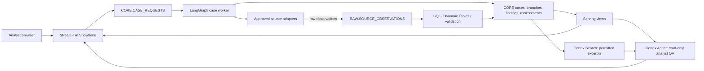

# TrustSignal Snowflake Delivery Blueprint

**Status:** execution-ready hackathon plan. Account-specific object names, roles, source credentials, and feature availability still require confirmation before deployment.

This blueprint turns the product design into a build and deployment sequence for a worldwide, evidence-led legal-party research service. It extends, rather than replaces, the [system design](system-design.md), [source catalog](official-source-catalog.md), and [implementation roadmap](implementation-roadmap.md).

The [complete implementation plan](complete-implementation-plan.md) is the authoritative execution backlog. For the full analyst experience, it selects Streamlit container runtime for Cortex Agents APIs and a serialized single-worker MVP before verified multi-worker claims. The warehouse-runtime app and general conditional-claim guidance below are preliminary scaffolding, not validated production concurrency or viewer authorization.

## 1. Outcome and demonstration boundary

The hackathon release proves a full chain for a deliberately small global source set:

1. An analyst submits a legal-party name and a strong identifier or jurisdiction.
2. The system resolves identity before it attributes events.
3. A durable worker runs registry, leadership/ownership, sanctions/adverse, and news branches in parallel.
4. Every source response is preserved as a time-stamped raw observation, transformed into cited findings, and assessed using a versioned deterministic policy.
5. The UI shows a comparison board, evidence, coverage/freshness, score explanation, and review actions.
6. A read-only Cortex Agent answers follow-up questions over governed data and permitted evidence excerpts.

The product must say exactly which connectors are live. It must never claim global completeness, real-time delivery, or a verified conclusion merely because no result was found.

## 2. Runtime topology



### Runtime responsibilities

| Runtime | Owns | Does not own |
|---|---|---|
| Streamlit in Snowflake | Intake, case status, review queue, evidence/coverage display, analyst questions | HTTP connector calls, secrets, long-running orchestration, score mutation |
| LangGraph worker | Identity gate, parallel branch fan-out/join, retries, idempotent writes, scoring and route proposal | Browser state and direct analyst decisions |
| Snowflake | Durable system of record, governance, raw landing, transforms, serving, search, agent tools, source health | Unbounded scraping or speculative source access |
| Source adapters | Source-specific authorization, pagination, rate limiting, parsing, checkpoints and provenance | Cross-source scoring or UI rendering |
| CoCo | Engineering support for SQL, Python, tests and configurations, with human review | Production monitoring, decisions, source retrieval, or user-facing answers |

### Hosting decision

Use a separate Python worker for the hackathon by default. It gives the existing LangGraph flow a reliable long-running process and clean retry model. Deploy it in Snowpark Container Services only after the account confirms compute pools, image repository access, outbound access, and required packages. Otherwise deploy one small container worker outside Snowflake using a scoped key-pair or OAuth service identity and write only through its orchestrator role.

Use Snowflake Python procedures plus External Access Integrations only for short, well-bounded connectors whose dependencies and egress requirements fit the account. A browser page render must never wait for a source scan.

## 3. Snowflake account and environment plan

Create separate `DEV`, `DEMO`, and later `PROD` databases or account-isolated environments. For the hackathon, a `TRUST_SIGNAL_DEV` database and `XSMALL` autosuspending application and pipeline warehouses are sufficient for controlled demo traffic.

| Role | Minimum purpose |
|---|---|
| `TRUST_SIGNAL_PLATFORM_ADMIN` | Account-level integrations, warehouse ownership, break-glass administration |
| `TRUST_SIGNAL_DEPLOYER` | Approved schema, view, task, Streamlit, and Agent/Search deployments |
| `TRUST_SIGNAL_ORCHESTRATOR` | Claim requests; write cases, branch runs, findings, assessments, and actions; read source configuration |
| `TRUST_SIGNAL_CONNECTOR` | Write source-run and raw-observation records; read only source configuration and required secrets/integrations |
| `TRUST_SIGNAL_ANALYST` | Use the UI and read tenant-filtered serving views |
| `TRUST_SIGNAL_REVIEWER` | Analyst access plus reviewed case-action writes |

Start from [ACCOUNT_SETUP.sql.template](../snowflake/bootstrap/ACCOUNT_SETUP.sql.template), then apply narrowly reviewed grants after the schemas exist. Keep the Streamlit application and Cortex Agent away from `TRUST_SIGNAL_RAW`; they should use serving views and approved search services only. For any multi-tenant deployment, bind `TENANT_ID` from authenticated server-side identity and apply row-access policies before analyst roles receive access.

### Required account preflight

- Confirm account locator, cloud/region, edition, chosen authentication method, active role, and CLI connection name.
- Confirm Cortex AI, Cortex Search, and Cortex Agent availability, model availability, and permitted data regions.
- Decide whether Snowpark Container Services is available; otherwise approve the external worker identity and egress path.
- Confirm allowed external network access, secret management, packages, data-retention expectations, and any policy prohibiting raw-text retention.
- Create two small, auto-suspending warehouses and resource monitors appropriate to the hackathon credit limit.

## 4. Repository and object lifecycle

```text
snowflake/
  bootstrap/                 # reviewed templates, never credentials
  migrations/                # ordered, append-only DDL
  app/                       # Streamlit in Snowflake source
  snowflake.yml              # Snowflake CLI project definition
src/trust_signal/
  orchestration/             # LangGraph state and branches
  connectors/                # approved source adapter contract and adapters
  domain/                    # Pydantic contracts
  services/                  # Snowflake persistence and policy evaluation
docs/                         # source governance, architecture, operations
tests/                        # unit, contract, integration, e2e fixtures
```

Apply `V001__foundation.sql` and then `V002__case_requests_and_serving.sql` in a selected development database. The CLI project definition uses `definition_version: 2` and declares the Streamlit artifact. Set target environment variables in the CLI invocation or connection configuration; do not place account values or secrets into `snowflake.yml`.

Deployment order:

1. Confirm the account preflight and replace bootstrap placeholders locally.
2. Create database, warehouses, roles, schemas, then grants, with a reviewed administrative session.
3. Apply versioned migrations with the deployer role and record the applied revision in the deployment run.
4. Seed only approved source-catalog records and scoring policy versions.
5. Deploy the worker and run a synthetic connector contract check.
6. Deploy the Streamlit app with `snow streamlit deploy` from the reviewed commit using the configured connection.
7. Create Cortex Search and Cortex Agent only after permitted content and serving views are present; grant read-only tool access.
8. Run the acceptance case and capture source-run, case, branch, finding, assessment, and UI evidence.

Snowflake CLI project-definition and Streamlit deployment guidance: [project definitions](https://docs.snowflake.com/en/developer-guide/snowflake-cli/project-definitions/about) and [Streamlit deployment](https://docs.snowflake.com/en/developer-guide/snowflake-cli/command-reference/streamlit-commands/deploy).

## 5. Source connection plan

The source catalog remains the source of truth for terms, jurisdiction, authorization, expected freshness, data classes, and owner. An adapter is not enabled until its source record has an approved access method, rate limit, retention rule, and test fixture.

| Demo lane | Initial source | Connection mode | Evidence contribution |
|---|---|---|---|
| Global legal identity | GLEIF LEI API | Existing Python adapter; no secret | Exact LEI, legal name, registration and relationship context |
| National registration | One team-authorized registry, such as UK Companies House | Worker API client with Snowflake Secret or scoped external secret manager | Company status, officers, filing/registration facts |
| Sanctions / debarment | UN Security Council Consolidated List or another approved official list | Scheduled permitted file/API download | Official list entries and list-version provenance |
| Corporate disclosures | SEC EDGAR for relevant US issuer cases, if in demo scope | Worker client with declared user agent and rate limits | Filing/procedural facts, not universal entity identity |
| News | One licensed/reputable provider or clearly labelled permitted official newsroom feed | Worker connector, document terms recorded | Secondary leads and cited reporting; never a verified registry fact by itself |

Use [EXTERNAL_ACCESS.sql.template](../snowflake/bootstrap/EXTERNAL_ACCESS.sql.template) only when the connector runs inside Snowflake. The sample allows `api.gleif.org` and no credential. External Access Integrations require explicit network rules and allowed secrets; do not use literal credentials or broad hosts. See Snowflake's [external network access guide](https://docs.snowflake.com/en/developer-guide/external-network-access/creating-using-external-network-access).

For global expansion, prioritize an official primary source per jurisdiction and event class. The curated discovery list and access notes are in [official-source-catalog.md](official-source-catalog.md). Sources without API or reuse rights remain catalogued as unavailable/restricted coverage, not silently scraped.

## 6. Durable request-to-decision data flow

1. The UI validates legal name plus at least a jurisdiction, registration identifier, or LEI, then inserts a JSON request in `CORE.CASE_REQUESTS`.
2. The worker atomically claims a queued request, records `CLAIMED_AT`, creates the `CASES` row, and emits an identity branch run.
3. Exact identifiers resolve directly; name-only or conflicting candidates pause the case for analyst clarification. No specialist event result is attached to an unresolved party.
4. Once identity is sufficient, the worker creates branch-run records and launches registry, leadership/ownership, sanctions/adverse, and news branches concurrently.
5. Each adapter records a `SOURCE_RUN`, appends every permitted response to `RAW.SOURCE_OBSERVATIONS`, and carries source record ID, canonical URL, publication/retrieval time, content hash, payload format, and connector version.
6. Parsers and validators create normalized `FINDINGS`. Cortex AI may extract a structured candidate but deterministic logic must validate identity, source class, dates, procedural label, and citation before the item can be marked verified.
7. The comparison service writes corroboration, conflicts, duplicate relationships, chronology, and source gaps. Partial/failed branches remain visible with limitations.
8. A versioned policy writes an `ASSESSMENT` and an explainable proposed disposition: request details, analyst review, approve/monitor recommendation, or reject recommendation.
9. Serving views power the UI. Cortex Search indexes only approved excerpts, and the Cortex Agent may answer questions only through serving/search tools with citation instructions.
10. A reviewer decision creates an append-only `CASE_ACTION`; a new upstream observation starts a new monitored evaluation rather than overwriting history.

### Idempotency and concurrency rules

- The worker, not the browser, owns the effective idempotency key and must safely retry inserts using stable case, source-run, observation, and finding keys.
- Use a conditional claim update with `REQUEST_STATUS = 'queued'`, then verify exactly one row was claimed. Expired claims move through a controlled retry/recovery policy.
- Preserve all source observations. Deduplicate a current finding using stable source identity and content hash, while keeping corrections and superseded records in history.
- Attach `TENANT_ID` to every case-scoped query and write. The static demo tenant in the initial Streamlit file is strictly single-tenant scaffolding.

## 7. UI plan

The deployed Streamlit UI begins with three present surfaces: **New case**, **Review queue**, and **Source coverage**. Extend it in this order:

| Surface | Essential behavior |
|---|---|
| New case | Collect legal-party identity evidence; explain missing requirements; queue a durable request; never run source calls in the browser |
| Case overview | Party header, resolution status, progress by branch, last update, proposed route and policy version |
| Comparison board | Specialist columns against identity, ownership, status, sanctions, litigation, news, and coverage rows; reveal conflicts and gaps instead of flattening them |
| Evidence timeline | Cited, dated observations with source class and procedural label; distinguish verified events, allegations, and leads |
| Risk and review | Dimension scores, reasons, policy version, human rationale, request-more-detail/approve-monitor/reject controls |
| Source coverage | Enabled, restricted, failed, stale, and not-supported states with last successful run and expected freshness |
| Analyst QA | Cortex Agent question panel with readable citations and an abstention/coverage statement |

Use a compact, operations-oriented layout. The case header and case-status strip must be immediately visible. Evidence records should link to the stored citation/source; do not hide essential status behind a generative summary. The app currently reads serving views and queues work; case mutation controls must call audited stored procedures or a scoped API rather than write arbitrary table rows.

## 8. Cortex integration design

| Capability | Job in TrustSignal | Guardrail |
|---|---|---|
| Cortex AI | Structured extraction, classification, translation assistance, concise summaries | Model output is a candidate; schemas, evidence and deterministic checks gate verified status |
| Cortex Search | Retrieve approved source excerpts/documents | Index only licensed/permitted retained text, with source/tenant filtering |
| Cortex Agent | Analyst follow-up over case serving views and Search | Read-only tools, citations required, disclose source coverage and uncertainty |
| Cortex Analyst / semantic layer | Governed questions over case, score, coverage, and timeline facts | Expose only curated views; no raw or cross-tenant data |
| CoCo | Generate/refine code, SQL, tests and agent configuration in developer workflow | Human review and tests before commits, migrations, grants or production behavior |

Keep the deterministic LangGraph workflow as the execution authority for required parallel agents. Cortex Agent is intentionally a flexible research interface after case completion; it does not prove that all required branches ran or make final disposition decisions.

## 9. Security, privacy, and source governance

- Store API credentials in Snowflake Secrets or the approved external secret manager; never in Git, app code, prompts, or browser state.
- Separate raw, core, serving, and operations schemas. Limit raw payload access and define source-specific retention/deletion and redaction rules before live use.
- Apply least-privilege role grants and tenant row-access controls; maintain immutable case actions and policy versions.
- Allow source egress only to approved host/port pairs. Separate integrations by source or trust boundary and record changes in the source catalog.
- Treat personal data such as director names, addresses, and beneficial-ownership information according to source terms and applicable law. Do not use restricted data merely because it can be viewed in a portal.
- Log actor, case, source run, connector version, policy version, model/version, and deployment revision. Redact secrets and sensitive payloads from operational logs.

## 10. Quality, operations, and cost controls

Automated checks must cover exact-identifier resolution, same-name false matches, a source outage, malformed payload, pagination/retry, duplicate record, changed source record, stale connector, unsupported jurisdiction, and model failure. Add end-to-end checks that prove a queued request reaches a case, raw observation, finding, assessment, and displayed citation.

Track source freshness, publication-to-ingestion lag, branch success, identity ambiguity rate, false-match rate, verified-finding citation validity, review override rate, Cortex usage, warehouse credits, and EAI/worker failures. Configure warehouse auto-suspend, per-run branch/time limits, connector concurrency limits, retry budgets, and resource monitors.

## 11. Build sequence and exit gates

| Phase | Deliverable | Exit gate |
|---|---|---|
| 0: account and source approval | CLI connection, role map, selected real entity and 3-4 approved sources | Feature, access, and retention checklist signed off |
| 1: Snowflake foundation | Bootstrap, migrations, serving views, source catalog and policy seed | DEV database queried with only intended roles |
| 2: durable worker | Request claim, persistence repository, LangGraph checkpoints, retry/idempotency tests | Fixture case completes even with one failed branch |
| 3: live connector slice | GLEIF plus one official registry and one official event source | Real response is stored with provenance and shown as live |
| 4: analyst UI | Intake, progress, case board, evidence, coverage and review action | Analyst completes a case without command-line access |
| 5: Cortex | Governed Search, read-only Agent, citation/evaluation fixtures | Answer cites stored evidence and abstains for gaps |
| 6: rehearsal | Replayable demo, monitoring, cost bounds, walkthrough | Same reviewed commit works in DEMO and known gaps are visible |

## 12. Inputs required to execute against the real account

Before account deployment, provide through the approved secure channel: Snowflake account/region and CLI connection name; the desired DEV/DEMO database names; the role that can create integrations and warehouses; confirmation of Cortex and SPCS availability; the selected source credentials/terms; and the identity provider/tenant model. Do not place any of these secrets in this repository.
