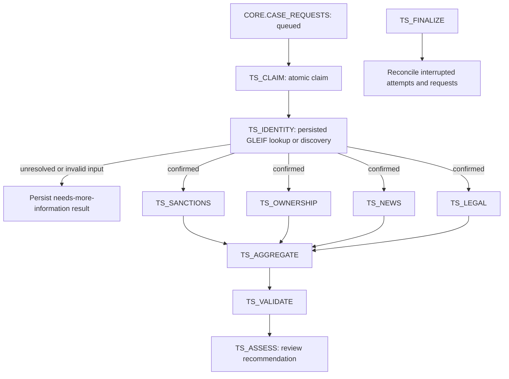

# Snowflake workflow orchestration

The production workflow is now expressed as a Snowflake task graph with reusable
Python stage handlers. The foundation is deployed in `TRUST_SIGNAL_DEV` and its
restricted-account path was verified on 2026-10-03. Live in-Snowflake source access
is blocked by the account's trial restriction. See the
[deployment report](deployment-2026-10-03.md) for verified scope and remaining gates.
The local LangGraph workflow remains available and is not invoked by the Snowflake handlers.

## Execution flow



The first graph claims **one case per graph run**, uses a one-minute schedule and
disables overlap between graph instances. Specialist tasks within a graph have a
common parent and can run in parallel. This is deliberately a bounded first
release; higher throughput needs measured batching, partitioning and ownership
controls before enabling overlapping graph runs.

Tasks coordinate execution. Portable Python components perform the actual work.
Future specialists can use Python stored procedures or synchronous Snowpark
Container Services jobs while retaining the same stage contracts. There is no
second LangGraph fan-out inside this task graph.

## Implemented versus next

| Stage | Current behavior |
|---|---|
| Claim | Atomically changes a queued request to running and snapshots its input. Reuses a graph's existing run on retry. |
| Identity | Uses the existing GLEIF agent through verified RAW ingestion. Confirmation requires eligible identity and matching persisted observation references. Name discovery, conflicts and invalid input end without specialist research. |
| Sanctions / ownership / news / legal | Explicit `skipped` branch outputs with coverage limitations. Connectors alone are not represented as working specialists. |
| Aggregate | Calls the standalone evidence aggregator with all branch results. |
| Validate | Explicitly reports that claim/event validation is not configured; no finding is eligible for scoring. |
| Assess | Saves an unscored analyst-review result with coverage/validation gaps. |
| Finalize | Marks interrupted running stage attempts as failed and unfinished case requests as retryable; preserves terminal results. |

The Snowflake intake's existing `configured_sources` mode maps to live GLEIF in
this first runtime adapter. Other identity registries are not selected automatically
yet. Demo-fixture requests are rejected for clarification before fetching data.
Missing/invalid party input yields a `WorkflowInputFailure` result, rather than a
fabricated party profile.

## Data and component ownership

Migration `V007__workflow_runs.sql` creates:

- `TRUST_SIGNAL_OPS.CASE_RUNS`: graph/request/case/tenant IDs, input snapshot, run state and complete terminal report.
- `TRUST_SIGNAL_OPS.STAGE_ATTEMPTS`: numbered attempts, status, durable output and sanitized error category.
- `TRUST_SIGNAL_OPS.WORKFLOW_CODE`: stage for immutable code bundles.
- `TRUST_SIGNAL_SERVE.V_WORKFLOW_RESULTS` and `V_WORKFLOW_PROGRESS`: result and latest-stage projections.

`domain/workflow.py` defines the contracts. `orchestration/stages.py` supplies the
portable executor. `persistence/workflow.py` owns queue claims and durable writes.
`orchestration/snowflake_runtime.py` adapts Snowflake's supplied Snowpark session;
it opens no application/key-pair connection inside a procedure.

The complete report is stored in `CASE_RUNS.RESULT`. Existing normalized CASES,
FINDINGS and ASSESSMENTS tables are not automatically populated by this adapter.
The future UI/serving integration should read the new workflow projections or add
a normalized publication repository. Tenant IDs remain attached to runs and serving
rows; these views require access controls before multi-tenant sharing.

## Retry and recovery behavior

The graph has two automatic retry attempts and suspends after three consecutive
failed graph runs. Completed stage outputs are cached by run/stage. Retrying a
completed stage does not repeat its source requests. Each failed/interrupted stage
gets a new numbered attempt. The finalizer can run between graph retry attempts;
the same graph/run IDs allow the retry to reconcile existing state.

Expected source outages should return a failed `BranchResult` or raise
`ResearchUnavailableError`. They become coverage gaps, allowing the join to finish.
Programming errors and workflow-storage failures fail the task and use task retry
and finalizer recovery. Conflicting finding IDs likewise stop aggregation.

Stage output is verified before downstream use. Case/run and queue terminal states
are written in one transaction with readback verification. A terminal write whose
outcome was unknown can be reconciled from its cached stage output on retry.
External requests and RAW retention are separate from these short transactions.

Analyst waiting is a persisted state, not a sleeping task. Clarification submits a
new validated request for the same case, preserving the original input/run. A review
decision does not keep a task graph running indefinitely.

For operator recovery, first stop new scheduling and wait for active graph runs and
automatic retries to finish. Inspect task history and stage error categories. Then:

```sql
CALL TRUST_SIGNAL_DEV.TRUST_SIGNAL_OPS.REQUEUE_WORKFLOW('<retryable_run_id>');
EXECUTE TASK TRUST_SIGNAL_DEV.TRUST_SIGNAL_OPS.TS_CLAIM;
```

Manual requeue creates a new graph/run and repeats research from the original
request. It does not reuse successful stages from a different run. To correct
input, submit a new request rather than mutate the retained input snapshot.
Graph-owned procedures must not be invoked concurrently for the same stage by
other workers: standard-table uniqueness is not enforced by Snowflake DDL.

## Build deployment artifacts

For a new installation, prefer the [complete initializer](snowflake-initialization.md),
which includes schema migrations, checksum history, permissions and these workflow
artifacts in one ordered plan. The generator below remains the workflow-only path.

From the repository root:

```bash
.venv/bin/python -m trust_signal.orchestration.deployment \
  --database TRUST_SIGNAL_DEV \
  --warehouse TRUST_SIGNAL_PIPELINE_WH \
  --role TRUST_SIGNAL_ORCHESTRATOR \
  --gleif-eai TRUST_SIGNAL_GLEIF_EAI \
  --output-dir snowflake/build/workflow-v1
```

The command only generates local artifacts. It does not connect to Snowflake,
create roles, apply SQL, upload code or start tasks. It produces a SHA-256 manifest,
deterministic code ZIP, and separate SQL files for grants, preflight, upload,
procedures, tasks, child activation, one-off execution and schedule control.
The SQL templates and procedure/task catalogs are versioned under `snowflake/`;
`snowflake/build/` holds only generated, account-specific installation artifacts.
Use a fresh directory after code changes; existing differing artifacts are not
overwritten. Only Python files inside `src/trust_signal` are packaged; local
configuration, credentials, keys and outputs are excluded.

The default Pydantic pin is `2.11.7`, an artifact-generation default, **not verified
account availability**. Run `preflight.sql` and select an available compatible
2.10+ version using `--pydantic-version`. Check the other packages, Python 3.11
runtime, package policy and package licensing access in the target account as well.
Package resolution/SQL compilation remains a live deployment gate.

The 2026-10-03 DEV deployment successfully compiled all five procedures using
Pydantic 2.11.7. If external access cannot be provisioned, use
`--without-external-access` in a fresh artifact directory. This removes the EAI
grant and attachment and deploys an explicit failed-lookup handler: it performs
no network request, persists the coverage limitation, produces an unscored
analyst-review result, and gates off downstream research. It is not live-source
deployment readiness. The default build still requires an approved GLEIF EAI.

## Deployment order

1. Apply reviewed migrations through V007 in DEV and configure the GLEIF EAI using the existing external-access template.
2. Inspect package availability and the target warehouse/account. Apply `grants.sql` as an authorized administrator to establish the dedicated orchestration role.
3. Stop the old root schedule, if present, and ensure no graph execution/retry remains active before replacing procedures or tasks.
4. Execute `upload.sql` with a client supporting SQL `PUT`, then `procedures.sql`, then `tasks.sql`, using the same owner role for every task.
5. Execute `enable_children.sql`; the root remains suspended. In an isolated DEV queue, use `snowflake/tasks/QUEUE_SMOKE_CASE.sql` under an authorized intake/admin role, then run `execute_once.sql` for a bounded smoke test.
6. Inspect request status, RAW evidence, stage attempts, workflow report and task history. Enable `start_schedule.sql` only after account verification. `stop_schedule.sql` stops future scheduled runs; it does not cancel an active run.

The orchestration role receives scoped data/warehouse/task permissions. The identity
procedure alone attaches the GLEIF EAI. Specialists currently have no network EAI;
add source-specific integrations/secrets when their actual handlers are deployed.
No workflow-procedure usage is granted to PUBLIC or the UI role by these artifacts.
The pre-existing intake still needs a validated, authorized submission procedure
before exposure beyond the dedicated hackathon environment.

Scheduled polling is the initial deployment mode. A stream-triggered dispatcher
can be added later, but it must drain a durable backlog: consuming a stream once
and claiming only one case would otherwise strand the remaining cases. Shared source
snapshot refresh should use a separate ingestion graph rather than fetching the
same global list independently for every case.

## Verification

Local tests cover the state transitions, identity/provenance gate, missing specialists,
coverage isolation, unexpected failures, attempt replay, malformed input, queue
claim loss/duplicates, terminal rollback, recovery guards, release immutability,
dependency/identifier validation and generated Python-handler syntax.
Repository tests use mocked Snowflake SQL results; they do not prove Snowflake
SQL compilation, grants, task scheduling or external access. Those require the
DEV smoke test above.

Next connect a sanctions specialist and its persisted snapshot reader, then replace
the validation and policy gaps with reviewed implementations. SPCS execution,
monitoring refresh, normalized serving publication and durable reviewer actions
remain separate work packages.

Official references:

- [Task graphs, parallel dependencies, retries and finalizers](https://docs.snowflake.com/en/user-guide/tasks-graphs)
- [Task graph runtime IDs](https://docs.snowflake.com/en/sql-reference/functions/system_task_runtime_info)
- [Running SPCS jobs as tasks](https://docs.snowflake.com/en/developer-guide/snowpark-container-services/jobs-as-tasks)
- [Python procedure handlers and supplied sessions](https://docs.snowflake.com/en/developer-guide/stored-procedure/python/procedure-python-writing)
- [Procedure packages and version constraints](https://docs.snowflake.com/en/sql-reference/sql/create-procedure)
- [Snowflake transaction behavior](https://docs.snowflake.com/en/sql-reference/transactions)
- [Stream-triggered tasks](https://docs.snowflake.com/en/user-guide/tasks-triggered)
