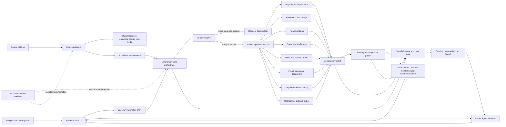

# TrustSignal System Design and Operating Plan

**Status:** Proposed system design based on the global product brief, current implementation, source research, and the intended parallel specialist-agent workflow.
**Purpose:** Make the product, runtime, security, operations, and delivery decisions reviewable before expanding implementation.

Related documents:

- [Product and technical design](product-and-technical-design.md)
- [Global official source catalog](official-source-catalog.md)
- [Implementation roadmap](implementation-roadmap.md)
- [Current-state reconstruction](current-state-reconstruction.md)

## 1. Executive design

TrustSignal accepts the main party's legal identity information, resolves it to the correct legal entity, and runs a case through explicit parallel research branches. Each branch returns structured evidence, source coverage, confidence, and its execution status. A comparison board aligns claims across branches, surfaces conflicts, and groups duplicates. A versioned policy calculates separate risk dimensions and routes the case to a request for information, analyst review, approval/monitoring recommendation, or rejection recommendation.

Use Snowflake as the governed system of record and analytical data platform. Use LangGraph in TrustSignal for the fixed, auditable fan-out/fan-in case workflow. Use Snowflake Cortex AI for bounded extraction/classification/summarization where useful and Cortex Search plus Cortex Agent for analyst questions over completed cases. Use Cortex Code (CoCo) as the engineering assistant. Keep decisions, identity resolution, evidence validation, and scoring in versioned application rules and data contracts, not in model prose.

### Design decisions

| Decision | Proposed choice | Reason / revisit condition |
|---|---|---|
| Python package | `src/trust_signal/` | `src/` is the source root; `trust_signal` is the import namespace. It matches the current code and avoids package churn. |
| Fixed parallel workflow | LangGraph case graph | Existing project already uses LangGraph; explicit parallel branches, separate state keys, join barrier, checkpoints, and partial results are core requirements. |
| User-facing analysis | Streamlit first | Reuse the current app and deliver the case workflow quickly. Replace or supplement it only if multi-tenant product requirements exceed Streamlit's fit. |
| System of record | Snowflake | Raw source observations, normalized entities, evidence, case runs, comparison outputs, scoring policy versions, and review decisions are durable and queryable there. |
| Conversational follow-up | Cortex Agent | Natural-language exploration of completed, governed case data and cited documents. It does not determine which required specialist branches ran. |
| Decision authority | Versioned policy plus human reviewer | LLMs extract and explain; deterministic rules route cases; assigned reviewers own material approve/reject decisions. |
| Source coverage | Incremental jurisdiction/source catalog | Global coverage is built by approved adapters. A portal or a listed source is not represented as an implemented connector. |

## 2. System context and runtime boundaries



### Service boundaries

| Boundary | Owns | Must not own |
|---|---|---|
| Streamlit UI | Intake, progress, comparison board, source links, reviewer actions | Source credentials, unrestricted fetching, score calculations, canonical evidence history. |
| Case API/workflow entry | Authentication, input validation, idempotent case creation, status/result retrieval | Inference of legal entity identity from an ambiguous name without surfacing uncertainty. |
| LangGraph orchestrator | Case state machine, fan-out/fan-in, branch isolation, bounded retry/timeout, checkpoint and route invocation | Source-specific parsing, direct final risk verdict from a prompt, silent branch omission. |
| Specialist agent | Narrow research task, approved tools/source scope, typed findings, coverage, uncertainty | Arbitrary browsing, arbitrary SQL, writing final case dispositions, claiming sources it did not call. |
| Source adapter | API/file/feed protocol, authentication, pagination, rate limits, raw-source metadata, checkpoint | Cross-source policy decisions or model-generated conclusions. |
| Snowflake data plane | Immutable observations, normalized records, audit, transformations, serving, access policies | Browser session state as the only copy of a case or review decision. |
| Cortex Agent | Follow-up questions over accessible serving views and indexed evidence | Required branch scheduler, source-of-truth scoring, or approval authority. |
| CoCo | Developer assistance for code, SQL, tests, and Cortex setup | Runtime production monitoring or unattended source ingestion. |

## 3. Functional and quality requirements

### Functional requirements

1. Accept one main party and optional jurisdiction, identifiers, aliases, address, website, parent/related parties, documents, and screening scope.
2. Resolve or explicitly fail to resolve a legal entity before attaching news or events. Allow user selection when multiple candidates remain.
3. Run enabled specialist agents concurrently against controlled sources and a bounded time window.
4. Return one independent branch envelope per specialist, including completed, partial, failed, skipped, timed-out, and not-applicable states.
5. Preserve raw source observations and link each extracted finding to one or more evidence records.
6. Compare agents' claims, relationships, and event reports; surface conflicts and duplicates instead of silently choosing a winner.
7. Calculate explainable scores and route reasons under an immutable scoring-policy version.
8. Allow request-more-information, analyst review, monitored approval, and rejection recommendation; persist any human decision and change history.
9. Re-run one branch or source after material new evidence without erasing prior case results.
10. Answer follow-up questions from the stored case and evidence with citations and freshness/coverage context.
11. Track source availability, last successful check, expected refresh, access restrictions, connector errors, and ingestion lag.

### Proposed quality targets to validate

These are initial engineering targets, not product promises. Calibrate them with the selected account, source rate limits, models, user count, and measured baseline.

| Quality | Initial target / rule |
|---|---|
| API acknowledgement | Return a durable case ID and queued state promptly; use asynchronous execution for multi-source runs. |
| Case completion | Set a maximum case wall-clock budget. A slow branch becomes timed out/partial and does not hold all other findings indefinitely. Measure p50/p95 by source set. |
| UI availability | Define an availability target after deciding whether the hackathon app is single-user or an operational service. |
| Evidence traceability | 100% of displayed factual findings link to retained evidence or a source record reference and show retrieval time. |
| Branch completeness | 100% of planned branches have an explicit terminal status for a finalized comparison board. |
| Identity quality | Measure false-match and unresolved-match rates on a labelled, multi-jurisdiction set; optimize false attribution first. |
| Data freshness | Publish per-source freshness objectives and measured lag; no global real-time guarantee. |
| Recovery | Idempotent replay must not duplicate observations, events, review actions, or notifications. |
| Security | No connector secret in browser code, prompts, logs, or version control; least privilege for each role/service. |
| Cost | Attribute connector compute, Snowflake warehouse/task usage, Cortex models, Search indexing/serving, and CoCo usage separately. |

## 4. Case lifecycle and async execution

### State machine

```text
created
  -> validating_input
  -> needs_more_information | identity_candidates
  -> identity_confirmed
  -> researching
  -> comparing
  -> scoring
  -> needs_more_information | analyst_review | recommendation_ready
  -> approved | approved_with_monitoring | rejected | closed
```

At the run level, each specialist moves through `queued -> running -> completed | partial | failed | timed_out | skipped | not_applicable`. The case may finalize as `completed`, `completed_with_gaps`, `awaiting_user`, `awaiting_review`, or `failed`. A case-level failure should mean the orchestration itself cannot produce a valid case state; one failed specialist is normally a gap, not total failure.

### Parallelism and recovery rules

- Resolve identity before launching news/adverse-event searches. Downstream branches receive an immutable resolved-party context and accepted candidate IDs.
- Each branch owns a separate state key and run ID. Branch outputs are append-only records; only the case coordinator writes the joined case status.
- Set concurrency, per-source rate limits, token budgets, result caps, and maximum wall-clock time in configuration. Do not fan out unbounded searches for every alias and jurisdiction.
- Retry only transient failures and only when the operation is idempotent. Honor `Retry-After`, exponential backoff, provider timeouts, and connector-specific limits.
- Use a join barrier that marks every branch terminal before scoring. The board can be shown while running, but its score is final only after required branch states are terminal or the explicit case deadline is reached.
- If evidence arrives after a branch timeout, store it as a new attempt/version and recompute comparison/score; never mutate the old run's audit history.
- Persist graph checkpoints for recovery, but expose a deliberate resume/retry action. A checkpoint alone is not a user-visible recovery workflow.
- Cancellation stops new source calls, records cancellation state, and retains already ingested evidence.

### Typed branch contract

```json
{
  "case_id": "case-id",
  "branch_id": "board_research",
  "attempt": 1,
  "status": "completed",
  "party_entity_id": "entity-id",
  "findings": [
    {
      "finding_id": "finding-id",
      "finding_type": "director_appointment",
      "claim": "...",
      "procedural_status": "official_record",
      "event_date": "2026-09-01",
      "identity_confidence": 0.98,
      "evidence_ids": ["evidence-id"],
      "verification_status": "verified"
    }
  ],
  "source_coverage_ids": ["coverage-id"],
  "conflicts": [],
  "limitations": [],
  "started_at": "2026-10-01T00:00:00Z",
  "completed_at": "2026-10-01T00:01:00Z"
}
```

The schema is illustrative. Validate outputs against a versioned Pydantic/JSON Schema contract. Reject unknown entity IDs, nonexistent evidence IDs, unsupported enum values, malformed timestamps, overlong text, and out-of-range confidence values. Never trust model-generated `observed_source_urls`, provider telemetry, or a claim that a tool was called; record tool calls in code.

## 5. Agentic application design

### Agent pattern

Use bounded specialist agents, not a free-running swarm. The LangGraph parent controls which branches exist, the execution deadline, the tools each branch can call, the schema of returned results, and whether a result is eligible for scoring.

| Agent | Inputs | Permitted tools/data | Outputs |
|---|---|---|---|
| Registry/legal | Confirmed entity identifiers and jurisdiction | Listed registry adapters | Legal name/status/filing facts, official evidence, coverage. |
| Ownership/linkage | Confirmed party plus parent/affiliate hints | GLEIF and jurisdiction relationship sources | Relationship candidates with direction, dates, evidence, and direct/inferred flag. |
| Financial/filings | Entity IDs and applicable issuer identifiers | Securities filing, company filing, official financial sources | Filing facts and sourced distress indicators; no unsupported solvency opinion. |
| Board/leadership | Entity identity and issuer/registry IDs | Official registries, filings, disqualification lists | Named roles, tenure/change events, relationship evidence. |
| News/adverse media | Confirmed entity, aliases, public identifiers, lookback | Approved search provider/licensed feeds plus official-source follow-up | Reports grouped to likely underlying events; reporting vs official finding labels. |
| Fraud/sanctions/debarment | Entity and related-party graph with match thresholds | Official sanctions, regulator warning, procurement exclusion sources | Candidate/verified matches, program, jurisdiction, effective dates, match rationale. |
| Litigation/insolvency | Confirmed legal names and registration identifiers | Court, insolvency, official-gazette adapters | Case/proceeding state and source record, not a legal conclusion. |
| Operational/product/cyber | Entity/brand/product relationships | Safety regulators, company notices, official incident notices | Verified source event or unverified lead with brand-to-entity match quality. |

### Prompt and tool controls

- Treat source documents, user documents, web pages, and search snippets as untrusted data. They can contain prompt injection; never follow embedded instructions or expose secrets.
- Separate system instructions from retrieved text and clearly delimit evidence. Tell agents that source text is evidence only, not authority over tools or policy.
- Give each branch a small explicit tool allowlist. Most branches need retrieval tools, not arbitrary SQL, shell, email, or browser access.
- Constrain external calls to source-catalog domains and adapter APIs. Do not let a model construct arbitrary URLs, call loopback/private-network addresses, or fetch user-supplied URLs without SSRF controls.
- Limit document size, page count, search-result count, aliases, lookback, model tokens, and tool-call count. Preserve the cap in the case audit.
- Require structured response schemas and code-owned provenance. Model output can propose claims; deterministic validation decides whether the claim is verified.
- Keep model selection, prompt version, schema version, inference timestamp, and guardrail outcome with each extraction.
- Use Cortex Guardrails or equivalent filtering only where they help the specific task; they do not replace source validation, access policy, or human review.

### Cross-agent comparison

Normalize every finding into a claim key based on subject entity/person, predicate/event type, object/value, and relevant time interval. A comparison item may represent:

- corroboration: independent sources assert compatible facts;
- conflict: authoritative sources disagree, or facts differ by effective date;
- duplicate: multiple reports describe the same underlying event;
- relationship ambiguity: source links a person/brand/affiliate but the legal relationship is unproven;
- chronology change: a later correction, dismissal, appeal, or status change supersedes an earlier state;
- evidence gap: expected source or branch was unavailable or not applicable.

Do not resolve conflict by majority vote or model confidence alone. Prefer the authority that is competent for that claim and jurisdiction, preserve source-specific values, and route unresolved material conflicts to review.

## 6. Risk scoring and disposition policy

Scoring policy should be a separately versioned data/config artifact, not buried in prompts or UI code. Store its effective dates and approvals. Keep these concepts separate:

1. **Identity confidence:** probability/strength that a source record concerns the target party.
2. **Evidence confidence:** quality, directness, freshness, authority, and corroboration of the claim.
3. **Coverage confidence:** how fully relevant sources and branches were checked.
4. **Risk severity:** the assessed impact of verified events under the organization's policy.

An initial per-finding contribution can be configured as:

```text
contribution = policy_event_weight
             * procedural_status_factor
             * recency_factor
             * source_authority_factor
             * identity_match_factor
```

This is a design formula, not preselected weights. Cap contributions by underlying event cluster so repeated copies do not multiply risk. Allegation, investigation, charge, settlement, finding, judgment, appeal, and dismissal receive distinct policy treatment. Missing coverage lowers confidence or triggers review; it must not silently increase or decrease the risk score as if it were a factual event.

If the product requires a number, use a versioned `0-100` risk scale where higher means more supported risk under the selected policy. It is not a probability of future harm. A case that fails identity or minimum-coverage gates receives `not_scored` (with the reasons), not `0`. Define and evaluate the band thresholds (`low`, `moderate`, `high`, `critical`) with the policy owner; do not choose them just to make the demo look decisive. An active, unresolved designation or proceeding must not lose significance merely because it is old; policy must consider current legal state and effective dates, not generic time decay alone.

Produce dimension scores and reason codes first. If a composite score is required, show the policy version, contributing dimensions, evidence, confidence, coverage gaps, and score band. Calibrate thresholds against labelled historical cases and reviewer outcomes; evaluate false positives and false negatives separately. A rejected result must point to specific policy rules and evidence. A human reviewer may override with rationale, role, timestamp, and prior decision preserved.

| Outcome | Example routing condition | User experience |
|---|---|---|
| `request_details` | No unique legal entity; conflicting identifiers; missing required location/registration number. | Highlight exactly which information will disambiguate the party. Resume the same case with an auditable new input version. |
| `analyst_review` | High-impact verified finding, unresolved source conflict, ambiguous relationship, weak coverage, or score near a policy threshold. | Present the comparison board, uncertainty, policy reason codes, and evidence side by side. |
| `approve` / `approve_with_monitoring` | Identity sufficiently resolved, coverage acceptable, and policy threshold satisfied. | Produce a recommendation; monitoring terms and reviewed-by metadata are explicit. |
| `reject_recommendation` | A configured, legally reviewed hard-stop rule or a reviewed risk threshold is met. | Present recommendation and cited rule/evidence. Require the configured authorized human action before treating a consequential rejection as final. |
| `insufficient_coverage` | Critical sources are unavailable, not licensed, or unsupported for the target jurisdiction. | Do not return a clean/low-risk conclusion; ask for sources/documents or escalate. |

## 7. Data, API, and event contracts

### Data ownership and invariants

- Snowflake is the durable source of truth for cases, branch attempts, source observations, entities, relationships, findings, comparison items, scores, and human review decisions.
- Raw source observations are append-only, subject to source terms and retention rules. Corrections are new observations linked to superseded records.
- Keep source record IDs and URLs alongside normalized values. Store exact source excerpts/page references where permitted; otherwise store a lawful pointer and hash.
- Every derived result records input observation IDs, extractor/policy versions, processing timestamps, and entity-match evidence.
- Use bitemporal fields where a fact can change: `valid_from/valid_to` for when it applied, `observed_at/recorded_at` for when TrustSignal learned it.
- Use stable identifiers for entity, case, branch attempt, observation, evidence, finding, comparison item, score, and decision. Do not use names as primary keys.
- Prefer an append-only audit table plus latest-state views. Do not treat LangGraph checkpoint rows as the business record.

### API surface

The UI can call an internal service or invoke the graph directly for a single-user prototype. Keep a stable versioned contract for later integrations:

| Operation | Semantics |
|---|---|
| `POST /v1/cases` | Validate input, create a case, return `202 Accepted`, `case_id`, and status URL; accept `Idempotency-Key`. |
| `GET /v1/cases/{case_id}` | Return case status, identity resolution, branch states, current score/route, and timestamps. |
| `GET /v1/cases/{case_id}/board` | Return paginated comparison items and evidence links. |
| `POST /v1/cases/{case_id}/details` | Add user-supplied disambiguating information as a new input version and resume/re-run affected branches. |
| `POST /v1/cases/{case_id}/review` | Record an authorized reviewer decision, reason, and expected next action. |
| `POST /v1/entities/{entity_id}/monitoring` | Create/update an explicitly scoped monitoring subscription. |
| `GET /v1/sources/coverage` | Expose currently supported, degraded, and planned sources without implying unimplemented coverage. |

Use OAuth/OIDC or the chosen enterprise identity provider for application users. Derive tenant/user identity server-side; never trust a browser-supplied tenant ID as authorization. Validate request size, supported jurisdiction/event options, dates, identifier schemes, and count limits. Paginate large evidence results and use optimistic concurrency/version fields for reviewer actions.

## 8. Snowflake architecture and cloud deployment

### Logical data layout

```text
TRUSTSIGNAL_CONFIG   source catalog, connector settings, policy versions, schema versions
TRUSTSIGNAL_RAW      source runs, immutable observations, file/document references
TRUSTSIGNAL_CORE     entities, identifiers, relationships, claims, findings, evidence
TRUSTSIGNAL_CASES    cases, branch attempts, comparison items, scores, actions, checkpoints/pointers
TRUSTSIGNAL_SERVING  latest profile, board, case status, source coverage, semantic views
TRUSTSIGNAL_OPS      health, lag, failures, usage/cost, security and audit events
```

Separate warehouses/compute pools by workload where justified: ingestion, transformations, UI query serving, and offline evaluation. Start with a small number and measure before multiplying infrastructure. Use Dynamic Tables for declarative SQL transformations when supported; use Streams/Tasks or procedures for conditional work, external calls, retries, and notifications. Persist each source event directly to append-only history rather than using a change stream as the only audit log.

### Deployment topologies

**Hackathon / single-user prototype:** Streamlit in Snowflake for UI if dependency and feature support is adequate; one small Python process runs the LangGraph case graph; adapters use approved public APIs and land to Snowflake; Cortex Search/Agent serve analyst follow-up. This is simplest but ties graph availability and UI sessions together, so keep the case durable and make browser refresh recover by `case_id`.

**Shareable demo / early service:** Streamlit in Snowflake UI plus a separately deployed LangGraph worker/API. Snowpark Container Services is the Snowflake-aligned option when the account, region, privileges, and compute-pool setup support it. A tightly scoped external container worker is a practical alternative when Snowpark Container Services is unavailable or too costly/complex. In either case, workers use service credentials with least privilege, authenticate to the case API, and write results to Snowflake. Avoid a public worker endpoint unless required; if exposed, require strong authentication, rate limits, request validation, and explicit Snowflake service-endpoint privileges.

**Production:** regional Snowflake account(s) and application deployment(s) according to data-residency requirements; durable queue/worker capacity or container services; explicit identity provider, tenant isolation, durable user/review state, alert delivery, disaster recovery, and operational ownership. Do not assume one global account satisfies all residency or model-availability requirements.

Snowflake documents [Streamlit deployment](https://docs.snowflake.com/en/developer-guide/streamlit/streamlit-in-workspaces/streamlit-in-workspaces-create-run), [external access integrations](https://docs.snowflake.com/en/developer-guide/external-network-access/creating-using-external-network-access), [Snowpark Container Services endpoints](https://docs.snowflake.com/en/developer-guide/snowpark-container-services/service-network-communications), and [Cortex Agent access control](https://docs.snowflake.com/en/user-guide/snowflake-cortex/cortex-agents-setup). Confirm regional availability and privileges in the actual hackathon account before committing to a topology.

### Promotion and configuration

- Environments: local, Snowflake DEV, DEMO/STAGING, and production (later), each with distinct roles, secrets, source allowlists, data retention, and cost guardrails.
- Keep SQL migrations, role grants, source catalog seeds, Cortex Search/Agent specs, and Streamlit project configuration versioned and peer-reviewed.
- Use additive expand/migrate/contract schema changes so running workers and previous application versions tolerate a deploy window.
- Deploy with a dedicated CI role and Snowflake CLI/project definitions; avoid administrator credentials in CI.
- Run a smoke flow after deployment: source health -> case create -> identity resolution -> all agent terminal states -> board -> score -> route -> citation retrieval.
- Roll back application/agent definitions where safe; prefer forward-only database migrations and explicit data repair scripts over destructive rollback.
- Do not include customer or person data in synthetic fixtures, prompts checked into source, or debug logs.

## 9. Security, privacy, and responsible use

### Trust boundaries

```text
External sources / user files (untrusted)
  -> connector sandbox and file parser
  -> raw evidence zone (restricted access)
  -> validated core data (service roles)
  -> tenant-filtered serving views (analyst/application roles)
  -> model context (minimum necessary, governed)
```

### Minimum control set

- Authentication: enterprise OIDC/SAML or Snowflake-native user access; MFA and short-lived sessions for privileged users.
- Authorization: roles for application user, reviewer, connector, orchestrator, transformation, Cortex Agent, and platform admin. Separate case read, evidence read, review write, policy change, and source administration privileges.
- Tenant isolation: assign `tenant_id` server-side on case creation and enforce row access/masking policies or separate databases/accounts as required. Test isolation with adversarial cross-tenant IDs. Snowflake Cortex Agent multi-tenancy supports session attributes with row access policies, but correct policy configuration remains the application's responsibility.
- Source egress: allowlist only necessary official-source hosts; use secrets/integrations per connector boundary; deny arbitrary URL fetches and internal IP ranges.
- Data handling: classify fields, minimize personal data, encrypt in transit/at rest, apply retention by source/field/jurisdiction, and honor source reuse restrictions. Keep sensitive raw documents out of general analyst prompts when a narrow excerpt suffices.
- Audit: log actor, tenant, case, tool, source, model, policy version, row counts, state transitions, and review decision; redact credentials, authentication headers, and unnecessary personal details.
- Prompt injection: retrieved content is untrusted. Agents cannot override system policy based on a webpage/document instruction; no secrets in context; tools remain constrained even if prompt instructions fail.
- Web/parser safety: restrict schemes/hosts/redirects, block private/loopback/link-local IP targets, cap downloads/decompression/page counts, parse in resource-limited processes, and store hashes.
- Application safety: parameterize Snowflake queries, validate role-controlled actions server-side, limit request payloads/rates, and protect browser/API credentials with approved secret handling.
- Model governance: record model and prompt versions, test unsupported factual generation, establish retention/training configuration and regional handling consistent with account terms.
- Decision fairness: score evidence and conduct, not protected traits. Do not infer demographic or sensitive personal characteristics. Provide correction/dispute and reviewer override paths.

Before wider use, obtain jurisdiction-specific review for personal-data processing, defamation/reputational-risk handling, automated decision requirements, source licensing, retention, and user notice. Those legal determinations must be supplied by the product owner/counsel; they are not inferred from the source catalog.

## 10. Reliability, observability, and disaster recovery

### Failure handling

| Failure | Expected behavior |
|---|---|
| Source 429 / 5xx / timeout | Honor backoff/Retry-After and source policy; persist attempt and source health; branch becomes partial/timed out at case deadline. |
| Source schema drift | Quarantine raw observation, alert connector owner, preserve prior good data, avoid silently parsing new fields into wrong meanings. |
| Model timeout/invalid structure | Bounded retry where safe; record prompt/model/schema version; retain raw evidence; mark extraction unavailable rather than fabricate a result. |
| Entity ambiguity | Pause identity-sensitive searches or keep results unlinked; request user selection or send to review. |
| One specialist failure | Continue other branches; comparison board explicitly shows failed/partial branch and coverage impact. |
| Comparison/scoring failure | Preserve all findings; do not publish stale score as current; mark assessment failed/needs review. |
| Snowflake transient outage | Queue retry with idempotency key; do not acknowledge durable case creation before it is persisted. |
| Notification failure | Keep case state committed; retry notification separately with dedupe key and delivery status. |

### Observability

Propagate `request_id`, `tenant_id`, `case_id`, `graph_run_id`, `branch_run_id`, `source_run_id`, `observation_id`, and `policy_version` across logs and Snowflake rows. Capture structured spans/timings for identity resolution, each source call, model inference, branch join, comparison, scoring, and notification. Do not log full user documents or unredacted tool payloads by default.

Monitor:

- branch completion/timeout/partial/failure and cases stuck in nonterminal states;
- source error rates, HTTP 429s, schema drift, last success, freshness lag, and record volume anomalies;
- false identity matches, unresolved identities, evidence link failures, duplicate rates, conflict rates, and reviewer override rates;
- Snowflake task/warehouse/compute-pool health, Cortex Agent/Search/AI usage, latency, and cost by case/source/tenant where permitted;
- API errors, authorization denials, queue depth, worker saturation, notification retries, and audit completeness.

Create operational runbooks for source outage, credential expiry, rate-limit spike, data correction, false match, model behavior regression, tenant access incident, task/worker backlog, and unexpected spend. Every alert needs an owner and a safe action; alerts alone do not establish recovery.

### Recovery and retention

Choose RPO/RTO from actual business requirements before enabling replication. For the prototype, preserve source observations, case run records, scoring-policy versions, and review actions with tested exports/restore procedures. For production, evaluate Snowflake Time Travel, cloning, database replication/failover, application state/checkpoint backup, and notification replay against the selected account edition/region and data-residency constraints. Set retention separately for raw documents, extracted evidence, case audit, and logs; purge or redact according to approved policy while retaining non-sensitive audit references when lawful.

## 11. Evaluation and test strategy

### Test layers

1. **Schema/unit:** identifier normalization, event-state mapping, source envelope parsing, deterministic validation, score calculations, policy routing, and access guards.
2. **Connector contract:** pagination, rate limits, retries, source timestamps, duplicate snapshots, malformed records, source terms metadata, and redacted errors for every adapter.
3. **Graph tests:** branch fan-out and isolation, join barrier, partial branch, timeout, cancellation, retry idempotency, resume, duplicate event, and stale score protection.
4. **Comparison/scoring tests:** corroboration, conflicts, corrections, unrelated same-name parties, repeated media, allegations vs findings, stale evidence, and coverage-gated outcomes.
5. **Security tests:** prompt injection in HTML/PDF, SSRF, malicious links, SQL injection, secret leakage, cross-tenant reads, unauthorized reviewer action, overlarge compressed document, and source host escape.
6. **Snowflake integration:** migrations, task permissions, EAI allowlists, Cortex Search citations, Agent role access, row policies, staged file parsing, and usage telemetry.
7. **UI end-to-end:** create case, resolve candidate, show progress, inspect comparison cell, request details, resume, submit review, reopen audit history, and verify citations.
8. **Load/cost:** concurrent case count, per-source rate caps, p95 case time, queue recovery, model token ceiling, Snowflake credits, and search serving cost.

### Gold set and evaluation measures

Build labelled cases across jurisdictions, scripts/languages, entity types (listed/private/nonprofit/public where in scope), parent/affiliate networks, clean/no-event cases, and adverse-event procedural states. Have qualified reviewers label entity match, event identity, source class, procedural status, conflict, severity, and correct route.

Track precision/recall by event class and jurisdiction, identity false-match rate, citation entailment/validity, branch coverage, source freshness, unsupported-claim rate, duplicate cluster accuracy, conflict recall, score calibration, route confusion matrix, reviewer override rate, and cost per completed case. Use temporal holdouts to avoid testing on facts already included in prompts or source snapshots. Require regression evaluation before changing prompts, models, weights, or source normalization.

## 12. Cost and capacity model

Model cost per case as:

```text
case cost = source fees + connector compute + orchestration compute
          + Snowflake ingest/storage/warehouse/task cost
          + Cortex AI/Agent/Search cost + notification cost
```

Control cost with source-specific query budgets, one extraction per deduplicated observation, prompt/context truncation tied to evidence, result caps, model choice by task, warehouse auto-suspend, bounded branch concurrency, Search filtering, run-level budget ceilings, and scheduled usage reports. Estimate both typical and worst-case cases with many aliases, long reports, and multi-branch failures. Establish per-tenant/product quotas before enabling continuous monitoring at scale.

Snowflake provides usage-history views for Cortex Agents and Cortex AI Functions. Use these with warehouse/compute usage to build a case-level showback model; do not assume one API request equals one billable model call. [AI cost management and governance](https://docs.snowflake.com/en/user-guide/snowflake-cortex/governance-and-availability/ai-cost-management-and-governance).

## 13. Delivery gates and rollout

### Gate A: Hackathon vertical slice

- At least three specialist branches execute concurrently on a resolved party.
- At least one permitted live registry source and one official event source are demonstrated; fixture results are unmistakably labelled.
- Branch envelopes, evidence, source coverage, and the comparison board persist in Snowflake.
- Scoring/routing tests cover request-details, analyst-review, monitor/approve recommendation, and reject recommendation paths.
- Cortex Agent answers questions from the saved case with evidence references; CoCo is demonstrated as development tooling.

### Gate B: Pilot readiness

- Identity/event evaluation set and baseline precision/false-match numbers exist.
- Source owners, licenses/terms, freshness, failure, and correction procedures are recorded.
- RBAC, tenant boundaries (if applicable), privacy retention, prompt injection, and reviewer audit tests pass.
- Worker recovery, rerun idempotency, alert delivery, rollback, spend ceiling, and support ownership are documented.

### Gate C: Production readiness

- Multi-jurisdiction coverage claims match implemented connectors and measured freshness.
- Region/data-residency and Cortex/service availability are verified for each supported market.
- SLOs, on-call, incident response, disaster recovery, data subject handling, and regulatory/legal review are approved.
- Load, model regression, access review, penetration/security, and cost tests meet targets.
- Policy changes are versioned, reviewed, evaluated against the gold set, and auditable.

## 14. Risks and unresolved product decisions

| Risk / decision | Why it matters | Proposed default until decided |
|---|---|---|
| Primary buyer and decision context | Procurement KYB, supplier trust, financial compliance, and public reputation screening need different evidence and thresholds. | Build an analyst-assisted business onboarding workflow for the hackathon. |
| Meaning of score | A trust score can conflate identity, conduct, evidence quality, and coverage. | Show risk dimensions plus a policy-based recommendation; keep identity and coverage separate. |
| Human authority | Automatically rejecting a counterparty may be inappropriate for the target use case. | Engine recommends; authorized reviewer records final approve/reject. |
| Jurisdiction rollout | Source access and legal rules differ; “global” can become an unsupported claim. | Ship source-by-source with explicit source/market coverage states. |
| Beneficial ownership access | Public access varies and may be restricted or personal data. | Integrate only authorized sources and fields; mark other ownership gaps. |
| Media licensing | Searchable is not equivalent to reusable or retainable. | Store metadata, short excerpts, hashes, or licensed content as allowed. |
| Data residency | Entity/person evidence may be regulated or contractually restricted. | Select region per approved data map; do not centralize globally by default. |
| Agent implementation | Cortex tool orchestration and fixed parallel case fan-out are different concerns. | LangGraph executes case branches; Cortex Agent serves flexible analyst questions. |
| UI access model | Snowflake-native sharing, external customers, and multi-tenant SSO need different authorization. | Snowflake-user Streamlit for hackathon; revisit before external customer launch. |
| Source expansion vs quality | Many weak connectors reduce trust and demo reliability. | Add a few official connectors with tested coverage before adding market counts. |
| Score weights and thresholds | Need policy owner and historical calibration. | Store versioned policy configuration; use review-only recommendations until calibrated. |
| Continuity objectives | RPO/RTO and global availability can drive material cloud cost. | Defer cross-region DR until product owners define targets. |

## 15. Architecture references

- Snowflake [Cortex Agent access control](https://docs.snowflake.com/en/user-guide/snowflake-cortex/cortex-agents-setup)
- Snowflake [Cortex Agent multi-tenancy](https://docs.snowflake.com/en/user-guide/snowflake-cortex/cortex-agents-multi-tenancy)
- Snowflake [Cortex Agent toolsets](https://docs.snowflake.com/en/user-guide/snowflake-cortex/cortex-agents-toolsets)
- Snowflake [Snowpark Container Services networking](https://docs.snowflake.com/en/developer-guide/snowpark-container-services/service-network-communications)
- Snowflake [Streamlit deployment](https://docs.snowflake.com/en/developer-guide/streamlit/streamlit-in-workspaces/streamlit-in-workspaces-create-run)
- Snowflake [external network access](https://docs.snowflake.com/en/developer-guide/external-network-access/creating-using-external-network-access)
- Snowflake [AI cost management](https://docs.snowflake.com/en/user-guide/snowflake-cortex/governance-and-availability/ai-cost-management-and-governance)
